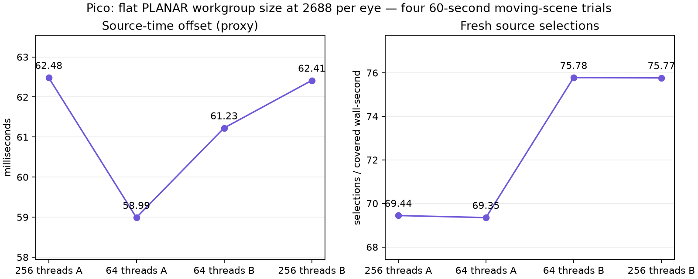
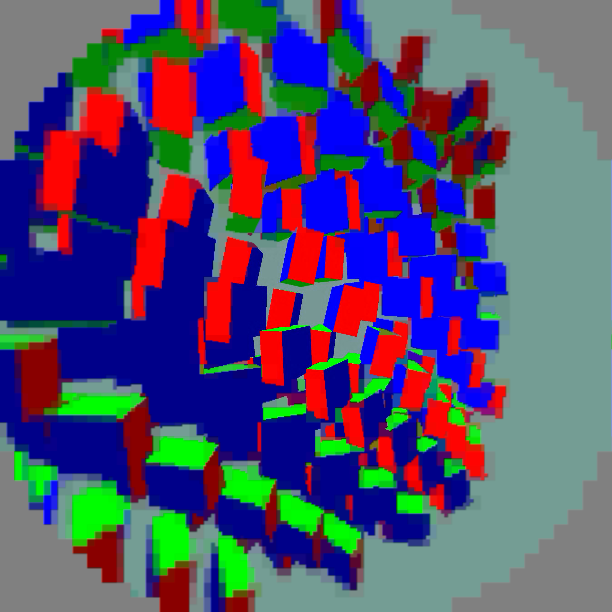

# 64-thread flat PLANAR kernel: selected

Flat peripheral tiles in compact output now have an optional 64-thread reconstruction kernel. It writes the same retained luma/chroma samples as the existing 256-thread kernel. Other tile paths retain their original workgroup size. Selected on the Pico via `debug.wivrn.nx.compact_flat64=1`; library callers opt in with `NXVC_VKD_FLAG_COMPACT_FLAT64`.

Four completed 60-second trials at 2688² per eye, ABBA order with the last control repeated after a startup failure. Fixed: ready wait 1 ms, JIT maximum 5 ms, priority 1, FDM 3, static-post 2, smoothing 3, continuously awake. Mean of per-run post-warmup means:

| Threads | Pass A GPU | Pass B GPU | Total decode GPU | Fresh selections / covered wall-second | Source-offset proxy |
|---|---:|---:|---:|---:|---:|
| 256 | 2.5927ms | 3.9170ms | 6.5098ms | 72.60 | 62.4479ms |
| 64 | 2.5340ms | 3.7100ms | 6.2420ms | 72.56 | 60.1063ms |

**Pass B fell 5.3%, total decode GPU fell 4.1%, source offset fell 2.34 ms.** Fresh selections were essentially unchanged. Both control/candidate pairs show lower Pass B time; this is a modest improvement, not 90 FPS. Presentation GPU means also changed 3.9125→3.7083ms, but the experiment changes decode scheduling rather than presentation instructions. Runtime/load interaction remains possible.

## Output checks

Three 2176² compact fixture frames decoded on the Pico produced identical **7,750,656-byte** outputs for both kernels, SHA256 `8dfc1bc33c8f44e00f8fe768a1e28c50146d7b3a6545c7858c7bed25f862bb74`. This is a tested fixture, not an exhaustive bit-exactness proof for every stream. Input hash and output hashes are included. Coverage checks compare every 64/256-lane output index for fine/coarse compact tiles. A separate 25-second 2688 capture passed and was visually inspected:

## Failures retained

An initial control never rendered because the Pico remained asleep; the runner now explicitly wakes it after enabling continuous wake. Another control exited during swapchain setup before streaming. Logs showed mutable swapchain rejections; the cause is unresolved. Its crash buffer contained older tombstones, not evidence of a new native crash. Both failed attempts are archived and excluded from aggregates. All four completed timing runs had zero session stops.

Source offset is a software display-time proxy, not photon latency. Fresh selections are not panel FPS. Synthetic animation is not physical head motion. No 240 FPS claim. Extract `logs.tgz` before `python3 summarize.py <log-directory>`; live harness scripts retain machine paths.
