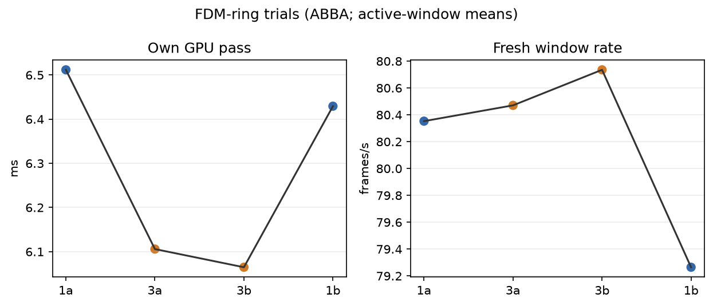
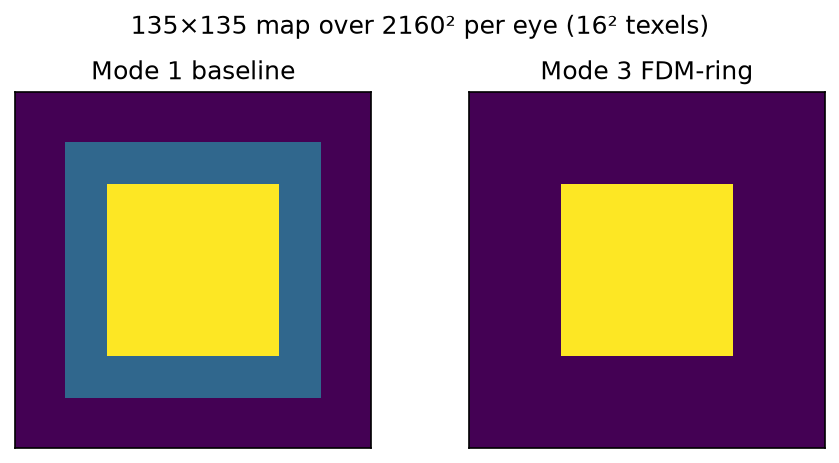
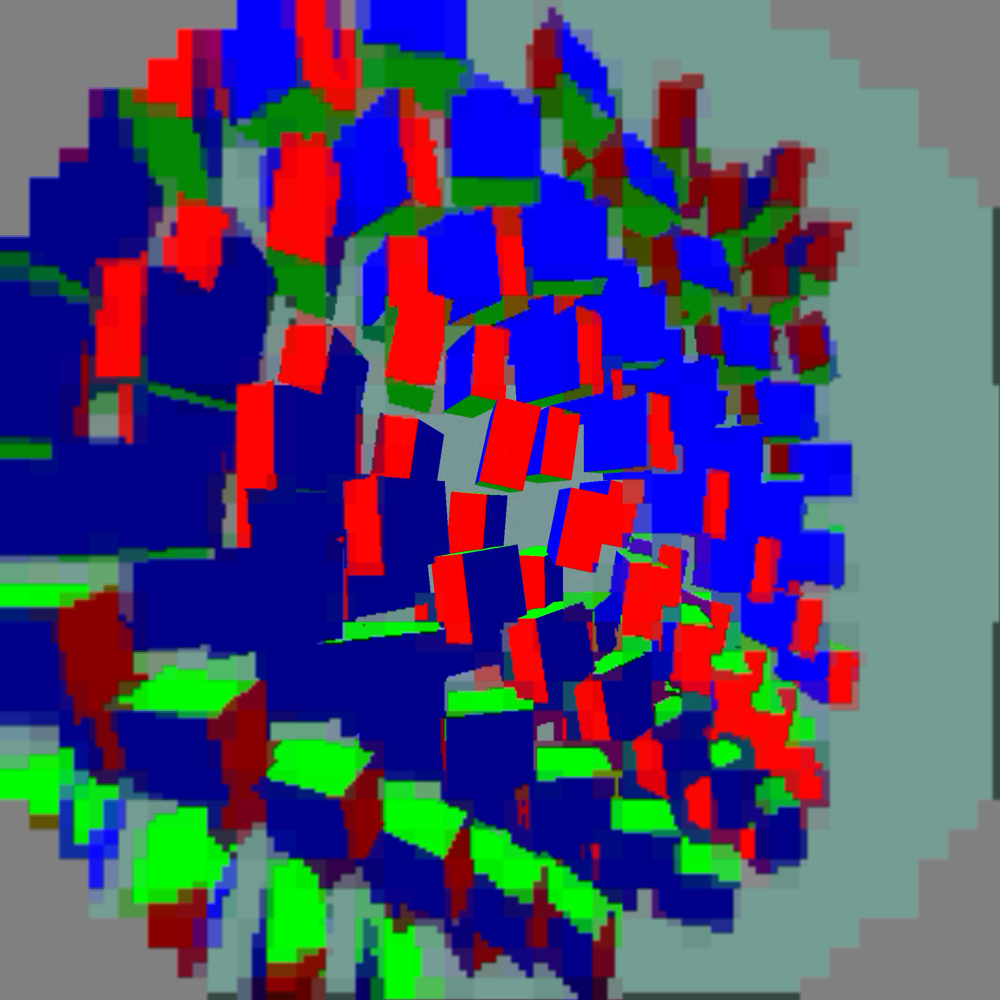

# FDM-ring positive result

Four completed 60-second synthetic moving-content trials ran ABBA (`1a`,
`3a`, `3b`, `1b`). The first 10 seconds of available telemetry were omitted;
results are active render-window means.

| path | own GPU pass | fresh source rate | source offset proxy |
|---|---:|---:|---:|
| mode 1 baseline | 6.4706 ms | 79.81/window-s | 63.92 ms |
| mode 3 FDM-ring | 6.0853 ms | 80.60/window-s | 60.06 ms |

Mode 3 reduced mean own-GPU pass by `0.3853 ms` (`5.95%`) and slightly
increased the fresh-source rate. Source offset is a harness proxy. There are
no photon-latency or 240-fps claims.

The output is 2160² per eye. The density map is 135×135 texels at 16² pixels.
The full centre remains unchanged (4225 protected cells); the middle ring is
5184 cells, changing density from 128 to 64. The native round codec region is
unchanged. `density-map.png` distinguishes those regions; `per-run.png` shows
the ABBA observations. `logs.tgz` contains raw client, scene, server, and
status logs. No APKs are included.

Yellow: density 255 in both axes (full shading). Blue: 128 (roughly half per axis). Purple: 64 (roughly quarter per axis). These are presentation shading regions; the separate codec quality boundary remains round.

## Visual check and deployment

This separate 25-second capture completed with the client alive. Screenshot readback was excluded from all timed trials. The centre remains visibly detailed; coarse peripheral blocks remain. This is a sanity check, not a matched-frame quality comparison. Reduced ring shading may increase aliasing during movement. Synthetic full-field animation does not prove performance under physical head movement.

The tested APK enables the opt-in `debug.wivrn.nx.fdm=3`; mode 1 remains available as the previous shading profile. Mode 3 is selected for the current Pico speed profile, with `peripheral_smooth=3`, `decode_priority=1` and `ready_wait_us=4000`. Output dimensions and codec sampling are unchanged. Capture was reset to zero and the test scene stopped after verification.
