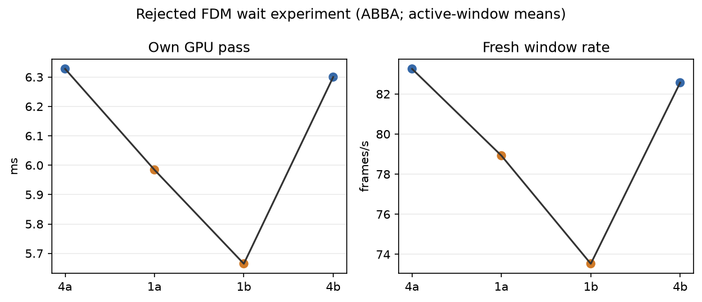

# Rejected FDM wait experiment

FDM 3, peripheral smoothing 3, priority 1, and constant 60-second synthetic
full-field trials ran ABBA: 4a, 1a, 1b, 4b. The first 10 valid render
telemetry seconds were excluded.

| ready wait | own GPU pass | fresh source rate | source offset proxy | repeats/render window |
|---|---:|---:|---:|---:|
| 4 ms baseline | 6.314 ms | 82.906/window-s | 61.003 ms | ~13.46 |
| 1 ms candidate | 5.824 ms | 76.225/window-s | 60.716 ms | ~26.56 |

The shorter wait lowers own GPU cost but reduces fresh-source rate by 8.06%;
the source-offset change is only about 0.29 ms, insufficient as a latency win.
Vendor MTP averages were 34.042 → 34.308 ms; these are not photon timing.
The experiment was rejected and the 4 ms setting restored. There are no
wall-clock FPS, 240-fps, or head-motion claims.

The repeat figure is a non-fresh-iterations proxy (it includes iterations
with nothing to show), not an exact repeat count. Logs include visibility
transitions and source-offset outliers (the 1b worst was 2908.6 ms), so the
source-age means are not a clean end-to-end latency proof.

`per-run.png` shows the ABBA observations; `logs.tgz` contains raw client,
scene, server, and status logs. `extra.jsonl` preserves repeat and vendor
metrics. Code reference: commit `1087f725`. No APKs are included.

