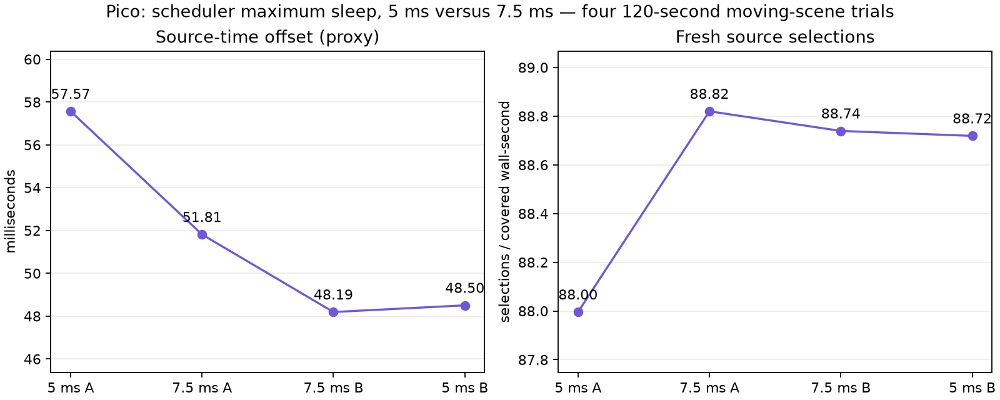

# JIT maximum sleep A/B — Pico 4, 90 Hz, 2026-09-10

Four 120-second `NXWARP_BENCH_FULL_FIELD` trials at the lower-resolution control profile, ABBA order:

- `base-a`, `base-b`: `debug.wivrn.nx.jit_max_sleep_us=5000` (selected/restored profile)
- `candidate-a`, `candidate-b`: `debug.wivrn.nx.jit_max_sleep_us=7500`

Warm summaries omit the first 10 seconds of available render telemetry. Mean source display-time offset was **53.04 ms** at 5 ms versus **50.00 ms** at 7.5 ms; fresh selections were **88.61/s** versus **88.94/s**. The lower offset is a source-time proxy, not verified photon latency. The candidate also had slightly higher own GPU cost (4.104 vs 4.058 ms, +1.12%), and cannot determine behavior at the current 2688 high-resolution profile. The [separate high-resolution trials](../res150-jit/README.md) favor keeping 5 ms for latency. Per-run drift is substantial.

`analyze_warm.py` parses render/decode windows; `analyze_stability.py` creates `coverage.jsonl`; `summarize.py` regenerates `summary.json`; `plot.py` creates `per-run.png` (requires matplotlib). Raw client, scene, server logs and status files are included. `run_trials.py` is included for provenance only; it changes device state when run.

