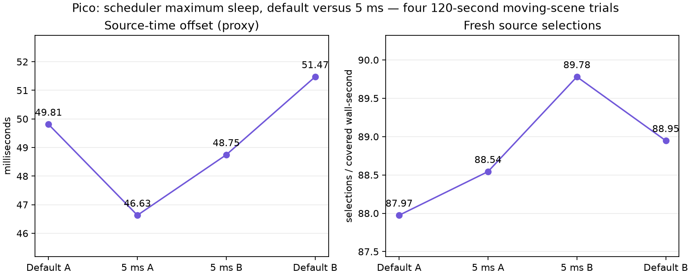

# Longer JIT cap validation: select 5 ms

Four 120-second synthetic moving-content Pico trials, ABBA order. Client `9cb034d3`, 1 ms ready wait, static-post 2, FDM 3, smoothing 3, decode priority 1, continuously awake. Each trial retained 60 render/decode telemetry windows and completed; zero session stops. Analysis retains all 54 valid post-warmup windows per trial, rather than just the final 30.

| Maximum scheduler sleep | Presentation GPU | Fresh selections / covered wall-second | Source-offset proxy |
|---|---:|---:|---:|
| Default 45 ms | 4.1398 ms | 88.46 | 50.6426 ms |
| 5 ms | 3.9204 ms | 89.16 | 47.6889 ms |

Means of per-run means. Both adjacent control/candidate pairs improve source offset (3.18 and 2.73 ms) and fresh selection. Select **5 ms maximum scheduler sleep**: mean source offset improves **2.95 ms**, with no observed delivery penalty in these runs. This bounds the scheduler's recovery probe; it does not force a 5 ms sleep or change its deadline budget. Ready-frame wait remains 1 ms.

This confirms the direction of the shorter trials, with a larger effect under these conditions. Thermal/load variation remains possible; GPU timing is not proof that changing CPU sleep reduces shader instruction cost. The native centre and smoothing are unchanged.

Source offset is predicted client display time minus the selected frame's server-stamped display time. It is a software proxy, not physical motion-to-photon latency. Logged fresh selections are not panel FPS; synthetic motion is not physically moving the headset. No 240 FPS claim.

Raw logs and per-run statuses are in `logs.tgz`. Extract it before running `python3 summarize.py <extracted-log-directory>`. Scripts retain the original machine paths for the live Pico harness. Selected property: `debug.wivrn.nx.jit_max_sleep_us=5000`; restart the client after changing it.
