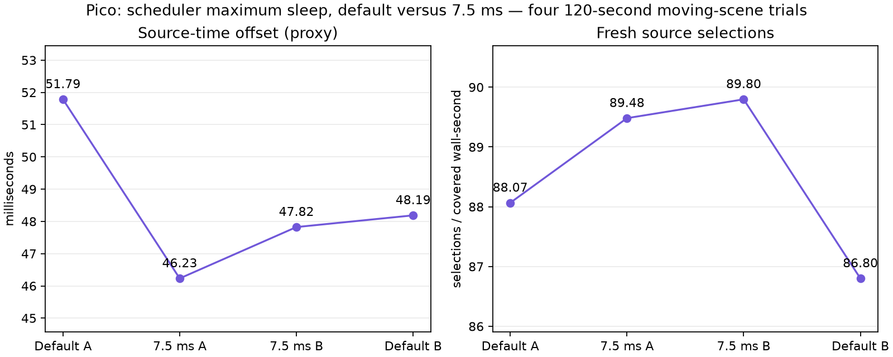

# 7.5 ms cap versus default: control-label correction

Four completed 120-second Pico trials, ABBA. **This was not the intended comparison against the selected 5 ms cap.** A runner string substitution requested 47500 microseconds for the controls; the client clamps that to 45000. Startup logs verify a 45 ms initial cap. Preserve the original script and summary keys as evidence; their `47500` key means a requested value, not an effective maximum.

| Effective maximum sleep | Presentation GPU | Fresh selections / covered wall-second | Source-offset proxy |
|---|---:|---:|---:|
| Default 45 ms | 3.9028 ms | 87.43 | 49.9861 ms |
| 7.5 ms | 3.6833 ms | 89.64 | 47.0278 ms |

Means of run means after ten telemetry seconds, all 54 remaining valid windows per run. Zero session stops. These data suggest improvement against the default; they do not establish an improvement over 5 ms. Keep **5 ms selected** pending a correct direct comparison.

Client `9cb034d3`; ready wait 1 ms, static-post 2, FDM 3, smoothing 3, priority 1, continuously awake Pico. Synthetic full-field motion, not physical headset motion. Source offset is a software display-time proxy, not photon latency. Fresh selections are not panel FPS. No 240 FPS claim.

Raw logs and per-run status files are in `logs.tgz`. Extract before running `python3 summarize.py <log-directory>`. The live runner retains original machine paths and the incorrect control request intentionally. The corrected direct experiment uses a separate directory.
