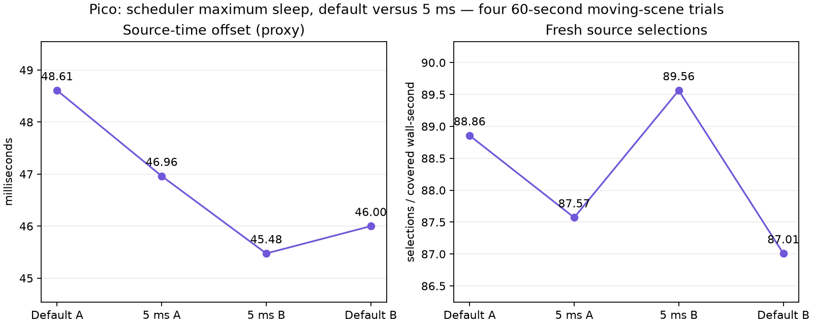

# Bounded JIT sleep: promising, experimental

Four 60-second Pico trials in ABBA order compare the default 45 ms maximum sleep against a 5 ms maximum. Ready-frame wait remains 1 ms, static-post 2, FDM 3, smoothing 3 and decode priority 1. Continuous awake mode; synthetic full-field motion, not physical headset motion. Client base `060474e4` plus `experiment.patch`.

| Maximum sleep | Presentation GPU | Fresh selections / covered wall-second | Source-offset proxy |
|---|---:|---:|---:|
| Default 45 ms | 3.9250 ms | 87.93 | 47.3042 ms |
| 5 ms | 3.5354 ms | 88.57 | 46.2188 ms |

Means of per-run means after the first ten telemetry seconds. All four completed trials had zero session stops. Source offset falls 1.09 ms; fresh selection improves on average but worsens in the first pair. Substantial per-run variation warrants longer validation before selecting this profile. GPU time changes do not establish that a CPU sleep cap directly reduces shader cost.

The default scheduler repeatedly settles near a 0.6 ms cap and probes upward by a refresh period. A smaller maximum bounds that probe. This experiment adds a startup-only Android property `debug.wivrn.nx.jit_max_sleep_us` (0–45000 microseconds); absent property preserves existing behavior. It does not force a sleep when the measured deadline budget leaves no room. Current user profile retains the default maximum pending validation.

An earlier control trial failed its scene-progress check at 49.99 seconds. The scene stopped advancing; device-loss errors appeared during cleanup. The cause is unresolved. Its logs are retained under `failed-control` in `logs.tgz` and excluded from the table. The owned streamer was restarted before all four completed trials.

Source offset compares predicted client display time with the selected frame's server-stamped display time, not photons. These results do not prove 240 FPS or physical motion-to-photon latency. Logs, analysis scripts and the temporary source patch are included; runner scripts preserve the original machine paths.
