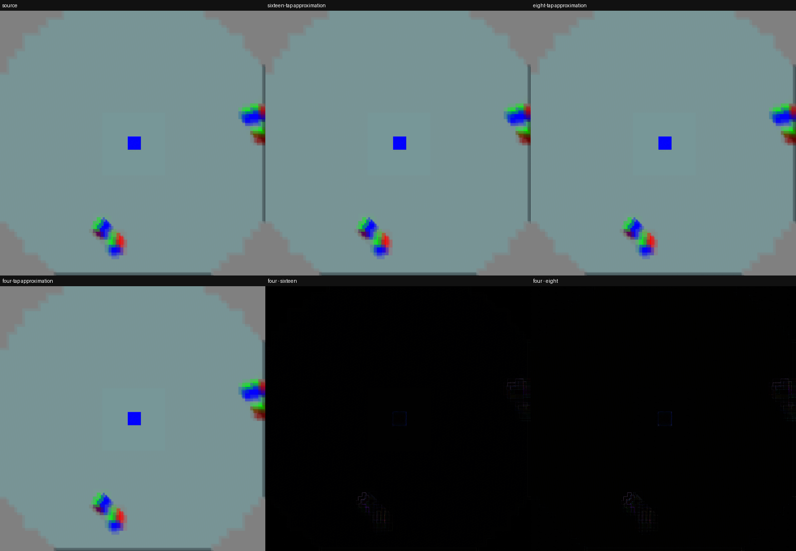

# Eight-tap Kuwahara approximation

An opt-in approximation replaces four samples per quadrant with two bilinear
block means. It retains four quadrant choices and luminance scoring, but may
choose a different edge and lose detail. The existing kernel remains available.

Pico 4 / Adreno 650, standalone RGBA fragment probe, two 2160×2160 draws per
frame pair; source texture 2176×2176, synthetic input. Four alternating-order
comparisons, each minimum of three repetitions of 12 pairs after one warmup.
This measures the complete probe draw, not live NV12 presentation or latency.

| Kernel | Mean of four run minima |
|---|---:|
| Existing: 16 extra samples + base | 11.332 ms |
| Approximation: 8 extra samples + base | 7.030 ms |

Reduction: **38.0%** in this probe. At roughly 7 ms, the approximation
is still expensive; it is not enabled in the low-latency user profile.
`debug.wivrn.nx.kuwahara_fast=1` chooses it when low-poly filtering is enabled
and the full kernel is disabled. It adds no temporal history or extra pass.

The default low-latency profile instead uses a cheaper peripheral blur.
Raw observations: [pico.log](pico.log), [summary.json](summary.json).

Rebuild using Android NDK clang++ (`-O2 main.cpp -lvulkan -o probe`) and
`glslangValidator -V` for both shaders. Push the binary and `.spv` files to
one directory on the Pico, then run `./probe 12 3` there.

This CPU reference filters the existing `compact-direct/native-final-eye0.png`
capture at its original 2160×2160 size before reducing the montage for display.
It is a display-image approximation, not a readback of the live NV12 shader.
Run `cpu_compare.py --input PATH_TO_CAPTURE` to reproduce. This mostly smooth
frame is not a sufficient quality assessment of detailed games or motion.
