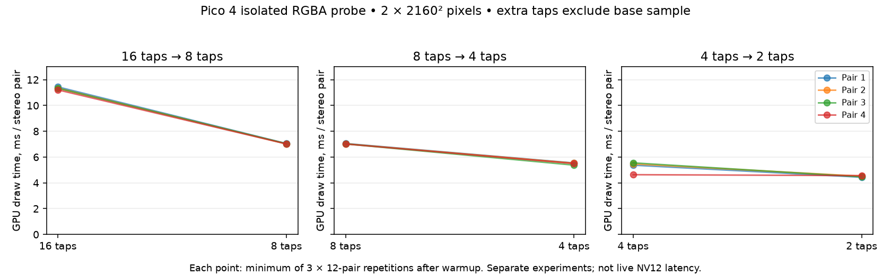

# Two-tap directional approximation

Two opposing diagonal bilinear samples are compared with the shared centre.
The closest luminance match wins, and its colour is averaged with the centre.
This sacrifices two quadrant directions and most of Kuwahara's variance
estimation. It is a directional edge-aware smoother, not equivalent Kuwahara.

Pico 4 isolated RGBA probe, two 2160×2160 draws; identical methodology to
[four-tap](../kuwahara-four-tap/RESULTS.md). Each row is the best of three
repetitions of twelve frame pairs after warmup; order alternates.

| Run | Four taps (ms) | Two taps (ms) |
|---|---:|---:|
| 1 | 5.373 | 4.436 |
| 2 | 5.469 | 4.517 |
| 3 | 5.552 | 4.468 |
| 4 | 4.634 | 4.563 |

Mean of run minima: **5.257 → 4.496 ms (14.5% lower)**.
The four-tap baseline varies substantially; the last pair saves only
0.071 ms. Do not infer a guaranteed live latency reduction.

Opt-in `debug.wivrn.nx.kuwahara_fast=3`, with low-poly enabled and its full
kernel disabled. Defaults remain unchanged. This spatial kernel adds no frame
buffer or temporal history.

[Raw GPU observations](pico.log), [summary](summary.json), and shader/harness
source are included. Build instructions match the eight-tap experiment.

