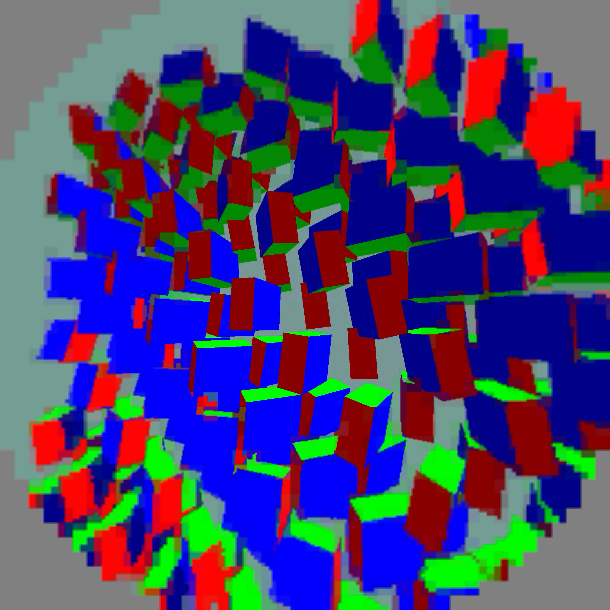
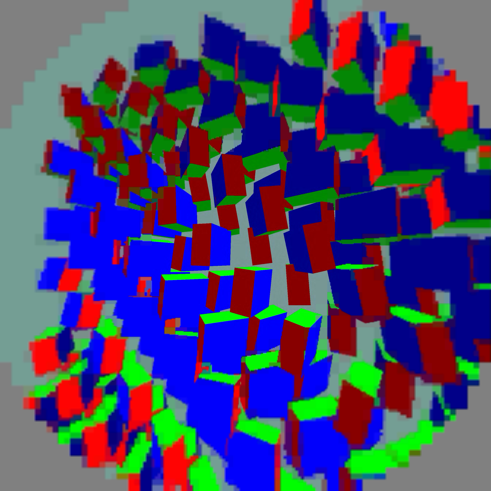

# Larger centre: corrected live integration and smoothing trials

**The 1024px native centre now renders through the Pico pipeline.** WiVRn commit `ff0bc57f` fixes the output pool: it queries the decoder dimensions instead of allocating the old 1152² image for a 1440² packed result. The native coordinate system remains 2688² per eye; the presentation shader maps it into the packed texture. Changing that coordinate system to packed dimensions would introduce another distortion.

## Actual Pico captures

Selected lightweight smoothing, left and right eye. These are application presentation-pass readbacks, before headset lens composition—not photographs of the physical display. The full-field scene is animated. Both images were inspected for the previous layout distortion; no buffer crop/stretch was apparent after the fix. Human head-motion comfort still requires user testing.

## Smoothing decision

Mode 5 retains the cell-coordinate interpolation and adds four bilinear taps, each offset by half a retained texture pixel along both axes. At texel centres this gives a 3×3 binomial footprint. Coordinates clamp within the current eye. Blend strength grows continuously with distance outside the native centre; native centre tiles remain untouched. There is no history buffer or extra presentation pass.

A wider four-tap cross produced doubled edges and was rejected. A nine-tap Gaussian had a small visual benefit for substantially more presentation GPU time and was also rejected. The selected filter softens edges but **does not eliminate large palette blocks**. The encoder still represents peripheral tiles using coarse colour approximations. More blur cannot recover those missing colours; improving that representation is the next quality problem.

## Functional motion test and cost

Separate 30-second headless gamescope trials on the Pico, 2688² per eye, 1024px centre, with full-field animated content. Client processes remained alive and scene animation advanced through each trial. Screenshots were requested during the runs. The following post-warm-up window means are diagnostic, **not a controlled A/B performance claim**: screenshot stalls, short duration, scene timing and device state limit comparison.

| Metric | Selected four-tap blend | Rejected nine-tap Gaussian |
|---|---:|---:|
| Fresh selections / second (mean logged windows) | 42.43 | 36.21 |
| Decode GPU | 14.92 ms | 14.87 ms |
| Presentation GPU / iteration | 5.33 ms | 7.94 ms |
| Source-offset proxy | 88.96 ms | 100.90 ms |

The larger native region itself is expensive. **This profile does not deliver 90 fresh FPS, let alone 240.** Source offset is not measured motion-to-photon latency. There are only seven post-warm-up presentation windows per final trial, so no frame-level percentiles or sustained thermal conclusion are inferred.

The final APK restores the already-tested four-tap code after rejecting the Gaussian. User profile: `compact_large_centre=1`, `peripheral_smooth=5`, `test_eye_size=2688`, with server `NXVC_PLANAR_LARGE_CENTRE=1` and the existing rounded wide-ring configuration. The synthetic scene is stopped before returning the headset for user apps.

Artifacts: [selected summary](binomial-summary.json), [Gaussian summary](gaussian-summary.json), [raw logs](live-logs.tar.gz), [analyzer](analyze_warm.py), and the per-run status files alongside this report. [Host packing validation](../large-centre/README.md) remains separate from these integrated checks.
