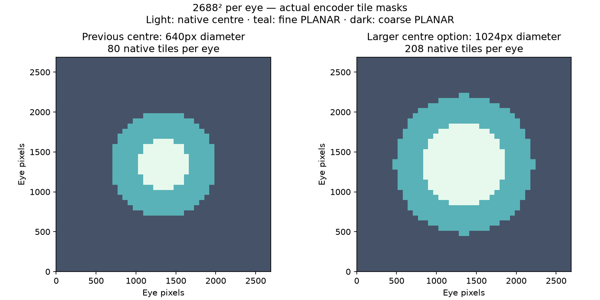

# Larger native centre and peripheral spatial smoothing

**Integration correction:** the first WiVRn integration distorted the view because its output pool still used 1152² while the decoder produced 1440². Decoder-only checks missed that integration error. WiVRn now queries the decoder's image dimensions directly. The corrected larger-centre profile has subsequently run through the live Pico presentation pipeline with both-eye captures; see [live validation](../large-centre-live/README.md).

User feedback at 2688² per eye: the native centre was too small and peripheral blocks were conspicuous. This is a **quality experiment**, with no new controlled Pico latency result yet.

| Geometry per eye | Previous | Optional larger centre |
|---|---:|---:|
| Native centre diameter | 640 px | 1024 px |
| Native tiles in rounded mask | 80 | 208 |
| Compact storage extent | 1152² | 1440² |
| Stereo NV12 bytes | 3,981,312 | 6,220,800 |

The diameter increases 60%; the tile mask retains 2.6 times as many native tiles. Packed pixel storage increases 56.25%, so this must not be described as a speed improvement. The fine PLANAR ring expands with the centre. The figure shows the actual tile-centre selection rule, not a headset screenshot.

## Spatial smoothing

WiVRn smoothing mode 4 retains the single-sample cell interpolation from mode 3 and adds two diagonal spatial samples. The weights are 1/2 for the original sample and 1/4 for each neighbour. Radius grows from 2 to 8 source pixels outside the native mask. Native centre tiles stay unfiltered; sample coordinates clamp to the current eye. This runs in the existing presentation pass, with no temporal history or additional pass. It targets block discontinuities, but does not recover discarded detail or guarantee invisible tile boundaries. Its Pico GPU cost and perceived quality still need comparison.

## Validation

Host RX 7900 XTX/RADV: a deterministic 2688² stereo fixture was encoded with the larger centre, then decoded to full-size and compact NV12. All **6,220,800 compact bytes** match the corresponding native luma and interleaved chroma samples, across both eyes and packing boundaries. Reproduce with `./run.sh /path/to/build/bin` (Python NumPy required). The runner enables the rounded mask, wide fine ring, and colour palette used by the selected profile. See [run log](run.log), [validation log](validation.log), [full comparison](full-exact.json), and [checker](validate.py). The default compact path also produces its expected 3,981,312-byte extent; this size check alone is not a full old-versus-new regression test.

The selected specialized PLANAR flat64 kernel also produces identical bytes to the generic compact decoder on this fixture. Core encoder/decoder, WiVRn server, and Android release APK builds passed. The corrected larger profile has separate live validation linked above; these checks do not establish fresh-frame rate, motion quality, or motion-to-photon latency.

## Opt-in integration

Pair server `NXVC_PLANAR_LARGE_CENTRE=1` with client `debug.wivrn.nx.compact_large_centre=1`, alongside existing quarter-centre, compact, round, and wide-ring settings. The core decoder flag is `NXVC_VKD_FLAG_COMPACT_LARGE_CENTRE`; CLI option `--compact-large-centre`. This is an explicit integration agreement, not a new negotiated bitstream feature. Restart both sides together. It applies only to the 2688²-per-eye compact stereo profile; legacy defaults stay unchanged.

Select client `debug.wivrn.nx.peripheral_smooth=4` for the added spatial filter, or `3` for the cheaper existing interpolation. Returning both larger-centre switches to 0 restores the prior geometry.
