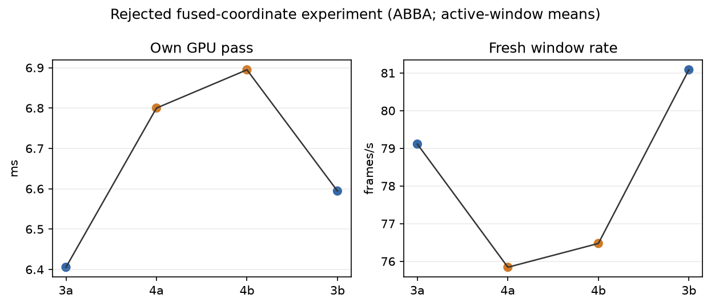

# Rejected fused-coordinate experiment

This archive records the rejected fused-coordinate candidate. Four completed
60-second synthetic moving-content trials ran ABBA: `3a`, `4a`, `4b`, `3b`.
The first 10 seconds of available telemetry were excluded; values are active
render-window means.

| mode | own GPU pass | fresh source rate | source offset |
|---|---:|---:|---:|
| baseline mode 3 | 6.500 ms | 80.10/window-s | 62.73 ms |
| fused candidate mode 4 | 6.847 ms | 76.16/window-s | 68.28 ms |

The candidate regressed own GPU by `+0.347 ms` (`+5.34%`), reduced fresh
source rate, and increased source offset. It is therefore archived and
rejected. These measurements make no motion-to-photon or wall-clock FPS claim. The scene moves across the full field; this is not a mechanically moved headset test.

`verify_fused.json` reports native samples identical, with maximum compact
coordinate error `0.0003319`; this is coordinate arithmetic verification, not
bit-exact GPU colour readback. `per-run.png` shows the ABBA observations and
`logs.tgz` contains the raw client, scene, server, and status logs. No APKs are
included.

The candidate passed source-pixel coordinates directly into compact-atlas mapping, bypassing normalization followed by multiplication. It retained one texture read and the same native-region guard. Less arithmetic did not translate into less measured GPU time on this device.
