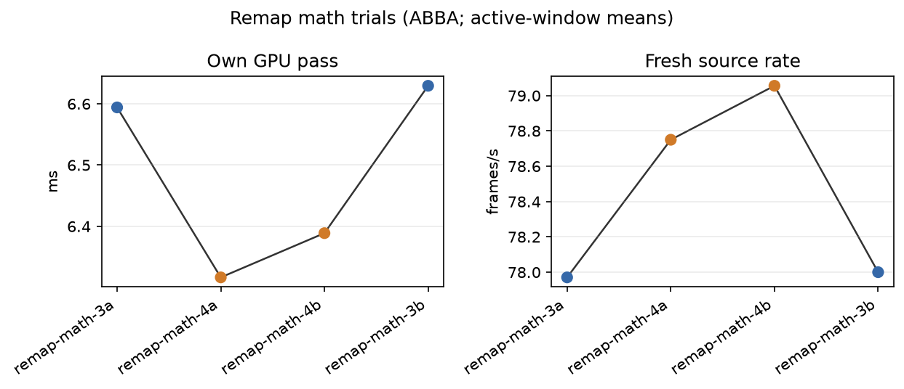
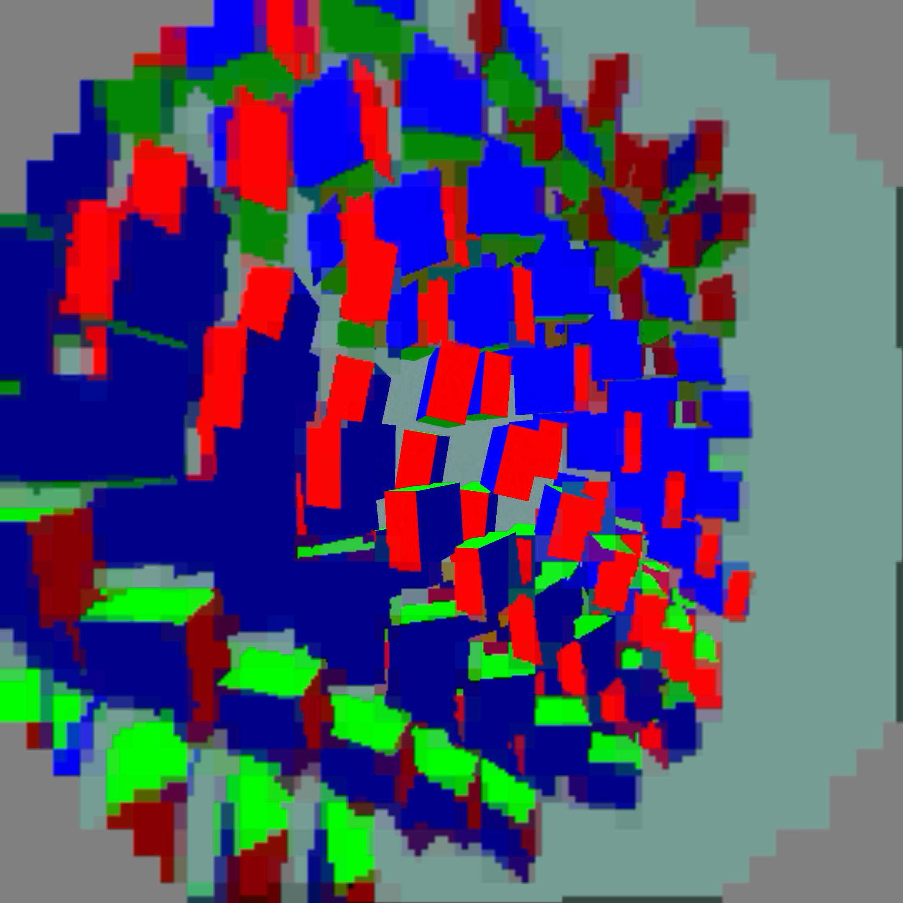

# Remap math validation and warmup-excluded trial report

The candidate simplifies the existing mode-3 sampling maths. The temporary
mode-4 switch used to compare implementations was removed before integration;
there is no new user configuration to enable.

## CPU verification

`verify_remap.json` records 9,469,952 stereo pixel centres plus 200,000 random
subpixel points (9,669,952 total). All mask and cell checks passed (`0` mismatches); maximum
source-pixel coordinate error was `2.98e-7` and mean error `2.76e-12`.

## Pico trials

Four completed 60-second synthetic moving-content trials ran in ABBA order:
`3a`, `4a`, `4b`, `3b`. The first 10 seconds of available telemetry were
excluded before computing active render-window means. All four status captures
report completion and the trial checks passed.

| path | own GPU pass (ms) | fresh source (/window-s) |
|---|---:|---:|
| mode 3, 3a | 6.5941 | 77.9706 |
| mode 4, 4a | 6.3167 | 78.7500 |
| mode 4, 4b | 6.3889 | 79.0556 |
| mode 3, 3b | 6.6294 | 78.0000 |
| mean mode 3 | 6.6118 | 77.985 |
| mean mode 4 candidate | 6.3528 | 78.903 |

The candidate mean own-GPU pass is `0.2589 ms` lower (`3.917%`) and fresh
source rate is `0.918/window-s` higher. These are active-window telemetry
means. They are not wall-clock FPS or photon-to-photon latency claims.

`per-run.png` plots the four observations in ABBA order. `logs.tgz` contains
the raw client, scene, server, and status captures. The JSON, verifier, and
analysis scripts preserve the calculation inputs and method. No APKs are
included.

## Final integration check

The simplified path was installed as mode 3 and passed a separate 25-second
moving-scene capture run. Capture readback was excluded from timing trials.
The image below is an actual Pico presentation readback, not an image-quality
difference test. The native centre remains sharp; coarse palette blocks remain.

