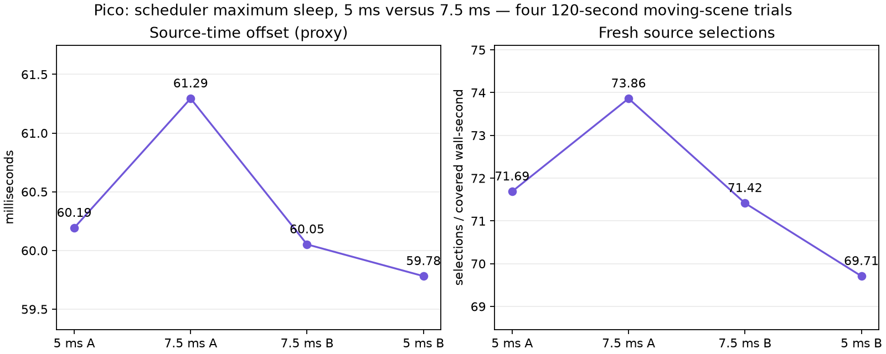

# 2688 scheduling: retain 5 ms for latency

Four completed 120-second Pico runs, ABBA, 2688² per eye. Client `ef05194d`, codec `ce340da`; ready wait 1 ms, static-post 2, FDM 3, smoothing 3, decode priority 1, continuous awake. All 54 valid post-warmup windows retained per trial; zero session stops.

| Maximum scheduler sleep | Presentation GPU | Fresh selections / covered wall-second | Source-offset proxy |
|---|---:|---:|---:|
| 5 ms | 3.9333 ms | 70.70 | 59.9870 ms |
| 7.5 ms | 3.8870 ms | 72.64 | 60.6731 ms |

Mean of run means. Both pairs show a higher source offset with 7.5 ms. Fresh selections improve, but the requested latency preference favors retaining **5 ms**. A larger sleep that helped at the smaller resolution does not automatically help this GPU load.

These are software timing and source-selection metrics, not photon latency or panel FPS. Synthetic moving content is not physical headset motion. No 90/240 fresh-frame claim. Raw logs and individual statuses are in `logs.tgz`; extract before running `python3 summarize.py <log-directory>`. Live scripts preserve the original machine paths.
