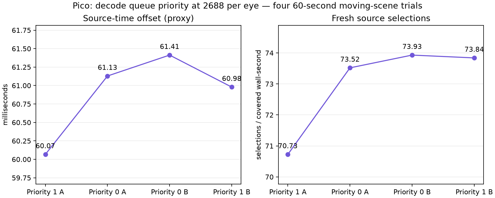

# 2688 decode priority: retain priority 1

Four completed 60-second Pico trials, ABBA. 2688² per eye, ready wait 1 ms, scheduler maximum sleep 5 ms, FDM 3, static-post 2, smoothing 3, continuously awake. All trials had zero session stops.

| Decode priority property | Presentation GPU | Fresh selections / covered wall-second | Source-offset proxy |
|---|---:|---:|---:|
| 1 (selected) | 3.8854 ms | 72.28 | 60.5229 ms |
| 0 | 3.8771 ms | 73.73 | 61.2708 ms |

Mean of per-run means after ten telemetry seconds. Priority 0 improves fresh delivery modestly but increases source offset by 0.75 ms. Keep priority 1 for the user's latency preference. GPU-pass difference is tiny and is not a demonstrated optimization.

Client `ef05194d`, codec `ce340da`. These are software source-age/selection metrics, not photons or physical display FPS. Synthetic moving content is not mechanically moving the headset. No 90/240 fresh-frame claim. Logs and per-run statuses are archived in `logs.tgz`; extract before running `python3 summarize.py <log-directory>`. Live scripts preserve original machine paths.
