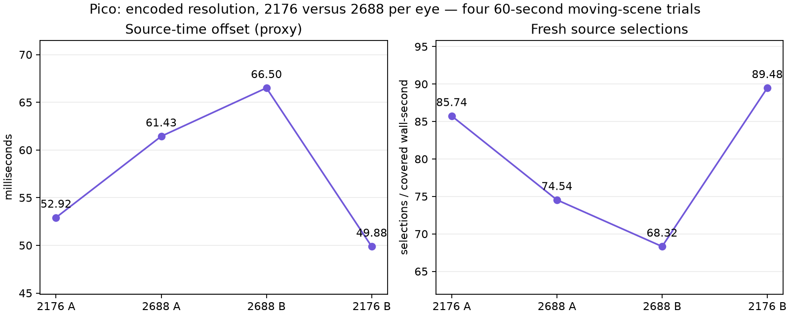
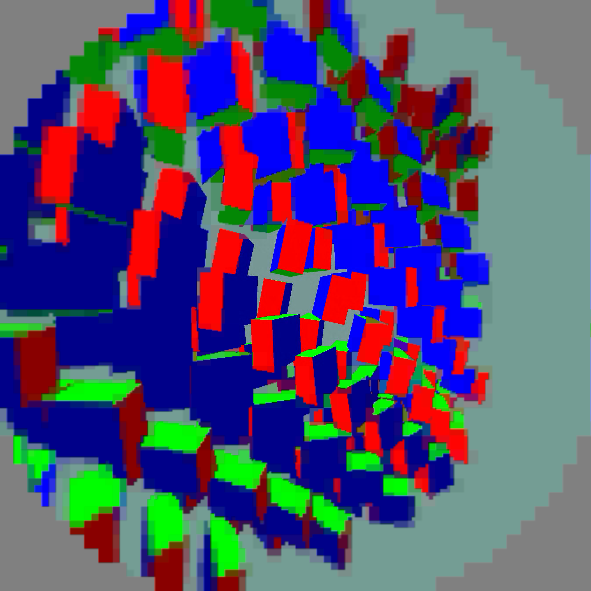
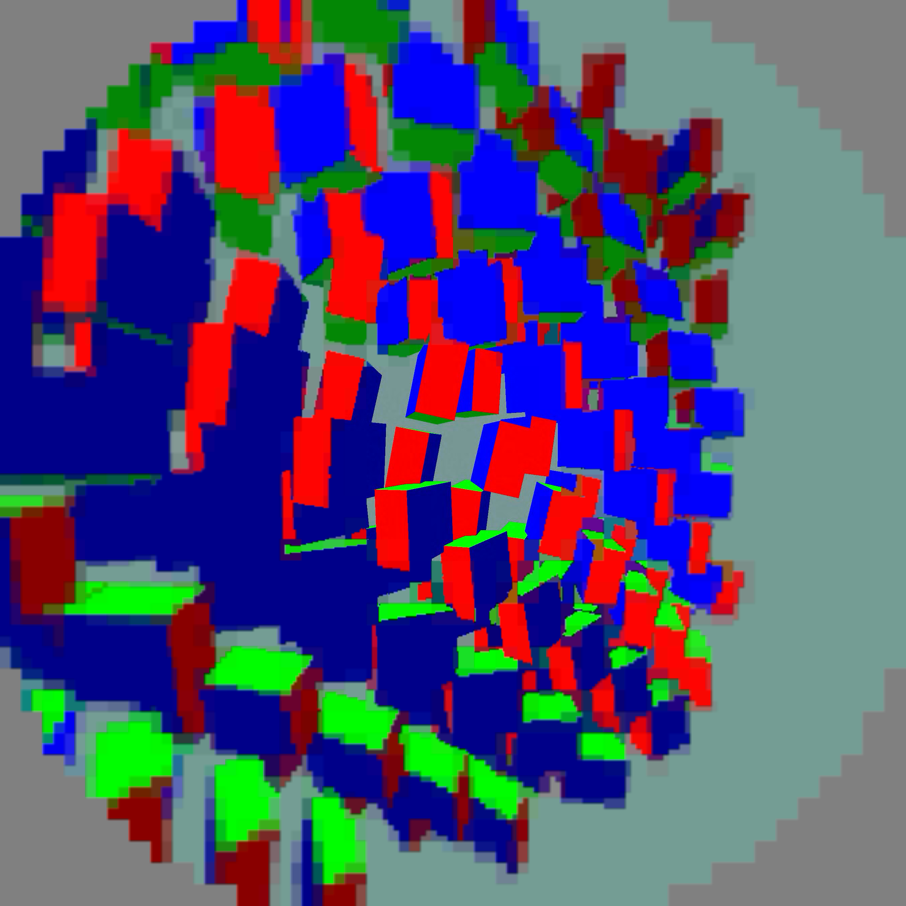

# Larger Pico baseline: 2688×2688 per eye

The compact decoder and presentation sampler now support both 2176² and 2688² eyes. 2688 is the next tile-aligned size above the 150%-pixel target: **152.6% of the original encoded pixels**. Native centre width grows from 512 to 640; packed storage grows from 928² to 1152² per eye. The larger presentation swapchain also measures 2688² per eye, versus the former 2160² display output (154.9% of display pixels).

Four completed 60-second moving-content Pico trials, ABBA. 1 ms ready wait, 5 ms maximum scheduler sleep, static-post 2, FDM 3, smoothing 3, priority 1, continuous awake. No session stops. Means of run means after ten telemetry seconds:

| Per-eye encoded size | Decode GPU | Presentation GPU | Fresh selections / covered wall-second | Source-offset proxy |
|---|---:|---:|---:|---:|
| 2176² | 4.406 ms | 4.100 ms | 87.61 | 51.40 ms |
| 2688² | 6.542 ms | 4.342 ms | 71.43 | 63.97 ms |

The larger profile is the next optimization baseline, **not yet a steady 90 fresh frames/s mode**. Decode cost rises about 48.5%, while presentation cost rises about 5.9%. Thermal/load variation and changing fresh-frame cadence complicate direct cost attribution. Large-profile pass A is roughly 2.5 ms and pass B roughly 3.8 ms in late windows; these are the next optimization targets.

## Actual Pico capture

Separate 25-second capture run; excluded from timing. Both eye images were inspected. Centre remains sharp; peripheral blocks remain conspicuous. Captures are display output, not source-reference comparisons.

The exhaustive axis-layout check matches every legacy 2176 tile and verifies contiguous, unique packed coverage for 2688. Shader layout is specialized, avoiding runtime division by a variable eye size. Compact allocation, plane queries and borrowed-output validation agree with the larger layout.

Fresh selections are logged source-frame selections, not physical panel FPS. Source offset is predicted client display time minus selected frame display time, not photon latency. Synthetic full-field animation is not physical head motion. No 240 FPS claim.

Raw logs and individual statuses are in `logs.tgz`; extract before running `python3 summarize.py <log-directory>`. Live harness paths are machine-specific. `debug.wivrn.nx.test_eye_size=2688` requests the larger size on reconnect; zero preserves configured sizing. Keep the former profile available for recovery.
