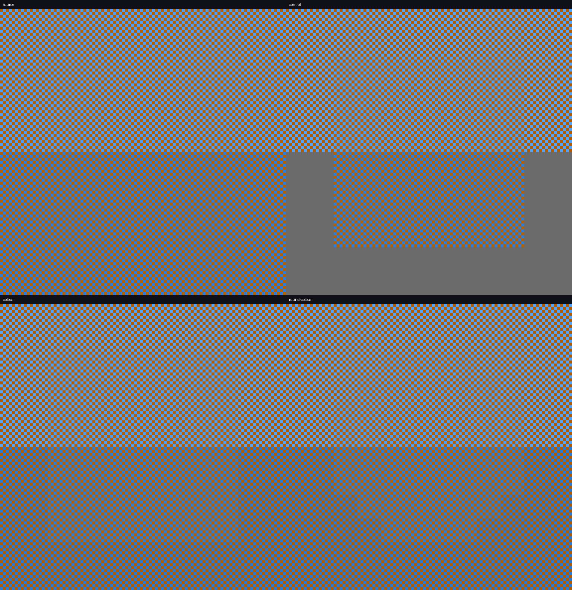
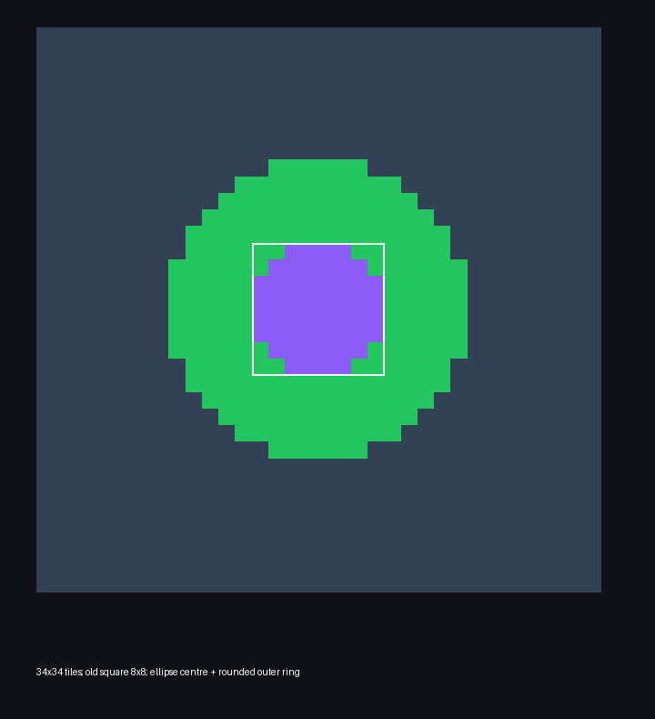
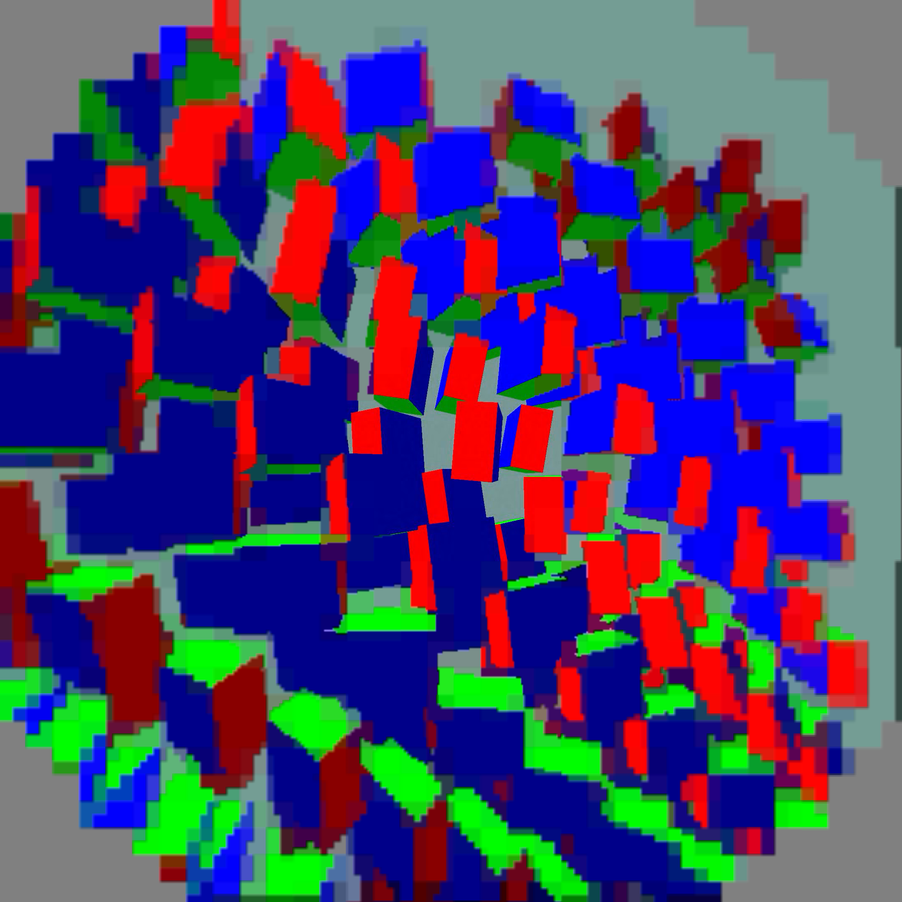

# Peripheral PLANAR colour and rounded centre

This is a synthetic 8-frame YUV420 test at 4352x2176 (two 2176-pixel eyes),
QP 40, inter, Lite entropy, GPU PLANAR centre, and the existing wide ring.
It measures decoded pixels and bitstream size only; it is not evidence of live
90 fps latency.

The control uses the existing luminance-only peripheral palette selector. `colour`
enables `NXVC_PLANAR_COLOUR=1`, which lets each PLANAR tile's palette split
(64 coarse or 256 fine cell averages) follow the strongest chroma axis when
chroma variance warrants it. `round-colour`
also enables `NXVC_PLANAR_ROUND=1`: the old 8x8-tile centre square is replaced by
an ellipse, and its outer ring uses the area-preserving factor sqrt(pi)/2.
Both flags are opt-in and require no wire or APK changes.

| variant | bytes | Y MAE | U MAE | V MAE |
|---|---:|---:|---:|---:|
| control | 1,381,944 | 7.895 | 55.270 | 41.407 |
| colour | 1,381,944 | 8.393 | 38.920 | 28.872 |
| round-colour | 1,264,032 | 8.459 | 38.913 | 28.847 |

Relative to control, colour-aware splitting reduces U/V MAE by 29.6%/30.3%,
at a 0.498 Y-MAE increase (+6.3%) and unchanged bytes. Rounded geometry has
essentially the same colour error (−0.01% U, −0.06% V relative to colour),
reduces bytes by 8.5%, and raises Y MAE by 0.066 versus colour (+0.8%).

The exact per-eye test geometry is 34x34 codec tiles. The former quarter centre
is 8x8 tiles at origin (13,13), corresponding to a 512x512 rectangle. The
rounded selector uses the same normalised ellipse (`radius <= 1`) and computes
the ring distance from `ceil(max(0, radius*sqrt(pi)/2 - 1) * 4)`. The native
check records 52 unchanged native tiles per eye across all three planes. The diagrams
and crop montage are generated by [`compare.py`](compare.py).

Reproduce the visual artifacts after placing the decoded `.yuv` files and
`quality.json` beside the script:

```sh
python3 compare.py --root . --width 4352 --height 2176
```





Purple: native INTRA centre. Green: fine PLANAR cells. Slate: coarse PLANAR.
White outline: the previous native square. Each step is one 64-pixel codec tile;
the round mask is not a per-pixel circle. Outer radius is widened to approximately
preserve the previous square ring area, while native-centre diameter stays fixed.

## Pico decoder validation

All eight frames of each variant matched the CPU reference exactly in all three
planes, including compact output and the former centre's four corner tiles.
[`pico-compare.json`](pico-compare.json) records the retained-sample comparisons;
[`pico_validate.sh`](pico_validate.sh) and [`validate_pico.py`](validate_pico.py)
record the decoder invocation and comparison. Short decoder timing logs are
provided for diagnosis, not as a controlled live performance claim.

## Cheapest presentation softening

The four-extra-sample blur was rejected for the user profile after the
[live motion test](live-blur/README.md): it raised presentation GPU time from
5.71 to 10.23 ms and reduced fresh updates from 80.65 to 55.12/s.

The selected `debug.wivrn.nx.peripheral_smooth=3` mode repositions the single
existing bilinear sample to spread interpolation across PLANAR cell edges.
No additional texture reads, image history, or rendering pass. It preserves
native tile coordinates and requires compact rounded wide-ring geometry.
This softens transitions, but does not recover lost detail or remove every
palette boundary. Chroma interpolation and region borders can still look uneven.

In the follow-up [live pair](live-remap/README.md), remap measured 6.28 ms
presentation GPU / 73.59 fresh updates per second; the following no-smoothing
control measured 5.71 ms / 80.60 per second. These are descriptive window means
from one pair with visibility transitions, not proof of a fixed added latency.



Actual 2160×2160 left-eye readback from a separate animated capture run,
excluded from timing measurements because image readback stalls the queue.
Block and palette boundaries remain visible; this is mild softening.
The native centre retains detail. [Installed profile](ACTIVE_USER_PROFILE.json),
[build hashes and encoder environment](live-manifest.json).
