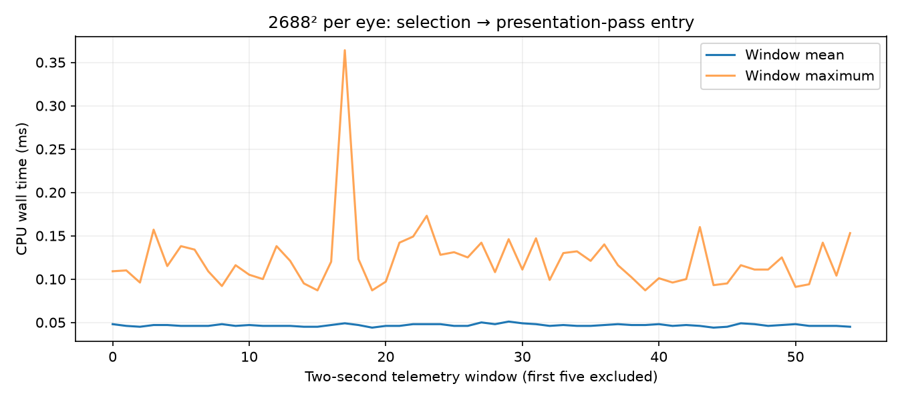

# Frame selection is already close to presentation-pass entry

A 120-second headless full-field animated Pico run at **2688×2688 per eye**, using the selected 64-thread compact decoder. Client `e4fb1eba`, codec `2239f1d`; ready wait 1 ms, JIT cap 5 ms, decode priority 1, FDM 3, static-post 2, smoothing 3. Capture disabled. The client remained alive and the scene advanced through 117.99 seconds; 60 render and decode telemetry windows, zero session stops.

## Measurement

The new aggregate probe starts immediately after `common_frame()` returns and ends immediately before `defoveator->defoveate()`. It includes swapchain acquisition/wait. Only actual pass calls count; cached re-presentation and gated frames do not. This measures CPU wall time up to pass entry, **not command submission, GPU completion, or photon latency**.

After excluding the first five two-second windows, **8,514 actual calls** produced a weighted mean of **0.0467 ms** and a maximum of **0.364 ms**. Means are reconstructed from logs rounded to 0.001 ms. Moving selection to pass entry could therefore recover very little time in this workload; it does not address the tens of milliseconds in the source-offset proxy.



## Why faster decode can coexist with fewer fresh selections

An audit of the [previous four sustained runs](../compact-flat64-long/README.md) found zero backward selections and zero selections older than an available frame in all 240 render windows. Their reported decoder throughput was 79.3/80.0 FPS with 256 threads and 81.8/81.7 FPS with 64 threads, while fresh selections decreased in the paired experiment. Decoding and selecting have different cadence and accounting windows. These aggregate logs are consistent with arrival timing and skipped intermediate frames; they do **not** establish an arrival-clustering cause or a stale-selection bug.

This diagnostic run measured approximately 84.7 decoded frames/s, 77.5 fresh selections per active telemetry second, 6.40 ms decode GPU, 4.04 ms presentation GPU per render iteration, and 62.0 ms source-offset proxy. It is a single instrumented run, not a controlled performance improvement. No 90/240 fresh-FPS or physical head-motion claim. The remaining investigation should focus on GPU work and arrival/queue timing, rather than a late-selection rewrite.

## Reproduce

Build the custom WiVRn NX client with `-Pnxwarp_dir=<nx-warp checkout> -Psuffix=.warp`, install it, and run the existing headless harness:

```sh
python3 nx-scratch/motion-live/capture_live.py selection-delay 3 1000 120 0 3
tar xf logs.tgz
python3 analyze.py selection-delay-client.log > timing.json
python3 plot.py
```

`analyze.py` deliberately excludes the first five probe windows; the general live summary uses its existing ten-second timestamp filter, yielding a slightly different window count. `audit_previous.py <directory>` expects the four original `compact-flat64-long-*-client.log` files. No visual algorithm changed, so the existing [high-resolution output capture](../compact-flat64/README.md) remains representative. The selected profile is unchanged.
