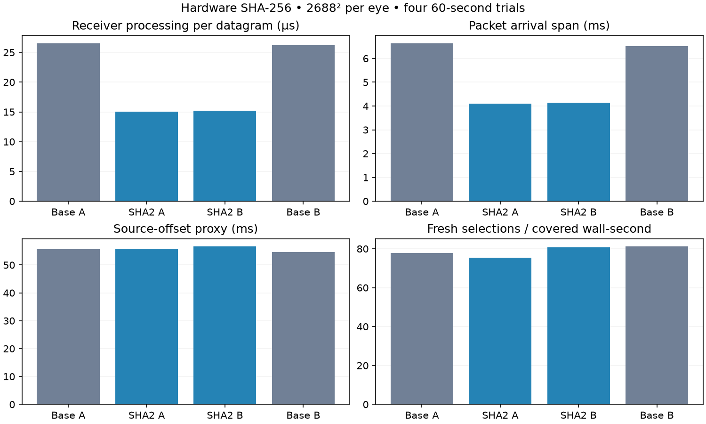
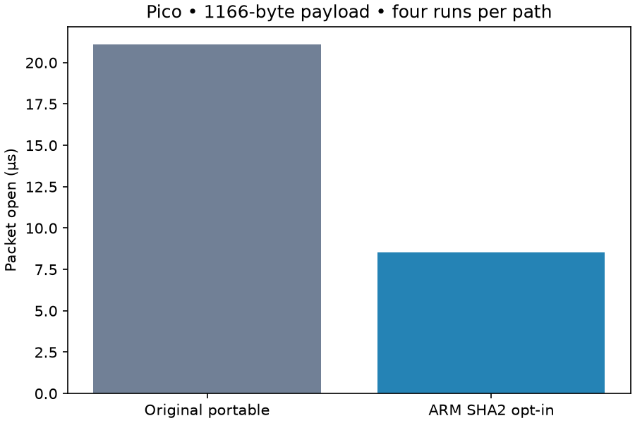

# Hardware SHA-256: cheaper packets, no live latency win yet

**Retain as an opt-in experiment; leave the latency-first profile off.** The transport's `NullAead` backend is not a no-op: it constructs a SHA-256 counter keystream and HMAC tag inside WiVRn's existing encrypted connection. The Pico advertises ARM SHA2 support. Using those instructions accelerates the same SHA-256 block computation; packet format, key derivation, tag verification and the outer connection are unchanged.

## Live comparison

Four completed 60-second full-field animated Pico trials at 2688² per eye, Base A → SHA2 A → SHA2 B → Base B:

| Metric | Portable | SHA2 |
|---|---:|---:|
| Receiver processing / datagram | 26.36 µs | 15.14 µs |
| Packet arrival span | 6.58 ms | 4.12 ms |
| Source-offset proxy | 55.10 ms | 56.19 ms |
| Fresh selections / covered wall-second | 79.47 | 78.01 |
| Decode GPU | 5.408 ms | 5.406 ms |

Receiver processing falls **42.6%** and packet span falls **37.3%**. Both pairs agree on these improvements. But the source-offset proxy worsens **1.10 ms** and fresh delivery falls **1.8%**; both pairs favor portable on those outcomes. Faster packet processing alone did not improve the complete pipeline. The candidate also spends more time in decoder queueing, decode wall, ready-frame wait and presentation lead. Those measurements do not establish the cause; changed arrival cadence is a hypothesis for a later scheduling experiment.

All four valid runs retain 30 render/decode windows with no session stops. A preceding control attempt never produced animated frames: the server-child failure was recovered by restarting the owned server before the four valid runs. That failed attempt is archived and excluded. The baseline APK was built before the hardware change; the measured candidate enabled hardware automatically. The final implementation makes this same path opt-in instead.

## Exactness and isolated cost

**528 cases** cover four input/key/nonce patterns, 22 payload lengths from zero through 4096 bytes, and six AAD lengths. Original portable, accelerated, and explicitly forced-portable outputs are byte-identical: 264,072 bytes, SHA-256 `b68827ef5a55c8f75944f46f15134685f14e265a0fb0bab526a459f4d217b9f6`. Round trips and corrupt-tag, wrong-nonce and short-tag rejection pass. This demonstrates compatibility for these cases, not a new security claim.

A permanent regression test pins a subkey and 80-byte packet from the pre-change implementation. The ARM transport-wire executable passes **674,135 checks**, including that vector. The host transport suite passes all six tests, and the new host wire-vector test passes separately.

Four alternating-order runs per path, 12,000 opens per run, 1166-byte payload: the final opt-in implementation measures **21.12 → 8.53 µs** per open, about **60% lower**. The first prototype measured 23.63 → 8.18 µs; both datasets are retained. These unpinned, uncontrolled-clock microbenchmarks do not prove energy or thermal savings.

## Configuration and reproducibility

The core defaults to portable. On supported AArch64 Linux/Android, `NXT_SHA256_ACCELERATE=1` permits hardware after checking `HWCAP_SHA2`; `NXT_SHA256_PORTABLE=1` overrides it. Selection is cached on first use. Other platforms and unsupported CPUs retain the portable implementation.

WiVRn client `1cfd924d` exposes startup-only `debug.wivrn.nx.transport_sha2=1`; force-stop/restart is required. The selected profile uses **0**. The final property-controlled build passed a separate 30-second animated smoke run with roughly 15 µs receiver processing per datagram; the option was then turned off and the app restarted. The measured live candidate used client `3ce766af` plus the accompanying core prototype; static sparse decoding and compact-flat64 remain selected. Ready wait 1 ms, JIT cap 5 ms, FDM 3, decode priority 1 and smoothing 3 stay fixed. This experiment does not reduce the protection supplied by WiVRn's outer connection.

Extract `logs.tgz`, then run `python3 summarize.py <log-directory>` to regenerate the live graph. GPU/fresh metrics exclude ten telemetry seconds; source-budget and receiver metrics exclude five logged windows. Source budgets weight selected-frame counts and include repeats. Receiver time uses means of rounded per-window reports. Packet span includes processing/scheduling as well as transport. Source offset is a software proxy, not photon latency. No physical head-motion, 90/240 fresh-FPS, or sustained latency-win claim.

`check.cpp` and `test.py` preserve the packet checks and microbenchmark; compile one control against the original `transport/src/aead.cpp` from `5af51f2` and one candidate against this revision. `live.py` records the last three valid runs; Base A was run separately after recovery. APK hashes identify the pre-gating live binaries; binaries and decoded packet blobs are not committed.
