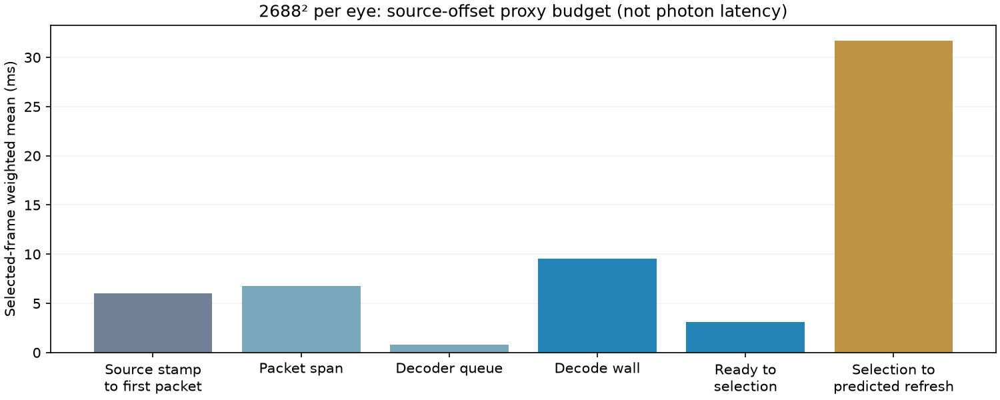

# Where the source-offset proxy accumulates

A 120-second full-field animated Pico run at 2688×2688 per eye, using client `3ce766af` and static sparse decoder `e5f920c`. This is a diagnostic run, not an A/B performance improvement.

| Contiguous interval | Selected-sample weighted mean |
|---|---:|
| Source display stamp → first packet | 6.00 ms |
| First → last packet | 6.75 ms |
| Last packet → decoder handoff | 0.81 ms |
| Decoder handoff → decode completion | 9.51 ms |
| Decode completion → frame selection | 3.13 ms |
| Frame selection → predicted refresh | 31.69 ms |
| **Source display stamp → predicted refresh** | **57.88 ms** |

**Presentation lead is the largest component of this proxy.** It is a scheduled interval to the runtime's predicted refresh, not proof of avoidable compositor queueing or a delay that can simply be deleted. Decode wall time and packet arrival span are the next largest components. The decoder handoff queue averages less than 1 ms in this run.

## Consistent timestamps, consistent samples

The server converts `view_info.display_time` into the headset clock. First/last packet receipt, decoder handoff/completion and `instance.now()` use that clock; `predictedDisplayTime` is the runtime's XR timestamp. No subtraction mixes raw host steady-clock time with headset XR time. The source stamp uses an estimated clock conversion, so synchronization error can affect the source-to-first component and total.

Every interval uses the **same selected stream-0 frame**. The six stages telescope to the existing source-offset proxy. Repeated selections intentionally count: the proxy describes the picture selected on each render iteration, not only newly decoded frames. The source-to-first term is signed and combines upstream work and the semantics of the source display stamp; it is **not pure network latency**. Packet span includes sender pacing, transport and receiver processing/scheduling. Decode wall includes more than codec GPU execution. Selection lead is also signed.

Samples require nonzero timestamps and monotonic first packet → last packet → decoder handoff → completion → selection. After excluding the first five two-second probe windows, **55 windows and 9,926 selected samples** remain, with **zero invalid samples**. The parser verifies the stage sum within logging-rounding tolerance and checks the reported total against the existing proxy for every fully valid window. No per-frame p95/p99 can be recovered from these aggregates.

## Conditions and interpretation

Selected settings remain compact-flat64, static sparse Pass A, FDM 3, ready wait 1 ms, JIT cap 5 ms, decode priority 1, static-post 2 and smoothing 3. The scene runs in headless gamescope, the Pico stays awake, and screenshot capture is disabled during timing. The trial completed, the client remained alive, animation reached 119.79 seconds, and 60 render/decode telemetry windows were retained. No session stops. Normal off-head sleep was restored afterward.

The smaller 57.88 ms total compared with prior ~61 ms runs does not establish an optimization: this is one instrumented run under changing conditions. It does not measure photons, pure link latency, physical head motion, or 90/240 fresh-FPS capability.

Next investigations should distinguish runtime scheduling constraints from reducible presentation lead, and sender pacing from receiver processing within the packet span. The [earlier selection-to-pass probe](../selection-delay/README.md) found only ~0.047 ms of CPU work after selection, so merely moving that code later is unlikely to help. Increasing a sleep cap blindly risks missed refreshes; this breakdown identifies the target but does not validate a scheduling change.

## Reproduce

Extract `logs.tgz`, then run `python3 analyze.py source-budget-client.log`. The script excludes five probe windows, checks sum consistency, and regenerates `summary.json` and `budget.png`. The raw logs and harness status are retained. Only aggregate instrumentation changed; existing [pixel-equivalence checks](../sparse-layout/README.md) describe the selected codec.
