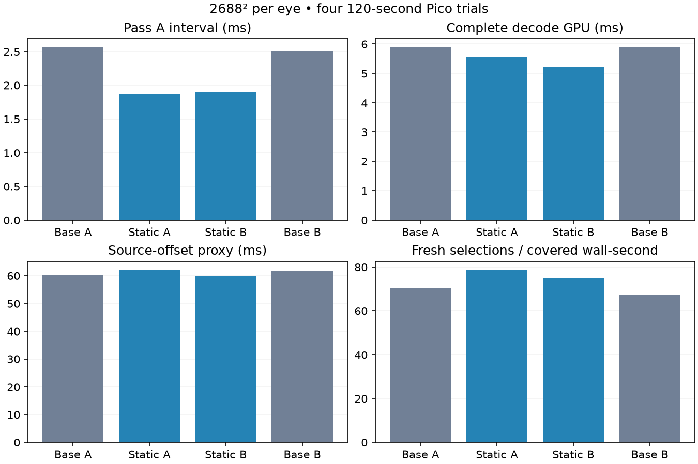

# Static sparse decoder: longer validation

**Keep for decode efficiency and fresh updates. A sustained latency improvement is not established.** Four uninterrupted 120-second Pico trials, Base A → Static A → Static B → Base B, at 2688×2688 per eye. Unlike the earlier short comparison, no standalone benchmarks occur between runs.

| Metric | Dynamic layout | Static layout |
|---|---:|---:|
| Pass A GPU interval | 2.539 ms | 1.885 ms |
| Complete decode GPU | 5.883 ms | 5.395 ms |
| Fresh selections / covered wall-second | 68.87 | 76.91 |
| Source display-time offset proxy | 61.00 ms | 61.09 ms |
| Presentation GPU / render iteration | 3.823 ms | 4.253 ms |

Means of two per-run means. **Decode GPU improves 8.3% and fresh delivery improves 11.7%.** Both adjacent pairs favor the static layout on these metrics. Source-offset direction differs between pairs: +2.06 ms in the first, −1.88 ms in the second, averaging +0.09 ms. The earlier short-run 3.69 ms reduction did not reproduce here. Do not describe this optimization as a demonstrated sustained latency win.

## Conditions and validity

Client `e4fb1eba`, candidate codec `e5f920c`, control codec `7fd4a4d`. The APK hashes identify the actual tested binaries. Settings remain compact-flat64, 2688² eye size, FDM 3, ready wait 1 ms, JIT cap 5 ms, decode priority 1, static-post 2, smoothing 3. Headless gamescope animates the full field; capture is disabled and the Pico is kept awake for each trial.

All four trials completed and each retained 60 render/decode telemetry windows, with zero session stops. After the ten-second exclusion, each contributes 54 render and 55 decoder windows. Covered render spans are 108.21–108.29 seconds; the largest inter-report gap is 2.015 seconds. Fresh rates include gaps within those spans. Valid vendor GPU-temperature samples peak at 75.6°C, excluding zero readings. The first control starts cooler; clocks and thermal conditions are not controlled, so these data do not prove thermal efficiency or throttling.

The presentation interval rose as fresh delivery rose; it is reported rather than hidden. These measurements do not isolate why that interval changed. Average decode throughput is similar, 82.78 versus 82.22 frames/s, despite more decoded frames reaching fresh selection. Arrival cadence and presentation interaction remain subjects for investigation.

## Interpretation

The sparse specialization removes unused dense-layout work without changing the representation. Prior [byte-identical static, motion, rANS and dense-LITE checks](../sparse-layout/README.md) remain applicable. This longer experiment adds timing and session evidence; it does not add exhaustive pixel validation or a new visual algorithm.

Pass A includes preceding transfer/setup work. Source offset is a software proxy, not motion-to-photon latency. These logs contain aggregate windows, so no per-frame p95/p99 latency is claimed. Synthetic full-field animation is not physical head motion. Neither sustained 90 fresh FPS nor 240 FPS is proven. The optimized APK remains selected and normal off-head sleep is restored.

## Reproduce

Extract `logs.tgz` and run `python3 summarize.py <extracted-log-directory>` to regenerate the summary and graph. The parsers exclude windows whose report timestamps are less than ten seconds after the first report, independently for render and decoder streams. A retained window may straddle that boundary; there is no invented per-frame clipping. Covered wall time uses report-end timestamps: last minus first plus the first retained window's reported duration. Rounded report durations make this an approximation.

`run.py` preserves the original machine paths and APK swap sequence. Build/install the two revisions before reproducing; APKs and large YUV files are not committed. Raw logs, status files, hashes, analysis scripts and the graph are retained here.
