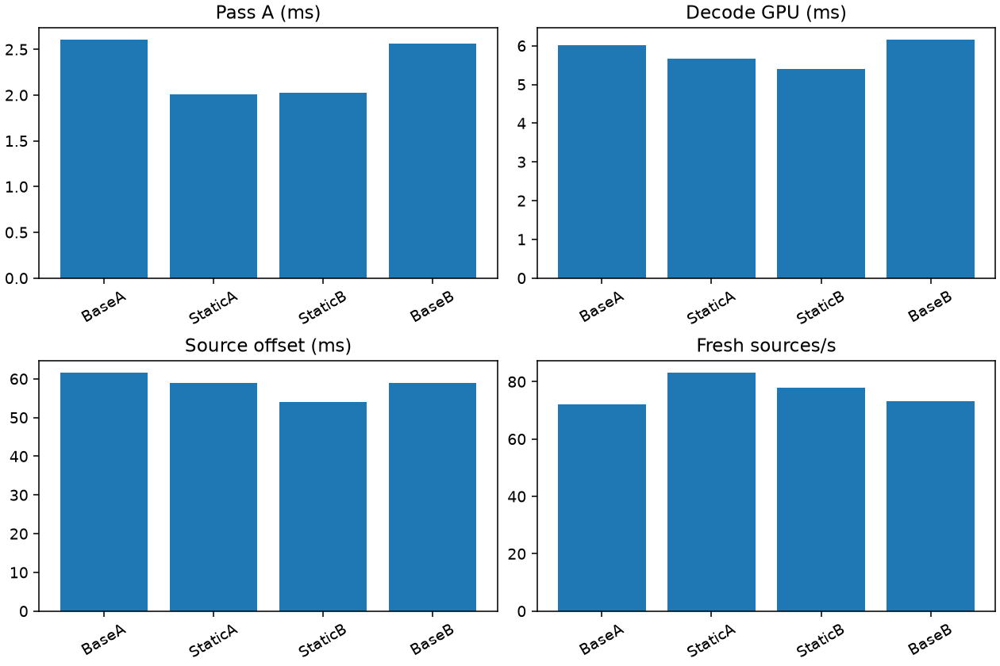

# Compile out unused sparse-decoder work

**Follow-up:** [Four 120-second runs](../sparse-layout-long/README.md) confirm decode and fresh-update gains, but not the 3.69 ms source-offset reduction below. Use the longer report for the current latency conclusion.

**Keep.** At 2688×2688 per eye, four 60-second live Pico runs favor specializing the entropy decoder's coefficient layout. Both adjacent pairs improve decode GPU time, fresh-source rate and source-offset proxy.

| Metric | Dynamic layout | Static layout | Change |
|---|---:|---:|---:|
| Pass A GPU interval | 2.582 ms | 2.018 ms | −21.8% |
| Complete decode GPU | 6.084 ms | 5.532 ms | −9.1% |
| Fresh selections / active telemetry second | 72.69 | 80.51 | +10.8% |
| Source display-time offset | 60.21 ms | 56.52 ms | −3.69 ms |

Means of two per-run means after ten telemetry seconds. Each run completed with 30 render/decode windows and no session stops. These are short trials, not sustained 90/240 fresh-FPS proof. Source offset is a software proxy, not measured motion-to-photon latency.

## Removed work

Sparse coefficient storage writes coefficients directly in scan order. Its shader nevertheless initialized shared scan tables used only by dense storage and carried runtime branches for the dense path. Specialization constant 6 now fixes the layout when creating the pipeline. Static sparse pipelines omit scan-table initialization and allow the compiler to eliminate dense-only work; static dense pipelines retain it. No stream syntax, centre resolution, quantization or temporal update behavior changes.

The pipeline cache key includes the layout. `NXVC_VKD_PASSA_DYNAMIC_LAYOUT=1` selects the original dynamic behavior for comparison. This is a process environment variable for the decoder; an ADB property with that name is not a live toggle. Existing PLANAR tiles already bypass entropy entirely; this change benefits the remaining entropy-coded detail tiles. The reported Pass A interval also includes preceding transfer/setup work, so it is not isolated shader execution time.

## Method and limitations

Custom WiVRn NX client `e4fb1eba`; codec control based on `7fd4a4d`, candidate is the accompanying two-file decoder change. Selected settings: compact-flat64, 2688² eye size, FDM 3, ready wait 1 ms, JIT cap 5 ms, decode priority 1, static-post 2 and smoothing 3. The headless gamescope scene animates the full field; the Pico remains awake. No screenshot capture during timing.

Order: BaseA → StaticA → StaticB → BaseB. Standalone correctness/timing tests and the candidate build occurred between BaseA and StaticA, so this is not an uninterrupted four-run sequence. Temperature and clocks were not controlled. Pair agreement is encouraging, but a longer paired run should check durability. Synthetic image motion does not establish performance during physical head motion.

## Correctness and standalone results

All 16 frames of both 2176²-per-eye LITE static and motion fixtures match byte-for-byte between dynamic and static layouts. Additional three-frame rANS and dense-LITE checks also match. Hashes are retained in `results.json` and `extra-checks.json`. This is fixture coverage, not exhaustive validation of every legal bitstream.

Four alternating-order standalone trials per condition, excluding each run's first four frames:

| Fixture | Pass A dynamic → static | Decode GPU dynamic → static | Decode wall dynamic → static |
|---|---:|---:|---:|
| Static | 3.129 → 2.690 ms | 6.075 → 6.100 ms | 8.673 → 8.648 ms |
| Motion | 2.879 → 2.464 ms | 5.563 → 5.798 ms | 8.202 → 8.422 ms |

The standalone total does **not** improve consistently: the unchanged Pass B measured slower. The keep decision rests on the paired live integration results, not the isolated entropy gain. The two regimes and their differing results are both retained.

## Reproduce

Extract `logs.tgz`, then run `analyze_live.py` with the four `sparse-layout-*-client.log` paths in the order above. It excludes ten telemetry seconds independently for render and decoder measurements, fails on missing metrics, and regenerates the graph and summary. `test.py` and `extra_checks.py` retain the original machine paths; their fixtures come from the earlier [LITE experiment](../../90fps-2026-09-09/lite-bitcount/README.md) and exact-reuse scratch set. APKs and large decoded YUV files are not committed; hashes identify the tested artifacts. `live.py` records the three remaining runs; BaseA was collected separately before building the candidate. After selecting the winner, the static-layout APK was reinstalled.
