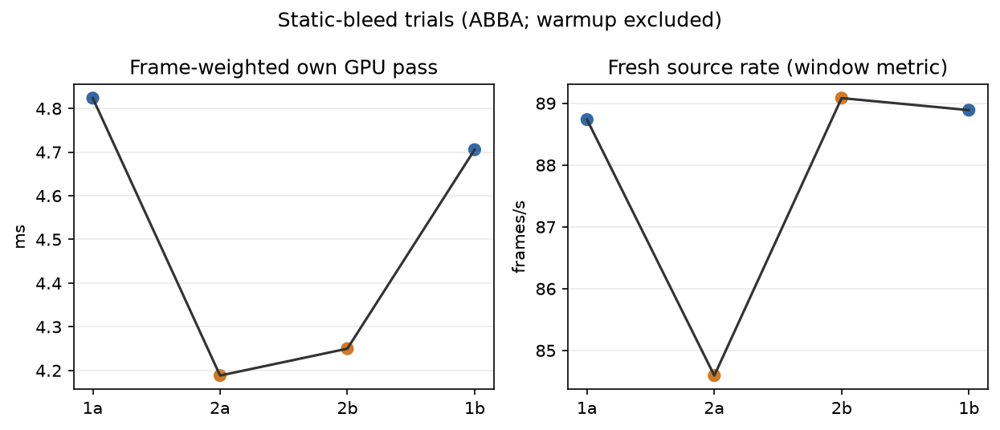
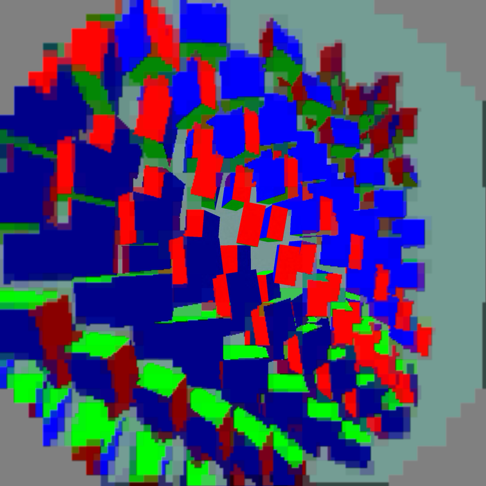

# Static-bleed positive result

Four 60-second synthetic moving-content trials ran ABBA (`1a`, `2a`, `2b`,
`1b`) with the other profile fixed. The first 10 valid render-telemetry
seconds were excluded. Runtime confirmed the static-bleed path is compiled out;
the guard strips bleed when margin is zero and the fallback latch handles
nonzero margin.

The primary result uses the frame-weighted GPU analysis:

| path | frame-weighted own GPU pass |
|---|---:|
| static post 1 | 4.76454 ms |
| static post 2 | 4.21909 ms |

That is `0.54545 ms` lower (`11.45%`). The original per-window mean is a
secondary sensitivity check: `4.7645 → 4.1700 ms` (`12.48%`). Its fresh-source
window metric changed `88.812 → 86.839/window-s`, distorted by the `2a`
transition containing only two iterations over 2.6 seconds. The source-offset
proxy was `53.06 → 52.13 ms`; it is not photon timing. The primary headline is
based on the per-run frame-weighted GPU means and is less sensitive to that
transition.

`per-run.png` plots frame-weighted GPU and the original fresh-source window
metric in ABBA order. `weighted.jsonl` is the supplemental analysis output;
`logs.tgz` contains raw client, scene, server, and status logs. No claim is
made about raw GPU instruction counts, 240-fps behavior, or photon latency.
No APKs are included.

## Final capture and active profile

A separate 25-second capture completed with the client alive and the new shader specialization active. Readback was excluded from timing runs. This is a visual sanity check, not a matched-frame image-equivalence test. The centre remains detailed and peripheral codec blocks remain. The animation moves across the field; the headset was not mechanically moved.

`debug.wivrn.nx.static_post=2` adds inactive edge-extension specialization to mode 1's inactive-effect specialization. The equivalent desktop variable is `WIVRN_NX_STATIC_POST=2`. Only an exactly zero bleed margin permits removal. If a nonzero margin appears, the general bleed path remains selected until the defoveator is recreated, avoiding repeated shader rebuilds. Vertex geometry, colour conversion, centre sampling and softening are unchanged.

The Pico profile now uses mode 2, FDM 3, smoothing 3, decode priority 1 and ready wait 4000 us. Capture was reset to zero and the benchmark scene stopped. Mode 1 remains the previous comparison profile.
