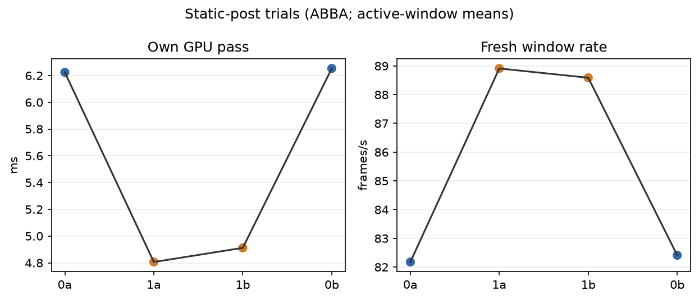
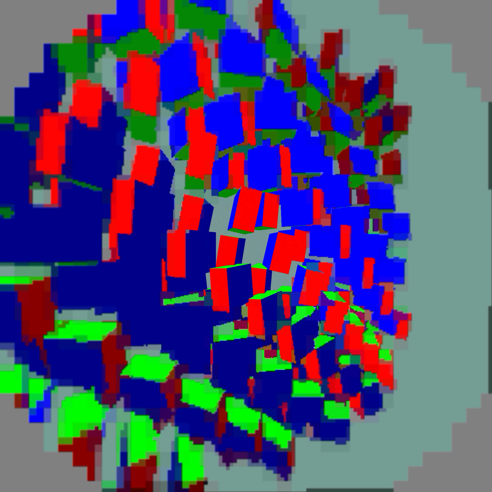

# Static-post positive result

Four completed 60-second synthetic moving-content trials ran ABBA (`0a`,
`1a`, `1b`, `0b`) with FDM 3, smoothing 3, priority 1, and 4000 us wait.
The first 10 valid telemetry seconds were excluded.

| path | own GPU pass | fresh source rate | source offset proxy |
|---|---:|---:|---:|
| static post off | 6.238 ms | 82.294/window-s | 60.406 ms |
| static post on | 4.859 ms | 88.750/window-s | 53.679 ms |

Static post reduced mean own-GPU pass by `1.379 ms` (`22.11%`) and increased
fresh-source rate. Source offset is a harness proxy; there are no photon,
wall-clock FPS, or 240-fps claims.

Runtime confirmed the static post was compiled out. The exact-neutral host
guard removes inactive CAS/glow/motion/blend/vignette/deband branches while
leaving colour, sRGB, smooth, and bleed unchanged. The safety latch keeps the
general defoveator path after the effect becomes active, avoiding pipeline
churn. This latch was added after the timed trials; the final capture verifies that the same specialized shader remains active with the neutral profile.

`per-run.png` shows the ABBA measurements. `logs.tgz` contains the raw client,
scene, server, and status captures. No APKs are included.

## Final Pico capture

A separate 25-second moving-content capture completed with the final APK and client alive. Screenshot readback was excluded from timings. This is a visual sanity check, not bit-exact image equivalence or physical head-motion testing; peripheral codec blocks remain visible. Visibility transitions in the timed sessions also limit conclusions from the software source-offset metric.

The option is enabled with `debug.wivrn.nx.static_post=1` (desktop: `WIVRN_NX_STATIC_POST=1`). Zero retains the existing shader. The affected strength values must all be exactly zero. Once any becomes active, the general shader remains selected for that defoveator's lifetime; reconnect to reconsider specialization after disabling effects. Smoothing, colour adjustment, sRGB conversion, and edge bleed retain their existing behavior.

The Pico speed profile now selects static post 1, FDM 3, smoothing 3, priority 1 and ready wait 4000 us. Capture is reset to zero and the benchmark scene stopped after testing.
