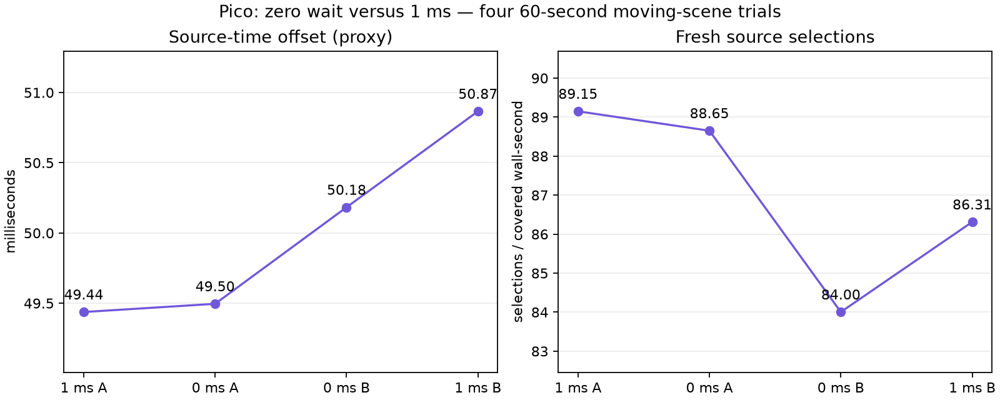

# Zero ready-wait: retain 1 ms

Four 60-second synthetic moving-content Pico trials, ABBA order (1 ms, 0 ms, 0 ms, 1 ms), client `060474e4`. Static-post 2, FDM 3, smoothing 3, decode priority 1, continuous awake mode. Exclude the first ten seconds of telemetry. All four trials completed with zero session stops.

| Wait | Presentation GPU | Fresh selections / covered wall-second | Source offset proxy |
|---|---:|---:|---:|
| 1 ms | 4.0625 ms | 87.73 | 50.1521 ms |
| 0 ms | 3.9271 ms | 86.33 | 49.8396 ms |

These are means of per-run means. Disabling the wait saves only 0.3125 ms in source offset, with about 1.6% fewer fresh selections. Keep 1 ms selected. Both conditions drift between repeats; the GPU difference cannot confidently be attributed to this CPU wait setting.

Source offset is predicted client display time minus the selected frame's server-stamped display time. It is not photon latency. Fresh selections are logged frame selections, not physical panel FPS. The scene animates across the field; this is not a mechanically moved headset or proof of 240 FPS.

`summary.json` contains active-window summaries; `coverage.jsonl` includes covered-wall rates and session stops. Raw logs are in `logs.tgz`. Included scripts preserve the original local benchmark paths and require the custom server, Pico, ADB and headless gamescope setup.
