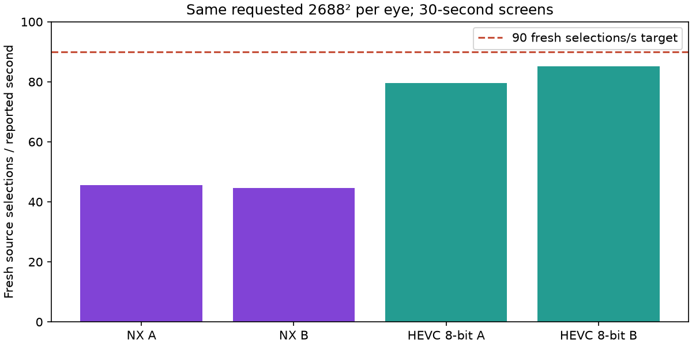
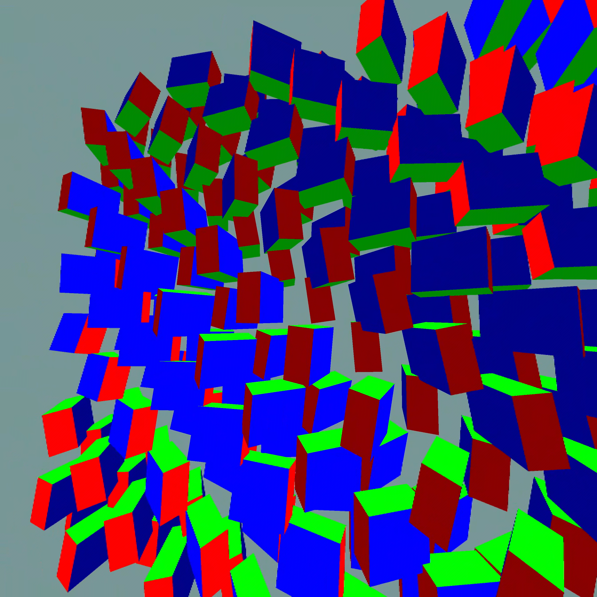
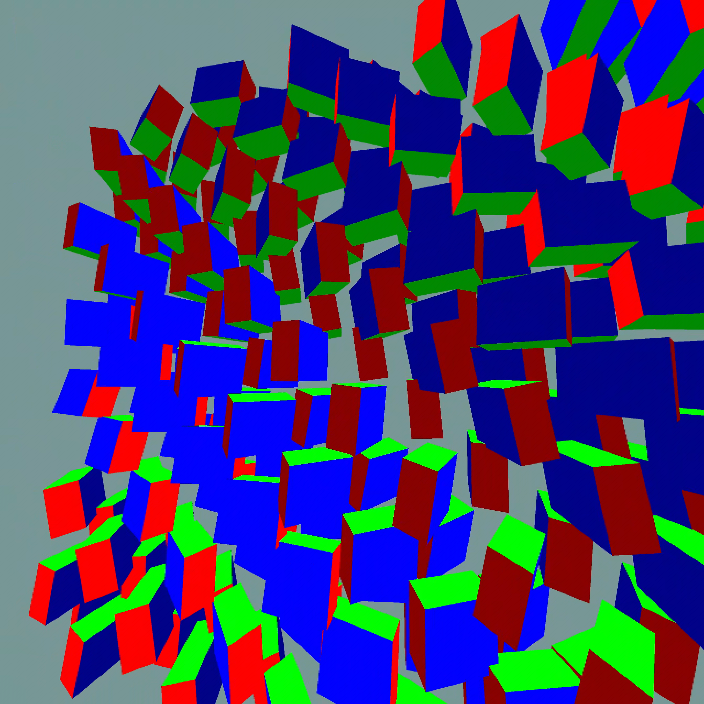

# Hardware-codec baseline — September 11

The existing VAAPI HEVC encoder and Pico Qualcomm MediaCodec path substantially outperform the current NX path in this short screen. **Neither is proven to sustain 90 fresh stereo frames/s here.** NX is restored as the selected user profile after testing; its 1024px native centre is unchanged.

## What was held constant

Same custom WiVRn NX build, Pico, 2688 × 2688 requested and negotiated eye dimensions, full-field animated scene, stream scale 1.0, packet pacing configuration and client presentation settings. Each timing run lasts 30 seconds. The server compositor applies foveation before either encoder; NX then adds its own tile-based approximation. Two HEVC repeats explicitly select 8-bit to match NX. An initial default HEVC trial negotiated 10-bit and is reported separately.

## Short-run results

| Run | Fresh selections/s | Presentation GPU ms | Source-offset proxy ms |
|---|---:|---:|---:|
| hw-nx-base-a-client | 45.67 | 3.24 | 81.60 |
| hw-hevc-a-client | 81.61 | 7.82 | -3.50 |
| hw-nx-base-b-client | 44.56 | 2.82 | 79.74 |
| hw-hevc8-a-client | 79.50 | 7.30 | -4.04 |
| hw-hevc8-b-client | 85.10 | 8.00 | -6.27 |

## Important limits

- Fresh selections use the existing first-eye source-index counter when a projection layer is submitted. This is more informative than display refresh, but does not prove that every stereo pair is fresh and synchronized.
- These are post-startup summary-window means, not per-frame percentile measurements. Only short screening runs were requested.
- Equal source dimensions are not equal quality or bitrate. NX combines the eyes into one coded stream and uses coarse PLANAR periphery; HEVC uses separate eye streams. Both describe an alpha stream.
- Rate control is adaptive and the link reports congestion. HEVC target bitrate moves from 49 toward 10 Mbit/s. NX logs roughly 281–292 KB/frame around 44 frames/s while its controller requests 8.7 Mbit/s: approximately 99–103 Mbit/s of encoded payload, excluding transport overhead. The target is not the actual bitrate.
- Source-offset is a signed display-time prediction proxy, not motion-to-photon latency. HEVC’s negative values reflect timestamp lead, not negative decoding time. Do not subtract these proxy columns to claim a physical latency saving. Hardware decoder timestamps and NX GPU queries also have different scopes.

## What this changes

The shared foveated input is not sufficient to explain NX’s deficit. Current native-centre reconstruction, entropy work and the large payload floor all matter. The hardware baseline supports investigating hardware-backed centre detail, but this test does not establish that a hybrid will beat full-frame HEVC; hybrid synchronization and composition would add work. The next comparison should retain the working hardware baseline while testing whether any NX component provides a measurable benefit.

Raw logs, configuration, scripts and analysis are in [raw](raw/). Actual eye captures, if present below, come from a separate capture run excluded from timing.

## Actual HEVC 8-bit captures

Separate 25-second run, excluded from timing. Both eyes retain fine contours across the view; these captures are not a matched-frame quality score against NX.

## Explicit 10-bit follow-up

Two further 30-second HEVC trials explicitly requested 10-bit and completed: **85.44 / 88.89 fresh selections per reported second**; presentation GPU means **8.24 / 8.56 ms**. The 8-bit and 10-bit runs were sequential, with adaptive network control, so this does not isolate a bit-depth speed advantage. The same first-eye-counter and signed-proxy limitations apply. NX was restored afterward.

Project direction: HEVC is a benchmark, not the foundation of the NX codec. See [the low-latency research direction](../../../../docs/LOW_LATENCY_DIRECTION.md).
