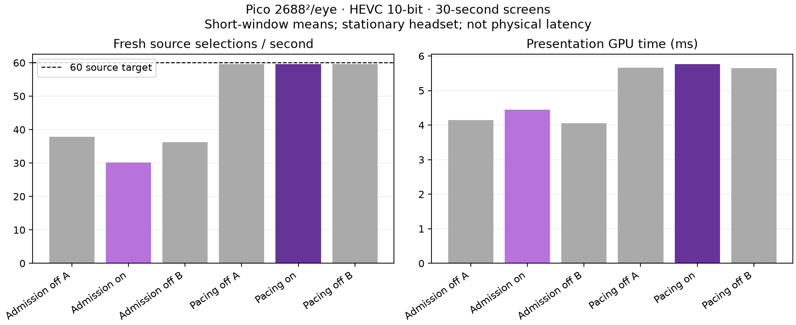

# 60 real HEVC frames with 90 Hz headset presentation

**The corrected source-pacing experiment holds approximately 59.6 fresh source selections/s with a 90 Hz render loop. It does not yet deliver 90 distinct predicted views or prove lower perceived latency.**

## Measurement

Pico, 2688×2688 per eye, 10-bit HEVC; stationary headset with the headless animated full-field fixture. Each run lasts 30 seconds. Client values are means of two-second telemetry windows after discarding the first 10 seconds. Freshness counts first-eye source selections, not synchronized stereo freshness or photons.

| Method / warp | Fresh selections/s | Render iterations/s | Presentation GPU ms | Matched fields | Active shifts | Mean active step |
|---|---:|---:|---:|---:|---:|---:|
| hevc60-off-a | 37.88 | 88.28 | 4.15 | 0 | 0 | 0.000 |
| hevc60-on-a | 30.19 | 85.22 | 4.45 | 939 | 279 | 1.329 |
| hevc60-off-b | 36.21 | 86.00 | 4.06 | 0 | 0 | 0.000 |
| hevc60-v2-off-a | 59.56 | 90.00 | 5.66 | 0 | 0 | 0.000 |
| hevc60-v2-on-a | 59.61 | 90.00 | 5.77 | 1512 | 22 | 0.570 |
| hevc60-v2-off-b | 59.56 | 90.00 | 5.64 | 0 | 0 | 0.000 |

## What changed

The first version discarded compositor commits before GPU work. Although its admission gate initially approached 60/s, it performed poorly: 30.19 fresh selections/s with warp on. The HEVC path carries compositor IDs on the wire; skipping commits introduces gaps that the receiver window can retire with empty-frame feedback. Logs show missing-frame feedback, recovery traffic and emergency half-rate changes. This is a plausible failure mechanism, not an isolated causal proof; network and startup effects are also present. The admission implementation is removed and retained only as a patch in raw evidence.

The retained opt-in implementation paces the compositor and encoders at min(commanded rate, 60), preserving the panel refresh setting and emergency divider. It does not intentionally punch holes in frame IDs. The application can consequently be paced more slowly too; this is not proof of an unchanged 90 Hz application workload. The revised off/on/off controls reached 59.56 / 59.61 / 59.56 fresh selections/s. GPU presentation means were 5.66 / 5.77 / 5.64 ms, a roughly 0.12 ms difference in this short screen, not a general overhead guarantee.

## Why this is not yet more real-time

Only 22 of 1,512 matched fields in the revised warp-on run had a nonzero extrapolation step (about 1.5%). Most views therefore reused decoded content without object-motion advancement. The source display-time proxy was negative in these runs because the frame carries a predicted display timestamp. It is not negative physical latency. The fixture also animates using predicted application display time, so assigning an arbitrary positive age would risk advancing an already predicted scene twice.

Two remaining integration requirements follow from the code audit:

1. Establish the relationship between simulation time, source image time and intended presentation time. The compositor timestamp alone does not establish the age of a game’s simulation. Test a known moving feature against its expected position at presentation.
2. Separate camera motion from object motion, or advance the submitted image pose consistently with the warp. The current headset optical-flow path contains camera movement but keeps the original layer pose; unlike server mode it has no matching pose extrapolation. Combining that with runtime head reprojection can double-count head movement. These stationary-head trials do not validate that behavior.

No additional arbitrary motion multiplier or latency offset was enabled. The original NX large-centre profile is restored; the experimental overrides are off.

## Reproduction and source

- WiVRn NX [34bd675a](https://github.com/nerdrx/wivrn-nx/commit/34bd675a): retained source-pacing implementation. The client is the prior [motion-field prototype](../hevc-motion/README.md).
- Set server WIVRN_NX_SOURCE_FPS=60 and WIVRN_NX_ALWAYS_MOTION_FIELD=1; client debug.wivrn.nx.motion_mode=headset. Use off for the warp control, default to restore saved settings. Restart sessions after changing overrides.
- Server builds passed for both versions; the existing fractional-admission cadence test passed for the retired version. All six device trials completed with the client alive. The retained pacing behavior is checked by the three revised device trials.
- [Raw logs, configuration, scripts, retired patch and summaries](raw/). Harness snapshots retain machine-specific paths and build dependencies. Raw log whitespace is preserved.
- [Previous prototype both-eye stills](../hevc-motion/README.md#captured-appearance) document that earlier capture, not this pacing trial. No new still can establish the temporal effect measured here.
