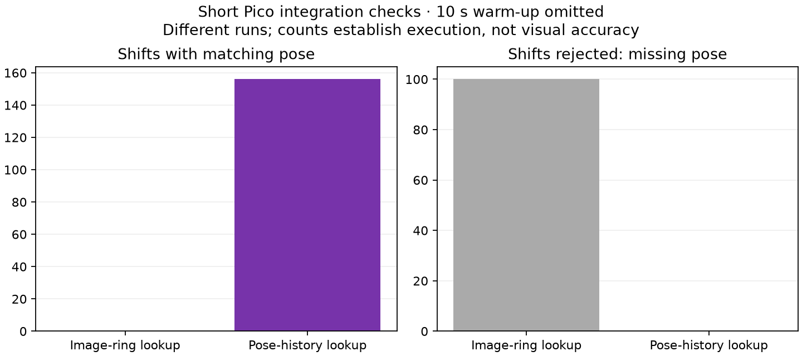

# Pose-aware headset motion shifts

**The headset now advances the submitted camera pose by the same interval as an optical-flow shift. A final 30-second Pico check exercised 156 compensated shifts, with zero missing-pose or invalid-pose rejections in its post-warm-up telemetry. This is an integration result, not proof of lower motion-to-photon latency or moving-head visual correctness.**

## Why the change is needed

The optical-flow field includes camera movement as well as object movement. Shifting the image while retaining its old layer pose asks runtime reprojection to correct movement already represented in those pixels. The client now extrapolates the source pose consistently with the image, following the principle already used by the server-side warper. This is an approximate optical-flow model, not an exact depth-aware reconstruction.

A field may be used only with its matching current frame and an earlier pose at exactly current display timestamp minus field span. Both eyes must agree on source identities and timestamps. The projection angles must be unchanged, and positions/orientations must pass finite/unit checks. Missing or unsafe metadata disables the object shift; the runtime still receives the original image pose. Ordinary previous-frame blending is disabled during compensated shifts because its pixels use older coordinates.

The first guarded version searched the decoder image ring. It rejected 100 shifts because the earlier images had already been recycled. The retained implementation copies up to 32 pose/field-of-view metadata records per view stream, under the existing frame lock. It retains no decoder images, adds no shader pass, and clears the history when decoders are set up again.

## Short device checks

2688×2688 per eye, 10-bit HEVC, opt-in 60 Hz source pacing, 90 Hz Pico mode, stationary headset and headless changing full-field content. Each run lasts 30 seconds; means below use two-second telemetry windows after the initial 10 seconds. The final history build differs from the earlier control build, so these are functional screens rather than an isolated performance A/B.

| Run | Fresh selections/s | Render iterations/s | Presentation GPU ms | Compensated shifts | Missing pose | Unsafe pose |
|---|---:|---:|---:|---:|---:|---:|
| hevc-pose-on | 56.83 | 89.99 | 5.76 | 0 | 100 | 0 |
| hevc-pose-off | 58.00 | 89.91 | 6.11 | 0 | 0 | 0 |
| hevc-pose-history | 57.67 | 89.99 | 6.11 | 156 | 0 | 0 |

The final run matched 1,043 fields; 156 had a positive shift with a matching pose. The weighted mean active step was 0.165 source intervals. Counts are from the render path, not optical measurements. First-eye source selections and render iterations do not establish 90 distinct stereo views.

## Validation and limits

- Android release builds succeeded. The new analytic C++ test passes with -O2 -ffast-math: known rotation/translation, quaternion sign equivalence, stationary poses, and rejection of non-unit, infinite, NaN or invalid projection inputs. It tests pose math, not the GPU optical-flow estimator.
- All three Pico checks completed with the client alive. No physical head rotation, translation or disocclusion-quality test was performed. Runtime reprojection interacting with approximate optical flow remains a visual validation requirement.
- No arbitrary time offset was added. The remaining timing problem is distinguishing game simulation time from predicted display timestamps; advancing already predicted content twice would be wrong. A known moving feature and its ground-truth position at presentation are needed before claiming more real-time motion.
- The original NX large-centre profile is restored; experimental source pacing and forced motion overrides are disabled.

## Source and reproduction

WiVRn NX [9a5cfa0f](https://github.com/nerdrx/wivrn-nx/commit/9a5cfa0f). The final APK was built before committing; subsequent implementation changes only adjusted indentation. Binary identity and [raw logs, scripts and build records](raw/) are included. Harness snapshots contain machine-specific paths. The experiment settings are those of the [60-source pacing screen](../hevc-60-warp/README.md).
