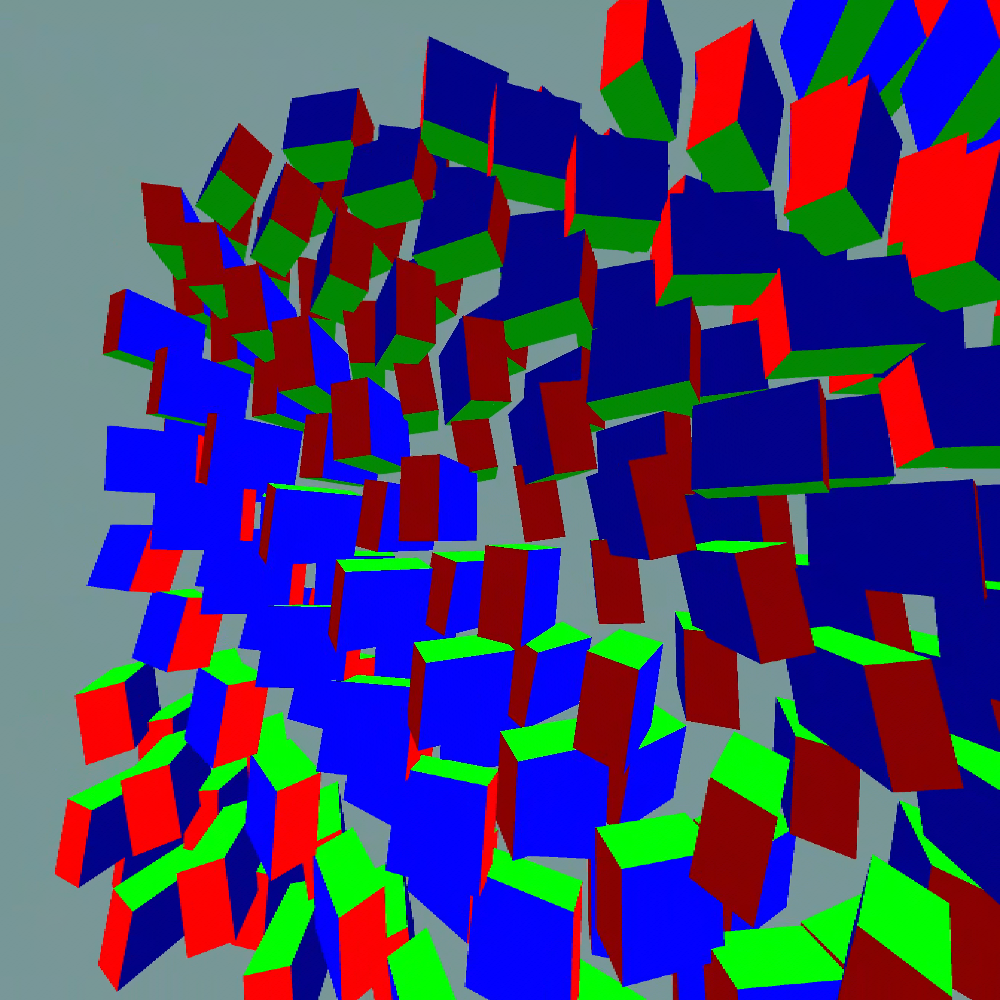
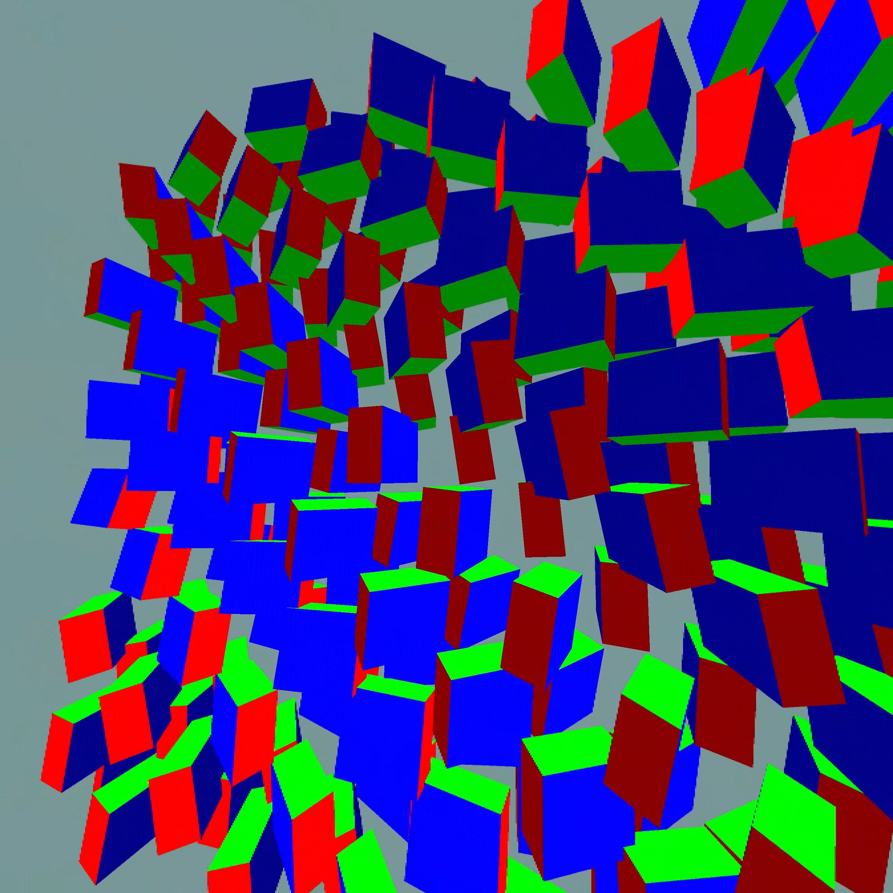

# Full HEVC with headset-side motion warp

An opt-in prototype uses the existing Qualcomm HEVC decoder for the full image and applies the existing WiVRn motion-field warp inside its presentation pass. This is a hybrid streaming experiment, not a new independent compression format. The fields come from the PC motion estimator; the MediaCodec API does not expose arbitrary motion-vector arithmetic.

## Implementation

- Explicit test override for headset motion mode, without changing saved user settings.
- Opt-in server field generation even when the application itself keeps up; existing failure and unsafe-submission guards remain.
- Retain eight completed motion fields so a decoded image can find its own matching field rather than only the newest one.
- Require a matching frame across both eyes and clear field history on decoder reset.
- Count matching fields, active warps and extrapolation steps. A step of 1 means one source-frame interval.

The existing runtime head-pose reprojection still applies. This screen uses a stationary headset and animated full-field content; it does not prove improved head-motion responsiveness, depth-aware translation or disocclusion handling.

## Short screens

All timing runs last 30 seconds at 2688² per eye with 10-bit HEVC. Values below discard the initial 10 seconds of telemetry. The final run includes the stereo/reset guards.

| Run | Fresh selections/s | Presentation GPU ms | Matched fields | Active warps | Mean active step |
|---|---:|---:|---:|---:|---:|
| hevc-motion-off-a-client | 86.94 | 8.44 | 0 | 0 | 0.0000 |
| hevc-motion-on-a-client | 80.39 | 8.19 | 1616 | 481 | 0.0073 |
| hevc-motion-off-b-client | 80.75 | 7.73 | 0 | 0 | 0.0000 |
| hevc-motion-final-client | 84.39 | 8.16 | 1611 | 159 | 0.0041 |

Matching and nonzero warp activity demonstrate that the prototype executes. **They do not demonstrate a latency or perceptual improvement.** Many predicted display times are at or before the source frame’s stamped display time, so the safe extrapolation amount is zero or very small. Do not force a larger step simply to make the effect visible; the timestamp meaning and visual error must justify it.

Fresh counts are the existing first-eye source selection metric, not proof of 90 fresh stereo frames or reduced physical motion-to-photon latency. The short off/on/off sequence includes drift and is not a statistically isolated performance win. Fields cannot supply newly revealed scene content.

## Disposition and reproduction

Keep this as an opt-in experimental path. The original NX large-centre profile is restored after tests. Set server environment WIVRN_NX_ALWAYS_MOTION_FIELD=1 and client debug.wivrn.nx.motion_mode=headset only for the prototype; default or an absent client property follows saved settings. Server forcing applies only to headset mode. Do not stack an extra rotational warp without accounting for the runtime’s existing reprojection.

The initial trial script failed while clearing an empty ADB property after all three timing runs completed; the override and original server configuration were restored manually. The script now restores the explicit default sentinel. This orchestration failure is retained in the raw log.

Raw logs, scripts and build records are in [raw](raw/). Separate eye captures, if shown below, are excluded from timing.

## Captured appearance

Actual 2688×2688 client eye outputs from capture request 777011, inspected in both eyes. Fine edge stair-stepping remains visible. These stills document appearance, not the correctness or responsiveness of extrapolated motion; capture overhead is excluded from the timing table.

## Source and next gate

WiVRn NX implementation: [7cfed506](https://github.com/nerdrx/wivrn-nx/commit/7cfed506). Core repository during the test: 8ace607, with unrelated branding edits. The final Android build and server build succeeded; the final device run exercised matching fields and nonzero warp steps after the stereo/reset guards were added.

The next experiment must trace the image's scene time, its predicted pose/display timestamp, the field's two source times and the actual presentation target on the same clock. Extrapolate scene motion only over the justified interval, while preserving the runtime's head-pose correction. Then compare a known moving edge against ground truth with warp enabled and disabled. Larger arbitrary warp steps would create animation without proving lower latency.

Harness snapshots retain machine-specific paths and local build dependencies; adapt them before reproduction. Raw log whitespace is preserved.
