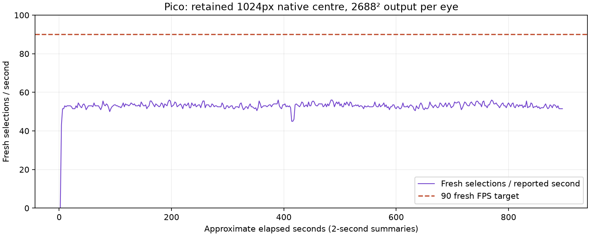
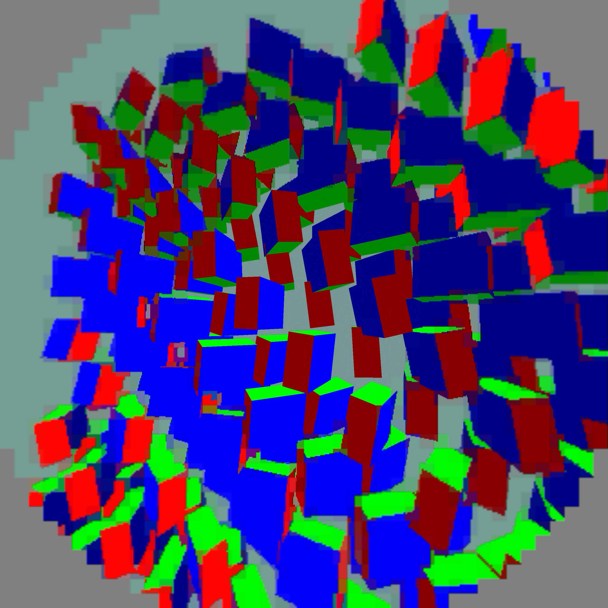

# Large-centre motion soak — September 11

The required **1024px native sharp centre** remains selected at **2688 × 2688 output per eye**. This is the R2 two-colour, ungrouped-cell profile with smoothing 3, compact flat64, priority 1 and a 1 ms ready wait. The native unused-palette-fit encoder bypass is installed. Client revision: 87f2e9bb; decoder: 2f58ed8.

## Sustained live result

Requested duration: 900 seconds. Harness completed: **True**. Scene: full-field animated geometry through the custom WiVRn NX and actual Pico client. This exercises changing image content; it does not simulate every real application or prove moving-head comfort.

| Measure | Result |
|---|---:|
| Fresh selections / covered wall-second | 52.92 |
| Fresh selections / reported second | 53.10 |
| Decode GPU summary mean | 13.000 ms |
| Pass A / Pass B | 4.857 / 8.145 ms |
| Presentation GPU summary mean | 3.074 ms |
| Source display-time offset proxy | 77.06 ms |
| Covered post-warm wall duration | 887.04 s |
| Largest render-summary gap | 2.028 s |
| Logged session stopping events | 0 |

**90 fresh FPS is not demonstrated.** Software source-offset telemetry is not physical motion-to-photon latency. GPU values average reported windows, not per-frame percentile samples. Coverage excludes the initial 10 seconds; the graph includes startup. Two-second reporting durations are rounded.

## Both-eye captures

Separate 25-second capture run, excluded from timing. These are actual client-rendered eye images, not photographs through the lenses. Centre detail is visibly retained; coarse peripheral colour patches and stepped edges remain. Smoothing does not repair missing palette detail.

Raw logs, status, profile and analysis scripts are in [raw](raw/). The frame-time chart is based on logged fresh-source counts, not the display refresh setting.
