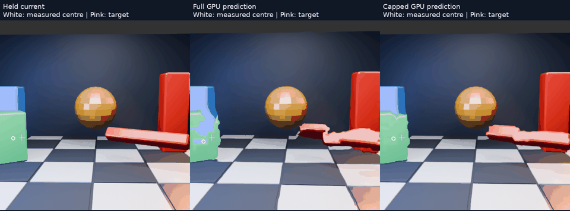

# Does prediction move the object toward its current position?



[Animation](comparison.mp4) · [Per-frame measurements](scores.json) · [Summary](summary.json) · [Threshold sensitivity](sensitivity.json)

White circles mark the measured centre of the visible green block. Pink crosses mark that block's centre in the correct future image. This evaluates outputs from the existing actual-GPU full/capped experiment; no new prediction method or live setting is introduced.

## What is measured

A fixed green-dominance threshold isolates the block for **evaluation only**. Neither these masks nor future images feed the predictor. We measure the centre of its visible colour mask, not its 3D object origin. For each frame, let `h` be the held centre, `p` the predicted centre and `g` the target centre. Projected progress is:

```text
progress = dot(p − h, g − h) / length(g − h)²
```

Zero means no movement along the target direction; one means closing that projected gap. Perpendicular error is not represented by this fraction, so Euclidean distance to the target is reported separately. Only frames with at least 100 selected pixels in every image and at least 4px held-to-target movement are eligible: **30/32 frames**.

## Results

| Output | Mean visible-centre error | Median projected gap closed |
|---|---:|---:|
| Held current | 31.64px | 0% by definition |
| Full GPU prediction | 19.75px | 34.2% |
| Capped GPU prediction | 26.67px | 16.3% |

Both predictions advance the block toward the reference on this measure. The full shift advances it farther, while the cap retains more position error. Together with the earlier folding measurements, this makes the tradeoff explicit: the cap reduces deformation but leaves content less current.

Three nearby green-threshold settings preserve this ordering. Full prediction's median projected progress ranges from about 34–40%, versus 15–16% capped. These are sensitivity checks of the evaluator, not additional predictor tuning or independent scenes.

## Important limits

This is **not measured latency in milliseconds**. The source-to-target interval is 33.33ms, but multiplying that interval by the fraction would assume constant visible-centre motion. Rotation, occlusion, changing visible area and image deformation violate that assumption. Distortion can shift a mask centre without correctly transporting the object. The method also ignores the red rotating bar and does not prove straight edges or jitter-free motion.

The block is selected by colour because this synthetic scene has a distinctive green mover. That scene-specific scoring choice does not make the prediction pipeline object-aware. A general evaluation needs more objects and trajectories, and an actual headset latency claim needs synchronized timing evidence.

## Reproduction

The runner consumes the archived experiment's `gpu-cap/full` and `gpu-cap/cap` outputs in the original local sibling layout. Refer to the [GPU cap report](../motion-gpu-cap/README.md) for its estimator, shader, source inputs and full-frame limitations. The current evaluator threshold is `G > 1.4R`, `G > 1.15B`, `G > 35` on sRGB bytes. Sensitivity uses nearby ratios listed in its JSON.

All 32 prediction images appear in the video at 15fps, four times slower than the 60Hz source; two are excluded only from the aggregate statistic. The GIF skips alternate video frames. Coordinates refer to 512×512 eye images. This is offline evaluation of GPU output, not a new Pico trial.
