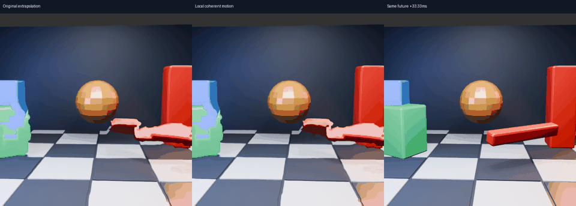

# Local coherent-motion cleanup

**Decision: reject as an added live pass.** It preserves useful motion but barely changes the distortion. This tests local vector cleanup, not whole-object reconstruction.

## Method

One pass over the original 64×64 GPU motion field (8px spacing, 512×512 images). Each node considers its 3×3 neighbourhood. Neighbours qualify when their current 8×8 mean linear-RGB colour distance is at most 0.12 and their displacement differs by at most 8px. With at least three qualifying samples including itself, use the componentwise median; otherwise retain the original vector. Read only the original field, so traversal order cannot cascade changes.

No future image, object mask, depth or object ID enters this operation. This is an offline CPU prototype, followed by the same actual GPU warp as the control. The 32 original moving-scene pairs and +33.33ms future references are unchanged. Animation plays four times slower than the source timeline.

## Results

| Metric | Original | Cleanup |
|---|---:|---:|
| Mean future RGB RMSE | 37.72659 | 37.72418 |
| Mean green-block position error | 19.746 px | 19.730 px |
| Median projected position gap closed | 34.24% | 34.36% |
| Mean nonpositive sampling-map Jacobian fraction | 8.603% | 8.590% |

87.5% of central nodes qualify for the median operation; this does not mean all those vectors change. The error and geometry changes are negligible, with no uncertainty analysis establishing significance. Visual tearing remains. Held-image RMSE is 39.670 and held block error 31.643px.

RGB error uses the central 384×384 crop. Position metrics use the earlier evaluation-only green mask, 30 eligible frames with at least 4px held-to-target displacement. These are position metrics, not measured latency. Occlusion and deformation affect centroids.

The Jacobian is the analytic derivative of the bilinearly sampled field at pixel centres, not a finite-difference estimate. Both eyes and a common unclamped central region are used. A positive determinant does not establish straight edges, correct positions or low jitter.

## Validation and limitations

All 32 GPU invocations completed with Vulkan validation enabled and no reported validation errors. Synthetic checks passed for constant translation, removal of an isolated compatible outlier, unchanged input data, and preservation of an incompatible motion boundary. Full-resolution headset presentation, quantization, foveation, HEVC artifacts and physical latency are not modeled.

Colour similarity does not imply a common object; componentwise medians can produce vectors no neighbour contains. The tight compatibility rule also leaves large conflicting estimates untouched. Making every vector locally smoother cannot by itself supply visibility, correct correspondences or coherent whole-surface transforms. No threshold sweep or live deployment follows this negligible result.

## Reproduction

Run `test_coherent_field.py`, `coherent_compare.py`, `coherent_alignment.py`, and `coherent_geometry.py` in the existing `nx-scratch/motion-regions` layout. Requires NumPy, Pillow, ffmpeg, prior `gpu-cap` fields, the original linear scene frames and the 8px GPU fixture. Scripts, scores, logs and animations are included. Some reused score keys retain the label `gate`; here they refer to median cleanup, not zero-motion gating.
