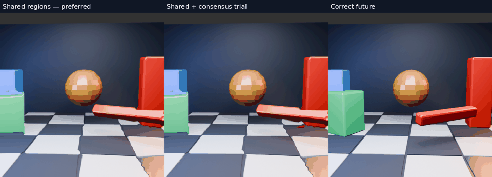

# Straight edges are a quality target

The user prefers shared-region transforms and explicitly requires straight moving edges to stay straight. This becomes a quality target alongside latency: average pixel error alone must not approve a change that visibly bends rigid geometry. The preferred shared-region prototype is retained; these follow-up candidates are not promoted.

[Full-resolution slow-motion video](comparison-slow.mp4).

## Two follow-up candidates

A deterministic 64-trial, three-point affine consensus fit rejects outlier motion samples. It needs at least max(8,35% of region cells) within 2.5px, then refits the consensus. A gradient bound rejects extreme models. The first candidate falls back to the original 8px field; the second falls back to the preferred shared-region model. Neither uses future pixels, object IDs or depth to predict. GPU estimation/warping and CPU diagnostic fitting remain as before.

| Method | Mean full-sequence RGB RMSE |
|---|---:|
| Preferred shared regions | 38.538297 |
| Consensus, dense-flow fallback | 37.932549 |
| Consensus, shared-region fallback | 38.730211 |

Consensus alone loses some of the straightening the user preferred. Shared fallback preserves more of it but does not establish an improvement. These are not deployment candidates.

## Preliminary edge diagnostic — only three eligible frames

The test identifies the green block by image colour **for evaluation only**, extracts its left/right silhouette through the middle 60% of its height, fits a line to each side and measures the larger 95th-percentile horizontal residual. This is horizontal pixel residual, not true perpendicular distance. A provisional 2px tolerance at 512² allows rasterization noise; the intended geometric target remains straight edges.

Frames are eligible only where both held and rendered-future references have complete measured rows and <=2px residual. That leaves just three of 32 frames: the colour mask is unreliable under occlusion, lighting and some orientations. This is a narrow diagnostic, not a validated universal edge detector. Eligibility is independent of candidate output. Per-frame values, coverage and indices are preserved in JSON. Missing candidate edges must count as failures, not wins.

| Method | Mean per-frame edge residual (px) | Frames failing 2px / eligible |
|---|---:|---:|
| Held reference | 0.615 | 0 / 3 |
| Rendered future reference | 0.868 | 0 / 3 |
| Original 8px grid | 9.431 | 3 / 3 |
| Preferred shared regions | 6.463 | 3 / 3 |
| Consensus, dense fallback | 7.095 | 3 / 3 |
| Consensus, shared fallback | 6.552 | 3 / 3 |

This supports the visual preference for shared transforms while also showing the target is unmet. Do not generalize the three-frame result to all objects or scenes. Next implementation work should preserve region boundaries during resampling; fitting a rigid transform and then bilinearly mixing conflicting regions can still deform edges. Evaluation needs explicit line/visibility fixtures before becoming an automated acceptance gate.

Same host GPU, 33.33ms extrapolation interval, aggressive moving-scene input and limitations as the prior region experiments. No live-region integration or latency benefit is claimed.
