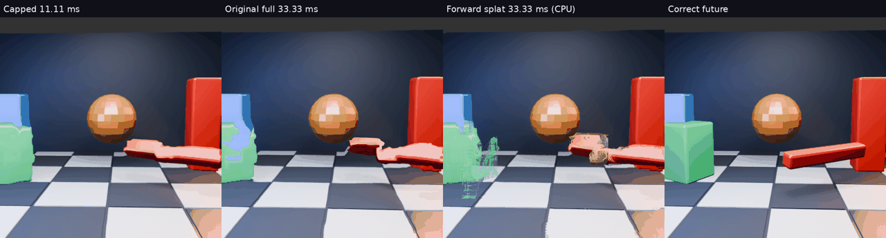

# Stronger source-anchored warp: more advancement, still broken edges

[Full animation](comparison.mp4) · [Scores](scores.json) · [Example](example.png)

## Question

Can forward transport recover stronger motion without the old inverse warp bending the image? This short offline diagnostic uses all 32 saved GPU 8px motion fields and source/reference images from the motion-gpu-cap experiment. No Pico settings or binaries changed.

## Method

Each current pixel scatters to `p + d(p)` with a four-pixel bilinear footprint. Accumulate linear-light colours and normalize overlapping contributions. Uncovered destinations use the existing capped GPU image. Motion is sampled bilinearly from the current-anchored GPU field. Future images enter evaluation only. This differs from the earlier iterative inverse-transport solve.

The new image reconstruction is **CPU NumPy**, not GPU or Pico execution. It reuses quantized sRGB readbacks converted back to linear light; this extra round trip differs slightly from the original GPU reconstruction. Overlap averaging is not a depth or visibility solution.

## Results

| Method | Mean RGB RMSE | Mean green-block centre error | Median projected gap closed |
|---|---:|---:|---:|
| Original full GPU warp | 37.7266 | 19.75px | 34.2% |
| Capped GPU warp | 38.3278 | 26.67px | 16.3% |
| Forward splat, CPU diagnostic | 37.3042 | 16.73px | 53.1% |

RGB scores use the central 384² crop across 32 frames. The existing green-block evaluator qualifies 30 frames. Average uncovered fraction is 2.61% of the central crop. CPU splat/reconstruction section averaged 41.97 ms here; this excludes field sampling, image I/O and packaging and is not a proposed live budget.

**Not ready for live use:** inspected frames 8, 16 and 24 show strong speckling, torn silhouettes and overlapping surfaces. Better centre progression and RGB error do not establish better-looking motion. Bilinear footprints do not cover expanding surfaces continuously, while overlaps mix unrelated foreground/background colours. Capped fallback leaves seams and stale content in disocclusions.

## Decision

Keep the installed cap. The experiment supports investigating stronger source-anchored transport, but does not solve quality. A usable implementation needs surface-consistent motion estimates and reconstruction that handles coverage and visibility together. More strength alone is insufficient. The current estimator uses a 32-source-pixel finest matching window even with an 8px vector grid, so boundaries can still share motion from different surfaces.

No physical latency, temporal stability, stereo, network or device performance is established. Both targets remain +33.33 ms; capped motion advances only +11.11 ms. Video plays 32 predictions at 15 FPS, four times slower than source progression, and does not represent a mixed live cadence. GIF skips alternate frames. The runner retains original sibling scratch paths; requires NumPy, Pillow and ffmpeg.

## Temporal follow-up

The user clarified that jitter is the primary failure, with clean edges still desired. We therefore compared the visible green-block centroid error trajectory against the correct future across the 32 images. RMS second differences of that residual are 10.51px capped, 20.73px original full warp and 21.37px forward splat; held is 9.23px. Mean residual step lengths are 7.46px, 11.53px and 12.25px respectively. See [all temporal measurements](temporal.json).

This diagnostic does not support a stability improvement: full-strength forward splatting remains roughly twice the capped residual second-difference RMS. It is **not a calibrated perceptual jitter metric**: occlusion, shape changes and mask-centroid shifts confound it, and it examines one object over a short sequence. No live recommendation follows from the improved average position score. Both edge coverage and stable correspondences remain necessary before raising the installed warp cap.
