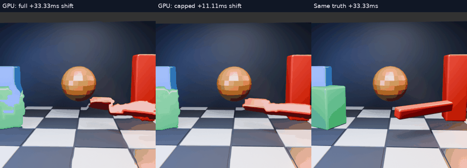

# GPU motion cap: less folding, less accurate motion

[Full-resolution animation](comparison.mp4) · [Example](example.png) · [Per-frame image scores](scores.json) · [Sampling-map geometry](geometry.json)

## Experiment

Run the actual Vulkan downsample, motion-estimation and warp shaders with a 512×512 image and 8px motion grid. Compare a full one-field-interval shift with one third of that shift. Previous/current images are 33.33ms apart; both predictions are judged against the **same target 33.33ms after current**. The reduced shift therefore represents 11.11ms of estimated motion without pretending the image is newer.

All 32 available predictions in the earlier stress scene are evaluated. Estimator inputs and resulting float fields match exactly between paired runs. Both eyes use the same inputs intentionally. The GPU's held and target readbacks also match byte-for-byte between paired runs. Vulkan validation reported no errors. The [binary identity](binary.json), logs (trailing whitespace normalized) and raw float fields are retained.

## Results

| Method | Mean RGB RMSE | Mean nonpositive map-Jacobian fraction |
|---|---:|---:|
| Held image | 39.6698 | — |
| Full shift | 37.7266 | 8.603% |
| One-third shift | 38.3278 | 0.945% |

The cap improves image error over full shift in **11/32** frames, and over holding in **28/32**. It does not reproduce the earlier CPU region predictor's average-error win. Visual inspection shows less stretching around the block and rotating bar, while the bar's pose remains wrong. This is a tradeoff between distortion and extrapolation accuracy, not a universal improvement.

### What the geometry number means

The diagnostic analytically differentiates the same bilinear float field used by the shader. For its pre-clamp inverse sampling map `q = p − t d(p)`, it counts samples where `det(I − t ∇d) ≤ 0`: local degeneration or orientation reversal. Such regions can fold image structure. Results average per-frame fractions over both eyes' central 384×384 crop, restricted to the common samples that stay inside the source image for both steps.

This is a mapping diagnostic, **not a final-image straight-edge, silhouette or temporal-jitter score**. Smaller positive distortions may still bend lines. It also excludes clamp-to-border behavior. The strong reduction gives a reason to investigate a conservative distortion limit even though mean RGB error worsens.

## Limits and integration decision

These are production compute shaders in a host fixture, not the complete headset presentation path. The client additionally uses quantized int8 fields plus a scale, foveated coordinates, pose compensation and optional blur. This test excludes HEVC encoding/decoding, transport, queueing, physical movement and motion-to-photon latency. No performance benefit is claimed.

The live client already derives extrapolation from timestamps divided by the field interval. Its existing cap is three field intervals. A 90Hz panel interval does not imply an 11.11ms-old decoded image. **No live default changed from this experiment.** A conservative cap remains a candidate requiring client-path quality evaluation; the numerical map result does not establish that every edge stays straight.

## Reproduction

The runner uses `motion-scene/build8/motion_gpu_truth`, built from WiVRn NX `tests/motion_gpu_truth` with `MOTION_TRUTH_SIZE=512` and `MOTION_TRUTH_BLOCK=8`. It passes steps `1` and `0.333333333`, independently rendered previous/current/future linear RGBA8 inputs, and no field override. The shader outputs sRGB. The [scene generator](../motion-scene/scene.py) is unchanged.

Scripts retain the original sibling `nx-scratch/motion-regions` / `motion-scene` layout; adjust paths in another checkout. The geometry script expects runner outputs under `gpu-cap`. NumPy, Pillow, ffmpeg and the Vulkan fixture are required. Videos run at 15fps, four times slower than the 60Hz source; the GIF skips alternate output frames. Every displayed frame is a prediction, with no fresh-frame inserts.
