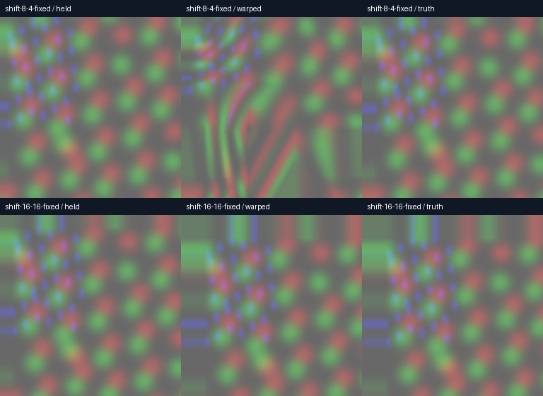

# GPU motion truth: an exact-match fix and an unresolved failure

2026-09-11, Radeon RX 7900 XTX (RADV). Actual production downsample, block matcher and warp shaders, 256×256 stereo fixture; Vulkan validation enabled with no reported validation errors. Not a timing benchmark or live Pico test.

Previous image: time 0. Current: translated by D at time 1. Expected future: translated by 2D at time 2. Warp consumes current and its measured motion at extrapolation step 1. Both eyes share input; RGB RMSE uses their central 128×128 pixels (32,768 pixels total). Border disocclusion is excluded. Input is linear UNORM; held and truth are converted to the same sRGB encoding as the warp output.

| Translation D (pixels) | Held-current RMSE | Original warp RMSE | Exact-match fix RMSE |
|---|---:|---:|---:|
| Stationary (0,0) | 0 | 0.243277 | **0** |
| (16,16) | 24.202535 | 0.272953 | **0** |
| (8,4) | 14.997635 | 17.664805 | **17.653948 — worse than held** |
| (8,4), step-zero control | 14.997635 | 14.997635 | 14.997635 |

The subpixel parabola introduced motion even when integer SAD was zero. [13eadd57](https://github.com/nerdrx/wivrn-nx/commit/13eadd57) preserves those exact matches. CPU estimator tests: 26 checks passed. The GPU stationary and 16px cases independently confirm the correction in final pixels. Zero quantized SAD does not guarantee a globally unique match.

**The 8px/4px failure remains.** Its level-zero pyramid has exactly matching translated samples, but many selected motion vectors are wrong. Coarse matching on this texture is a suspect; this does not establish the precise cause or its prevalence in real scenes. The aligned successful shift cannot stand in for arbitrary motion. No moving-head responsiveness or end-to-end latency win is claimed.

Images show the entire first eye; metrics exclude the border. Raw logs and PNG readbacks preserve all four controls before and after the fix. [Buildable headless fixture and instructions](https://github.com/nerdrx/wivrn-nx/tree/atlas-live/tests/motion_gpu_truth).

Next: confidence checks against retaining the current image, fractional/coarse-grid shifts and mixed object motion, before enabling extrapolation by default.
