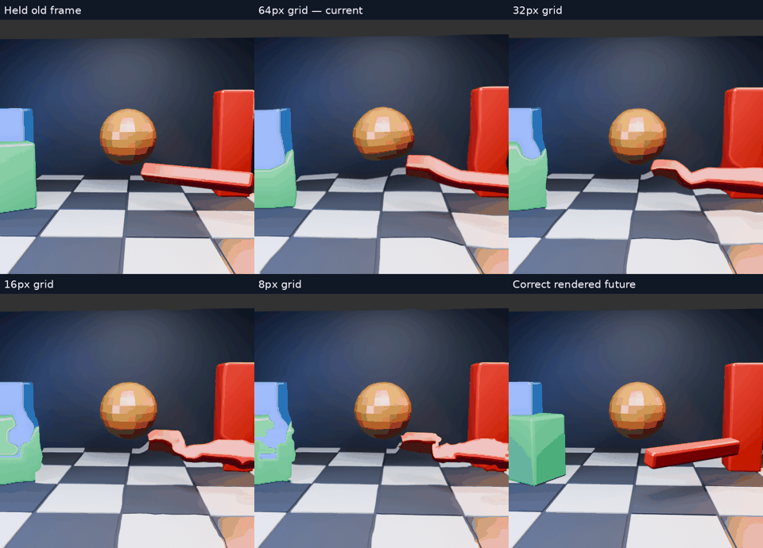
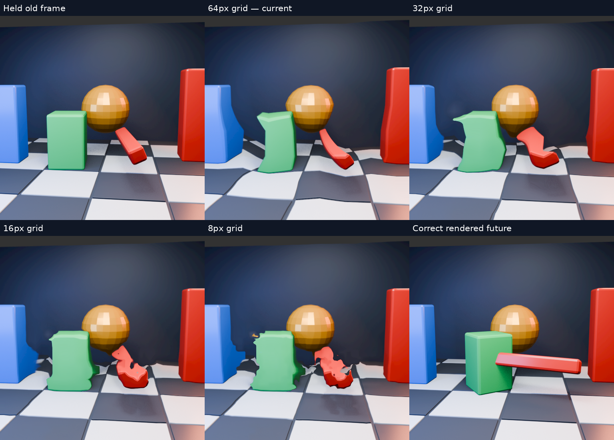

# Motion grid comparison: 64, 32, 16 and 8 pixels

Same moving 3D scene, same source frames, same production GPU matcher. Only the spacing of motion vectors changes. Every panel targets the same independently rendered future frame.

[Full-resolution 1536×1104 MP4](all-grids-slow.mp4), slowed 4×. Top row: held / 64px / 32px. Bottom row: 16px / 8px / true future. GIF is a reduced preview; inspect the MP4 for edges.

## Controlled setup

Uses the previous [moving 3D scene](../motion-scene/README.md), with a 33.33ms source interval and one interval of extrapolation. There are 32 outputs from 36 rendered frames at 60Hz, played at 15fps. The past/current/future inputs are i−2/i/i+2. This is a stress test with rapid object rotation, camera motion, parallax and newly exposed areas. Every output in this diagnostic is predicted; it does not simulate a runtime cadence of real and predicted frames.

Production downsample, nearby-match estimator and warp shaders run on the Radeon RX 7900 XTX at 512×512. Both eye layers share the image. Central 384×384 RGB RMSE is scored in both layers. Linear RGBA8 source conversion and sRGB output match the original scene test. No HEVC, physical headset, runtime pose compensation or latency measurement is involved. Vulkan validation enabled.

Only the vector grid changes: 8×8, 16×16, 32×32, 64×64 per eye. **The matching window stays at 8 pyramid texels (32 source pixels at the finest level).** An 8px vector spacing is not an 8px independent matching window; nearby estimates overlap. The pyramid and search radii remain fixed.

## Cost and integration limits

| Cell spacing | Cells relative to 64px | Raw int8 stereo vectors at 512² |
|---|---:|---:|
| 64px | 1× | 256 bytes |
| 32px | 4× | 1,024 bytes |
| 16px | 16× | 4,096 bytes |
| 8px | 64× | 16,384 bytes |

These are workgroup/payload counts, **not measured GPU-time multipliers**. Raw payload excludes packet headers. The fixture consumes floating-point vectors on the host and does not exercise transmission or headset SNORM quantization. The existing headset field sampler still needs one bilinear sample regardless of grid dimensions.

At the selected live 2688²/eye, 16px and 8px grids exceed the current 128×128-per-eye field acceptance limit. Neither can be enabled by simply changing the block-size constant. No production default or live profile was changed. An isolated GPU timing comparison and protocol/memory review are still required before deployment.

Reproduce by building the [fixture](https://github.com/nerdrx/wivrn-nx/commit/23207961) at `MOTION_TRUTH_SIZE=512` with `MOTION_TRUTH_BLOCK` equal to 64/32/16/8. Render `scene.py` from the previous scene directory, then run the included local-path `grid_compare.py` with the corresponding binaries. Logs and per-frame metrics accompany the video.

## Results

| Cell spacing | Mean RGB RMSE |
|---|---:|
| 64px | 40.801 |
| 32px | 38.380 |
| 16px | 37.855 |
| 8px | 37.727 |

Held-frame baseline: 39.670. Finer grids reduce aggregate error, but introduce finer ragged tears and still bend the objects. **Lower RMSE is not a convincing visual-quality win here.** 8px barely improves the score over 16px despite four times its cells. All four remain experimental; a finer grid alone does not solve the matching and occlusion problem.

