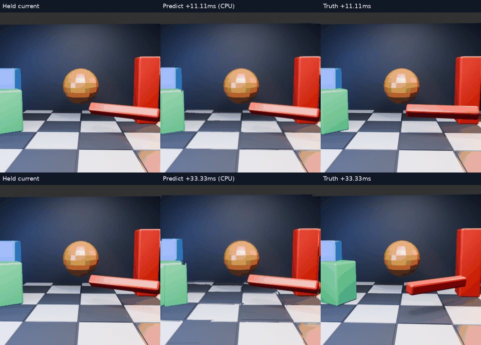
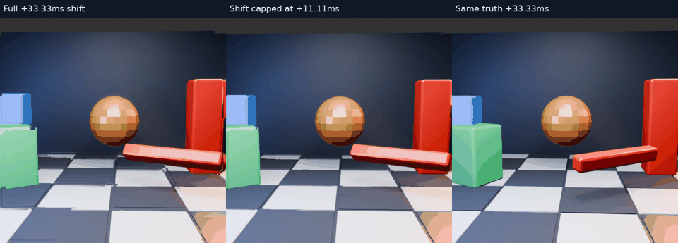

# Prediction horizon: +11.11 ms versus +33.33 ms

[Full-resolution animation](comparison.mp4) · [Paired scores](paired-scores.json) · [Example image](example.png)

## Question

Previous stress predictions looked two 60 Hz source intervals ahead: 33.33 ms. Does the same imperfect tracker become more useful over a shorter window? This experiment changes only the extrapolation distance and its independently rendered target. It does not change tracking, masks or region acceptance gates.

## Method

Eight common current frames (3, 7, 11, 15, 19, 23, 27, 31) use the same causal merged tracker and complete preceding 60 Hz history. Short targets are rendered in Blender at current frame plus 2/3 of a source interval, corresponding to **11.11 ms**. Long targets remain current plus two source intervals, **33.33 ms**. The displacement uses 2/3 or 2 times the track velocity in pixels per source interval. Region selection stays fixed to the long-horizon gate, avoiding a simultaneous acceptance change.

The scene's existing animation curves determine fractional-frame motion. Bezier interpolation and 3D rotation mean the short target is not simply a scaled pixel displacement. No future image enters tracking or composition. A fresh render of integer source frame 3 matched the original pixel-for-pixel ([control evidence](control.json)); this checks scene reconstruction for that frame, not all rendered states.

The animation contains **eight sparse samples**, not a continuous headset recording. Samples are four source frames apart; playback at 3.75 fps gives four-times slow motion. The upper row shows the short horizon and lower row the long horizon. Source images, target age and playback cadence are distinct quantities.

## Paired results

| Target horizon | Prediction RGB RMSE | Held RGB RMSE | Prediction minus held |
|---|---:|---:|---:|
| +11.11 ms | 24.0172 | 25.0232 | −1.0060 |
| +33.33 ms | 39.0640 | 39.8424 | −0.7784 |

The shorter target is easier even when doing **no prediction**: held error falls sharply too. Therefore the absolute error reduction is mostly evidence for a shorter age horizon, not a stronger tracker. Prediction gives a modest additional improvement in this eight-sample set, while partial silhouettes, old rotation angles and fill artifacts remain.

This supports investigating shorter source-image age and conservative extrapolation limits before adding more region complexity. It does not establish a live latency reduction, jitter-free motion or a deployable CPU predictor.

## What 90 Hz does not prove

A 90 Hz display interval is 11.11 ms; the decoded image can be much older because of rendering, transport, decoding and queues. The correct prediction horizon depends on the image timestamp and intended presentation time. This experiment does **not** establish that the live pipeline has an 11.11 ms horizon. At low source rates or under stalls it may need a longer horizon or a conservative fallback.

## Reproduction

The source is the [existing Blender stress-scene generator](../motion-scene/scene.py). Archived scripts render subframes, run the CPU tracker and build the gallery. They use the original sibling `nx-scratch/motion-regions` / `motion-scene` layout; adjust paths for another checkout. Dependencies are Blender, NumPy, Pillow, OpenCV and ffmpeg. The eight [short target images](truth) and raw paired measurements are included.

RGB RMSE uses the central 384×384 crop of 512×512 source sRGB images. CPU timing in the archived short runner includes target loading/scoring; no timing comparison or latency conclusion is drawn from it. No live configuration changed.

## Same old image, conservative shift cap

[Animation](same-target-cap/comparison.mp4) · [Scores](same-target-cap/scores.json)

A second evaluation keeps the target fixed at +33.33ms, but caps displacement to +11.11ms. It reuses predictions made without access to either target; this isolates the effect of under-extrapolating rather than making the target nearer. Across the same eight samples, mean RMSE is **38.5021 capped**, **39.0640 full shift**, and **39.8424 held**. Smaller shifts also limit the size of exposed-background damage in the inspected comparison. Rotation remains wrong; this is a modest quality result, not proof of temporal stability or lower latency.

Read-only integration audit: the live client derives motion steps from timestamps and field span, rather than assuming one panel period. Its current cap is three motion intervals. The region predictor here differs from the live GPU field, so this small study does not justify changing that default. The useful next experiment is a matched cap comparison using the actual GPU field and a larger set of frames.
