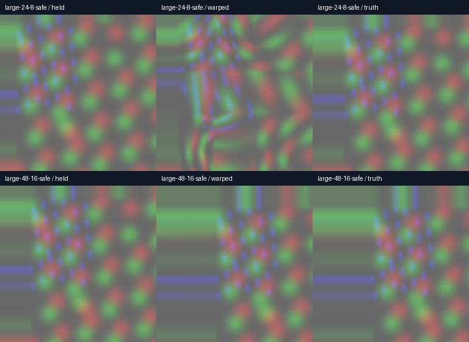

# Large motion: broader GPU screen, two rejected approaches

2026-09-11. Production nearby-match baseline `7e3ad9ac`, Radeon RX 7900 XTX, headless Vulkan validation. These are synthetic 256×256 image translations, not physical Pico head motion or live HEVC quality.

| Shift per source frame | Held RMSE | Current warp | Wider level-1 search | Second coarse candidate |
|---|---:|---:|---:|---:|
| 24,8 | 27.251914 | 19.025099 | 19.025099 | 19.786622 |
| 28,12 | 28.197321 | 9.771452 | 9.771452 | 7.664078 |
| 32,16 | 27.564964 | 0.203225 | 0.203225 | 0.203225 |
| 48,16 | 21.213290 | 0 | 0 | 0 |
| 64,32 | 25.190836 | 4.119191 | 4.119191 | 4.119191 |

Large displacement alone is not the whole problem. Some aligned shifts work well; intermediate shifts still create wrong local pulls. Increasing level-1 radius from 2 to 3 adds 24 comparisons per cell without improving these cases. Refining a second coarse candidate adds roughly another full search, improves 28,12 but worsens 24,8. **Neither approach is integrated.** Lower local SAD does not guarantee better final warped pixels.

The fixture needed a boundary correction: a large displacement could underflow the diagnostic pyramid index, and the fixed central crop could include newly uncovered pixels. It now rejects shifts >=96 and clips the score region to x>=max(64,2*DX), y>=max(64,2*DY), x,y<192. Counts across both eyes: 32,768 pixels for 24/28/32 shifts, 24,576 for 48,16, and 16,384 for 64,32. These differing crops prevent direct comparison of error magnitude between rows. Earlier 48px numbers used the old crop and are superseded here. Full images still show stretched borders; zero cropped RMSE is not whole-image perfection.

Current-image shift is D; expected future shift is 2D. Output and truth use the same sRGB encoding. Field interpolation remains bilinear. Logs and image readbacks preserve the wider-search and second-candidate trials; the rejected second-candidate shader is included. Wider-search variant changes only the level-1 radius to 3. No runtime profile change or additional Pico test was needed for these rejected host-GPU prototypes.

Next useful investigation is spatial agreement/confidence between cells and rejection of implausible deformation, plus renderer motion data where available. More search alone did not solve the visible block pulls. Mixed motion, occlusions and physical head movement remain unproven.
