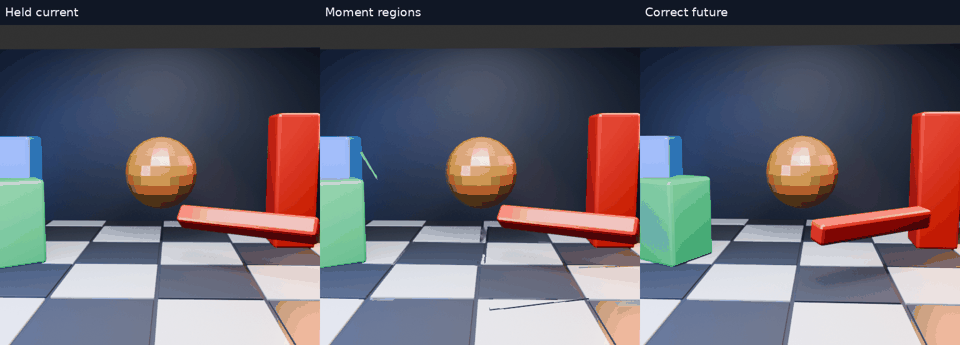

# Image-only layers: rigid motion and exposed background

Follow-up to the [image-only motion report](../../../../docs/IMAGE_ONLY_MOTION.md). The question is whether coherent image regions can move independently without the distorted grid edges, while removing their retained silhouettes from the background.

## Flow-fitted regions

[Full-resolution animation](flow-fit/comparison.mp4) · [Per-frame measurements](flow-fit/scores.json) · [Runner](layered_compare.py)

Previous/current RGB images alone determine motion. Overlapping hue bands and connected components collect similarly coloured surfaces; no named colours, renderer IDs, depth or future-frame masks are supplied. Forward/backward optical-flow consistency selects observations for robust similarity fitting. Each accepted region moves with one rigid-plus-uniform-scale transform. A CPU inpainting operation fills its old position, then transformed regions are composited using area order. Area order is only a heuristic, not depth.

**Result:** the flow-fitted version averages RGB RMSE 38.885 versus held-current 39.571, improving 28/32 frames. This small score improvement does not establish convincing object extrapolation: fast objects are sometimes rejected or barely advanced, masks miss highlights, and overlapping regions expose fill artifacts. The 32-frame stress scene is unchanged from earlier experiments.

**Cost:** mean 62.23 ms, median 62.32 ms, p95 75.57 ms for CPU input loading, motion estimation, segmentation, fitting, inpainting and composition. This is one unisolated host run with four OpenCV threads. Timing excludes future-image loading, scoring and animation generation. It is neither GPU time nor headset latency, and is far outside a 90 Hz budget. The method is an offline diagnostic, not deployed code.

## Moment-fitted regions

[Full-resolution animation](moment-fit/comparison.mp4) · [Scores](moment-fit/scores.json) · [Runner](layered_moments_compare.py)

The second variant matches previous/current hue components using colour, area and centroid distance. Region covariance supplies a principal axis for elongated regions and a bounded scale estimate. An explicit inverse transform and PCA sign-flip regression guard the motion convention. No future pixels enter matching. The initial rotation-direction bug was corrected before these published renders.

Mean RMSE is **43.771**, worse than held-current **39.571**. Inspection shows incorrect correspondences, partial object masks and fabricated background patches. This fails the clean-shape goal too: a rigid transform cannot rescue a mask that captures only part of an object. Neither version is promoted to the live client.

The next useful requirement is persistent, validated region correspondence and conservative visibility handling. These results do not justify adding inpainting and hue segmentation to the latency-sensitive live path.

## Measurement boundaries

These CPU images use source sRGB bytes directly; earlier Vulkan fixtures quantized linear bytes before converting back to sRGB. Therefore compare the paired held-current scores here, not small score differences against the earlier GPU table. All images are 512×512, central 384×384 scoring. Thirty-two predictions use two-frame intervals from a 60 Hz source (33.33 ms prediction horizon), played at 15 fps / four-times slow motion. There are no fresh-frame inserts.

The [direction regression](test_motion_direction.py) checks the inverse-map convention with constant translation/rotation and demonstrates its failure when successive transforms differ. It does not validate scene segmentation, silhouettes or timing.

OpenCV 5.0.0.93, NumPy, Pillow and ffmpeg are required. Runners retain the local `nx-scratch/motion-regions` sibling layout and use the [earlier scene generator](../motion-scene/scene.py); adjust paths for another checkout. Future frames are loaded only after prediction is complete.
