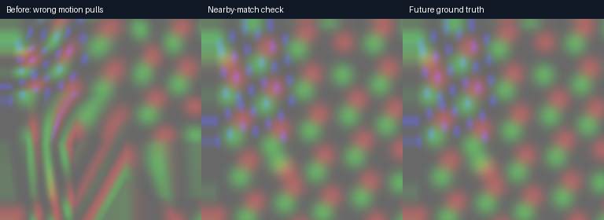

# Removing grid-shaped motion pulls with a nearby-match check

2026-09-11. The user identified grid-shaped deformation as more objectionable than average image error. Existing field sampling was already bilinear: wrong neighbouring motion vectors, not nearest-neighbour colour sampling, caused large local pulls in this fixture.

The matcher now independently checks a 5×5 neighbourhood around zero at the finest pyramid level. It replaces the hierarchical candidate only when SAD is lower, or equal with a shorter displacement. This catches small real motion when coarse matching locks onto a distant lookalike. No new pass, packet, image blur, or client texture samples. It adds 25 candidate SAD evaluations plus two candidate comparisons per field cell; its server cost must be measured.

## Actual GPU image comparison

Same production Vulkan fixture as [the previous test](../motion-gpu-truth/README.md): 256×256, identical synthetic inputs per eye, predicted future at one frame beyond current, RGB RMSE over central 128×128 in both eyes. Host Radeon RX 7900 XTX, validation enabled. These are GPU readbacks, not headset photographs.

| Translation per input frame | Held image | Before | Nearby check |
|---|---:|---:|---:|
| 0,0 | 0 | 0 | 0 |
| 4,4 | 9.838258 | 18.274524 | **0** |
| 8,4 | 14.997635 | 17.653948 | **0** |
| 16,16 | 24.202535 | 0 | **0** |
| 12,4 | 18.933313 | 14.240748 | 14.240748 |
| 5,3 | 10.423157 | 18.484945 | 15.563132 |

**The fractional-pyramid 5,3 case still looks worse than holding the image.** Zero error in selected aligned fixtures is not proof of arbitrary-motion quality. The nearby search covers ±8 source pixels because the finest pyramid is quarter resolution. Large motion still uses the original hierarchical search. Disocclusions, mixed object motion and physical head motion remain unqualified.

A cubic B-spline field reconstruction was also tested and rejected: it softened deformation corners but spread incorrect vectors, increasing 8,4 RMSE to 20.518914. Its shader and readback are archived here; it is not integrated.

CPU estimator mirror: 26 checks passed. Production shader and server builds passed. Existing exact-match correction remains. The client warp still uses its original bilinear field sampler, so this change adds no headset sampling work.

## Short live Pico screen

Two sequential 30-second animated full-field headless runs; discard first 10 seconds. Full-frame HEVC 10-bit, 2688×2688 per eye, 60 Hz source cap, 90 Hz presentation. Physical headset stationary. Source-clock experiment off; headset motion mode on.

| Client telemetry means | Before | Nearby check |
|---|---:|---:|
| Fresh first-eye selections/s | 59.72 | 59.61 |
| Render iterations/s | 90.00 | 90.01 |
| Own GPU time (ms) | 5.94 | 5.72 |

No obvious throughput collapse in this short screen. This is not an isolated measurement of extra server estimator time, a statistically demonstrated speedup, nor proof of physical head-motion quality or lower motion-to-photon latency. The small GPU difference may reflect run variation. A 90 Hz render loop does not mean 90 fresh decoded images. Raw logs and analyzer summaries are included. Original large-centre NX profile restored afterward.

Implementation: [7e3ad9ac](https://github.com/nerdrx/wivrn-nx/commit/7e3ad9ac), compared with [13eadd57](https://github.com/nerdrx/wivrn-nx/commit/13eadd57).
