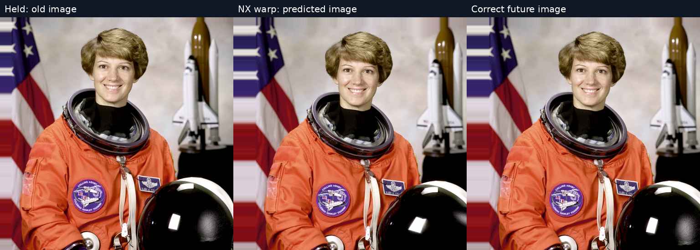
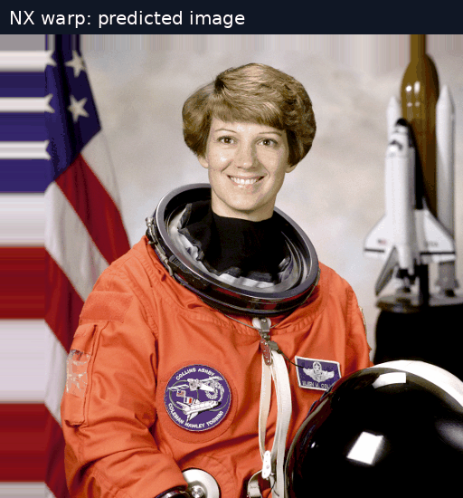
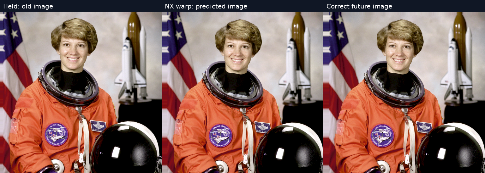
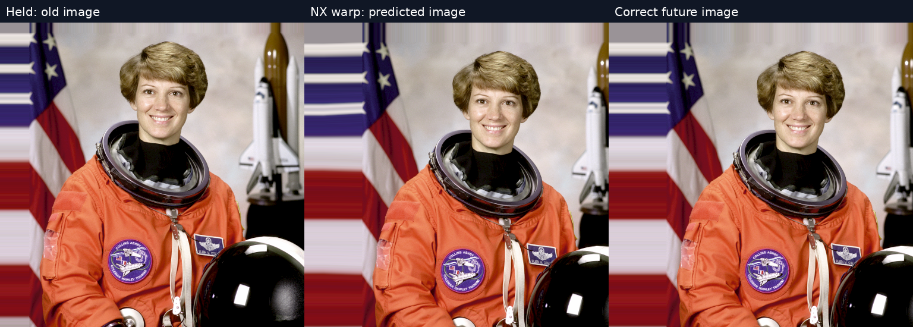

# Motion warp on a recognizable photograph

Actual production GPU motion estimation and warp, Radeon RX 7900 XTX, 512×512 input, 8×8 vector grid. No invented or retouched output. The source is NASA's Eileen Collins portrait, provided as the public-domain [scikit-image astronaut image](https://github.com/scikit-image/scikit-image/blob/v0.24.0/skimage/data/astronaut.png); [provenance](https://github.com/scikit-image/scikit-image/blob/v0.24.0/skimage/data/_fetchers.py).

## Medium shift: 24 pixels right, 8 down per input frame

The GIF alternates prediction and truth every 850ms for inspection; it is not a playback-FPS or latency demonstration. Watch the face, suit badge and helmet contours.

## Small shift: 8 right, 4 down

## Large shift: 48 right, 16 down

The border stretches because new content cannot be recovered from the old photograph. Do not mistake the clean scored interior for whole-image perfection.

| Per-frame shift | Held RMSE | Predicted RMSE | Scored pixels, both eyes |
|---|---:|---:|---:|
| 8,4 | 54.567431 | 0 | 294,912 |
| 24,8 | 77.205669 | 6.676425 | 294,912 |
| 48,16 | 89.683558 | 0 | 270,336 |

Previous image is the source; current is translated by D; future truth by 2D. Prediction extrapolates current one interval. Both eyes share the source. Input is converted from sRGB to linear RGBA8, then output and truth use the same sRGB encoding. This quantizes dark tones. Metrics exclude a 64px border and any additional uncovered left/top area; regions differ for larger shifts. This is controlled image translation, not an actual moving person, depth-aware VR motion, HEVC decode, Pico rendering or a latency measurement.

The production nearby-match shader is unchanged. [Fixture support](https://github.com/nerdrx/wivrn-nx/commit/172d9fc2) adds an optional linear RGBA8 input and CMake `MOTION_TRUTH_SIZE=512`. Run `motion_gpu_truth 1 24 8 /absolute/path/source.rgba`. Per-case logs and native-size PNGs are included. Vulkan validation reported no errors. The original 256px synthetic 8,4 regression still yields zero RMSE.
