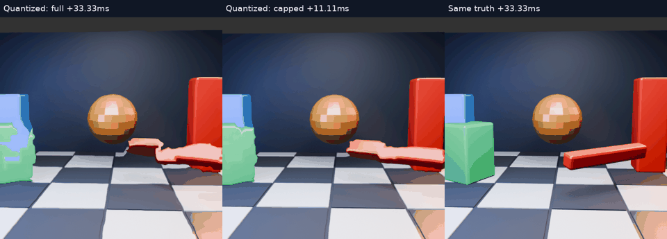

# Quantized motion fields: precision is not the main distortion source

[Animation](comparison.mp4) · [Image scores](scores.json) · [Geometry scores](geometry.json)

This extends the [float-field GPU cap experiment](../motion-gpu-cap/README.md) with the server's signed 8-bit vector representation. The same 32 input triples, 8px grid, 512×512 images and +33.33ms target are used. Only the field representation changes.

## Representation

The emulator follows `motion_estimator::read_back`: replace nonfinite components with zero, find the largest absolute component across both eyes, cap that scale at 0.25, multiply by `127/scale`, round halfway away from zero, and clamp to −127…127. It then converts signed bytes back to float vectors with `byte/127 * scale` and supplies these to the actual GPU warp through the fixture override.

The transmitted component bytes, decoded float fields and per-frame scale are archived. The largest component quantization error measured in this set was **0.4803 pixels at 512px resolution**, before extrapolation. This is not an end-to-end pixel-error bound: interpolation, clipping and image gradients affect the rendered result.

This models vector quantization, but **does not execute the client's actual SNORM texture sampling**. Dequantizing before float interpolation is equivalent in ideal arithmetic; hardware texture precision and operation ordering can differ. Nor does this test include foveation, pose compensation, blur, transport or decoding.

## Results

| Field and shift | Mean RGB RMSE | Mean nonpositive map-Jacobian fraction |
|---|---:|---:|
| Original float, full | 37.7266 | 8.603% |
| Quantized, full | 37.7488 | 8.369% |
| Original float, one-third | 38.3278 | 0.945% |
| Quantized, one-third | 38.3286 | 0.944% |

Held-image RMSE remains 39.6698. With quantization, the cap beats full-shift error in 11/32 frames, as before. The negligible mean-error changes suggest vector precision is not the main source of the visible distortion in this scene. Increasing wire precision would not address the much larger error already present in the float-field result.

The geometry metric uses the analytic bilinear-field Jacobian on the central crop, excluding samples clamped by either shift. It identifies local degeneration/reversal of the source sampling map; it does not certify straight silhouettes, temporal stability or correct motion. Quantization slightly changes which samples are eligible, so small geometry differences are not a quality ranking.

## Reproduction and limits

The archived runner reads the float fields from the preceding `gpu-cap/full` runs, quantizes them on the CPU, and invokes the same Vulkan fixture with steps 1 and 1/3. The target stays +33.33ms; the shorter shift represents +11.11ms of motion. Logs have trailing whitespace normalized. Paired held/target readbacks match exactly and validation reported no errors.

Scripts retain the local `nx-scratch/motion-regions` and sibling `motion-scene` layout; adjust paths for another checkout. The [previous experiment](../motion-gpu-cap/README.md) documents the source scene, fixture build and linear-RGBA inputs. Video playback is 15fps, four times slower than the 60Hz source, with 32 predicted frames and no fresh-frame inserts.

**No timing or latency improvement is claimed, and no live setting changed.** The next useful question is how to limit excessive field deformation without suppressing reliable motion or causing frame-to-frame jumps.
