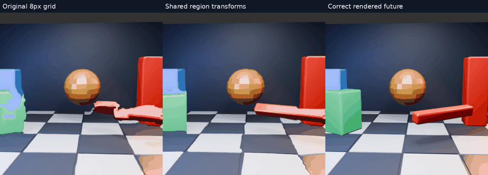
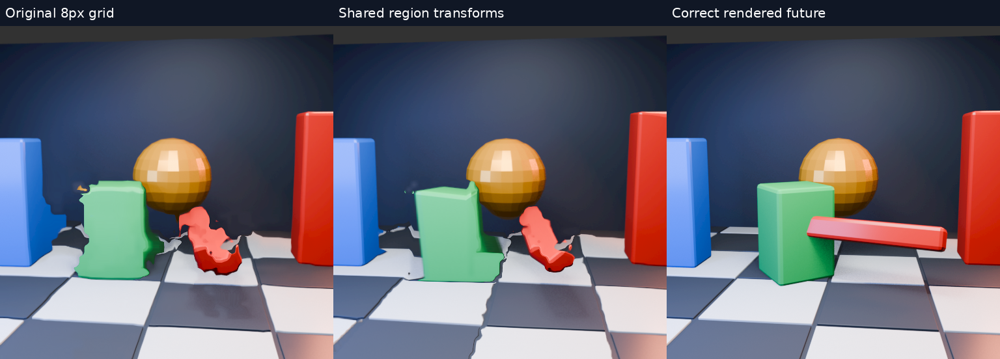

# Image-only motion regions: first transform-fitting experiment

Same moving 3D scene, 8px motion grid and 33.33ms prediction interval. No renderer object IDs, depth or future-image features are supplied to the grouping algorithm. The future image is used only for scoring and the reference panel.

[Full-resolution shared-transform MP4](shared-regions-slow.mp4), slowed 4×. Watch the green block: parts become straighter, while incorrect grouping introduces other edge distortions.

## What was actually tested

The actual GPU matcher exports its 64×64 floating-point vector field. An offline Python prototype groups neighbouring cells using current-image colour, then robustly fits an affine displacement model per region. It feeds the resulting field back to the actual GPU warp. Both stereo layers receive identical data, as in the existing fixture.

This is **regional affine flow fitting**, not complete object tracking or a depth-aware object renderer. It still samples the field bilinearly at region boundaries. It does not reconstruct hidden surfaces or identify whole objects semantically. CPU readback/fitting/upload is diagnostic, not a low-latency production implementation.

Two candidates:

* Cautious: connected neighbours need colour distance <38 in RGB bytes and motion difference <12px. Regions need at least 12 cells; robust fitting requires 60% support and only replaces cells with residual <3px. Gradient magnitude limit 0.8. Most unstable pixels retain the original field.
* Shared: colour-connected regions without the motion threshold, 35% support and gradient limit 2.0. An accepted affine model replaces the whole region, including outliers. This is deliberately stronger; similar-coloured surfaces can merge incorrectly.

Both use four least-squares/refit rounds with residual cutoff max(2px,1.7×median). These are heuristic thresholds, not trained segmentation. No future pixels influence fitting. Colour samples are 8×8 image-block means.

| Method | Mean RGB RMSE | Mean replaced cells per eye (of 4096) |
|---|---:|---:|
| Original 8px grid | 37.726588 | — |
| Cautious grouping | 37.788819 | 1594.0 |
| Shared region transforms | 38.538297 | 3942.1 |

**Neither candidate wins on mean error.** The stronger version alters shapes visibly but still has false groups and tears. These results do not rule out object/region transforms; they show that fitting shared transforms to already-wrong flow is insufficient without better boundaries and confidence.

[Cautious comparison MP4](cautious-regions-slow.mp4). All 32 frames are preserved in the animations and per-frame metrics. Same central 384×384 score crop, linear RGBA8 conversion, 512² host Vulkan execution and limitations as the [original scene test](../motion-scene/README.md). Vulkan validation enabled; no errors reported. No live runtime or latency advantage demonstrated; no production motion algorithm changed.

Reproduce with the included local-path scripts and `tests/motion_gpu_truth` built for size512/block8. Generate the scene and linear inputs as before. The fixture now exports `field.f32` and accepts `NX_MOTION_FIELD_OVERRIDE`; a final explicit synchronization check reproduces the selected shared-transform frame. Next work should improve region boundaries and reject implausible transforms before trying GPU integration.
