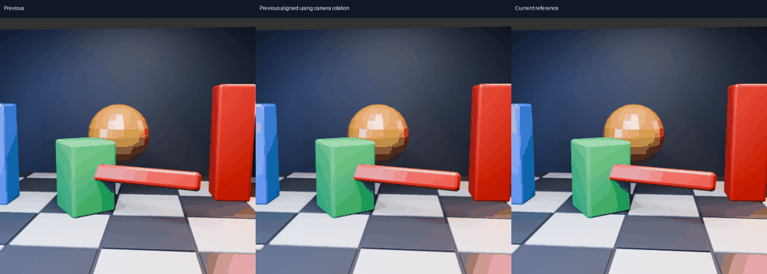
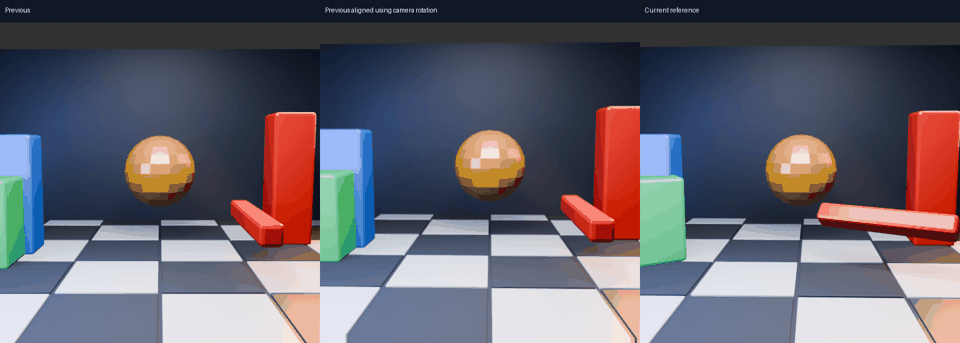

# Separate camera rotation before estimating motion

## Question
Can known headset rotation remove a source of motion-estimation ambiguity without renderer depth or object IDs? This is an offline camera-alignment diagnostic, not a deployed latency improvement.

Left: previous image. Middle: previous image sampled into the current camera orientation. Right: independently rendered current image. The static scene stays fixed while the camera rotates at a fixed position. Seven consecutive pairs, 512×512; the animation is a slowed diagnostic sequence.

## Results

Values are means of per-pair statistics. Image RMSE uses linear RGB scaled to 255 and only valid overlapping pixels. GPU vector statistics use the central 384×384 region of one eye; both fixture eyes receive identical images.

| Diagnostic | Original pair | Rotation-aligned pair |
|---|---:|---:|
| Static rotation: image RMSE | 23.783 | 1.941 |
| Static rotation: median estimated displacement | 7.815 px | 0.387 px |
| Static rotation: p95 estimated displacement | 9.156 px | 5.225 px |
| Mixed scene: image RMSE | 33.737 | 44.646 |
| Mixed scene: median estimated displacement | 7.886 px | 11.840 px |
| Mixed scene: p95 estimated displacement | 42.305 px | 51.025 px |

Camera alignment reduces static-scene image mismatch by 91.8%. However, the remaining p95 flow is 5.225 px even though the scene is stationary: the estimator cannot yet reliably distinguish unsupported motion from real motion. Resampling and rendering differences mean the aligned images are not pixel-identical.

## Translation and moving objects

Eight pairs from the existing moving scene, source frames 3, 7, …, 31 versus two frames earlier. The camera translates as well as rotates, with independent objects and occlusions. Removing rotation does **not** remove depth-dependent parallax. Rotation and translation can partially cancel in the original image; separating rotation can therefore increase the displacement the estimator must handle. This experiment does not identify that as the sole cause of the increase.

## Method and limits

Camera-to-world rotations and projection matrices are exported from Blender, standing in for known XR camera pose/FOV. No object identities, masks, depth or future pose enter alignment or the GPU estimator. Current pixel-centre rays are transformed by `R_previous.T @ R_current`, projected into the previous image and bilinearly sampled. Blender looks down local −Z, with +Y up; image coordinates point down. Out-of-image samples use replicated borders, excluded from image-error scoring. Flow metrics use a central crop.

The unchanged 8px GPU estimator runs on both original and aligned image pairs; all 30 invocations completed with Vulkan validation enabled and no reported validation errors. The fixture receives the current image as its target only to run/export the field: its printed extrapolation RMSE is **not** used as prediction evidence. CPU alignment adds a pass in this prototype; no speed claim is made. HEVC artifacts, production quantization, foveation, headset presentation and actual latency are not tested here.

Next: test a photometric zero-motion preference on the aligned pair, with moving-object controls so real movement is not simply suppressed. Only after that should alignment be considered for fusion into the existing GPU pyramid sampling. Current live settings are unchanged.

## Reproduction

`rotation_scene.py` imports `../motion-scene/scene.py` and renders with Blender 5.2. `rotation_compare.py` uses NumPy, Pillow, OpenCV and the existing `../motion-scene/build8/motion_gpu_truth` executable. Preserve the original scratch layout, or adjust those paths. The mixed run consumes the existing 36-frame scene render. Included scene source, camera matrices, scores, binary hash and raw fixture logs record this run. The test does not require a headset.
