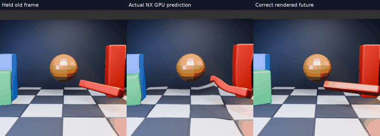
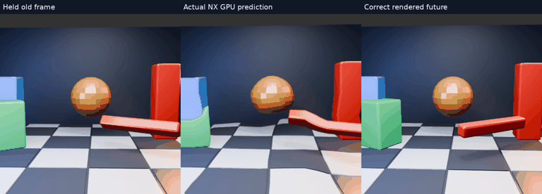
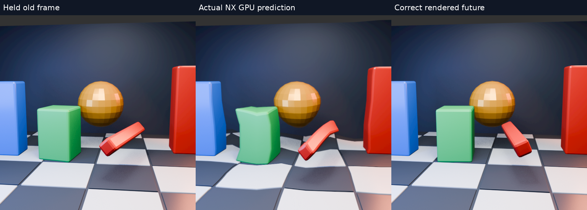

# Moving 3D objects and camera: actual GPU warp

A 512×512 Blender/Eevee scene: independently moving/rotating green block and red bar, static pillars and sphere, tiled floor, camera translation and changing orientation. The 36 independently rendered source frames are spaced at 1/60s. Movement is deliberately aggressive: the green block crosses eight scene units and the camera advances 2.2 units in 35/60s. No motion blur. This is a stress fixture, not typical gameplay.

## 16.67ms prediction interval — 4× slow motion

[Full-resolution MP4](gap1-slow.mp4). The reduced GIF is only a preview. Watch the green block's outline, rotating red bar and newly exposed background.

## 33.33ms prediction interval — 4× slow motion

[Full-resolution MP4](gap2-slow.mp4).

Every panel refers to the same future target. Left holds the last available frame; middle applies production GPU optical flow and warp from two earlier frames; right is Blender's independently rendered future. Each output is one full prediction interval beyond the latest source. Gap 1 uses indices i−1/i/i+1; gap 2 uses i−2/i/i+2. Both clips advance through 60Hz source indices but play at 15fps. They are deliberately all-prediction diagnostic sequences, not a mixture of decoded and predicted runtime frames.

## Method and limits

The actual production downsample, nearby-match estimator and warp run headlessly on the Radeon RX 7900 XTX, using an 8×8 motion grid. No optical flow is invented for the visualization. Source pixels convert from sRGB to linear RGBA8 before GPU upload; outputs and truth use the same sRGB encoding. That conversion quantizes dark tones. Both eye layers receive the same image. Metrics score the central 384×384 of both layers, without masking object occlusions. Full videos show the complete image.

This test includes parallax, object motion, acceleration, rotation and disocclusion. It does **not** exercise HEVC compression, Pico GPU performance, runtime head-pose compensation, the compositor, stereo differences or measured motion-to-photon latency. No live profile was changed. The image-based warp cannot invent newly exposed surfaces.

Scripts, per-frame logs and metric summaries are provided. Run `scene.py` under background Blender 5.2 to regenerate `frames/`; build the WiVRn `tests/motion_gpu_truth` fixture at size 512. `compare.py` uses the original local sibling path to that binary and needs Pillow and ffmpeg; adjust that path for another checkout. [Three-frame fixture support](https://github.com/nerdrx/wivrn-nx/commit/df71a52e).

## Measured image error

| Prediction interval | Outputs | Mean held RGB RMSE | Mean warped RGB RMSE |
|---|---:|---:|---:|
| 16.67 ms | 34 | 30.488 | 30.847 |
| 33.33 ms | 32 | 39.670 | 40.801 |

**Both aggregate results are worse than holding the image.** The videos show why: incorrect local motion bends objects and does not follow rapid rotation reliably. This is evidence of a remaining quality failure, not a latency win. GPU validation reported no errors across these runs.
