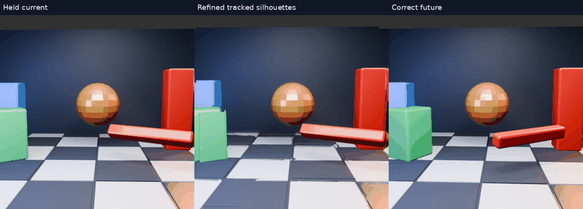

# Conservative silhouette refinement: rejected for live use

Follow-up to [persistent tracking](../motion-tracking/README.md). The hypothesis: small holes and pixel-scale contour steps cause some visible damage, so tidying masks while keeping exactly the same tracked motion might help.

[Refined animation](tracked-silhouette/comparison.mp4) · [Control animation](silhouette-control/comparison.mp4) · [Control GIF](silhouette-control/comparison.gif) · [Raw summary](summary.json)

## Method

The unchanged merged tracker consumes every preceding 60 Hz RGB frame. Its IDs, confidence and velocities remain unchanged; cleanup modifies only the masks passed to composition. Contours are approximated with a 1px tolerance. Enclosed holes up to 64 pixels may be filled, but larger holes remain open. Changes are rejected if total mask area changes by more than 3%, added pixels lie more than approximately 2px from the original, or masks would overlap. Existing deep cut-outs are preserved; no convex hull is used.

A padded exterior flood fill distinguishes actual holes from background connected to the image border. Regression tests cover that distinction, a foreground touching the corner, hole-size limits, concavities and neighbouring-mask exclusion. This validates constraints, not perceptual quality or arbitrary scene segmentation.

## Results

| Method | Mean RGB RMSE | Mean host CPU ms |
|---|---:|---:|
| Fresh control run | 38.6965 | 47.04 |
| Refined masks | 38.6871 | 60.09 |
| Held current | 39.5706 | — |

Of 297 mask proposals, 114 passed the gates, adding 4,260 pixels summed across mask observations. **No accepted hole fills occurred in this scene**; the scene result therefore does not demonstrate benefit from the hole-filling feature. Some accepted proposals may be unchanged. The tiny mean-error improvement does not resolve the visible trails, partial silhouettes or old rotation angles. The additional CPU work is unjustified by this result. **Do not promote this pass into the live path.**

The CPU times come from separate short, unisolated runs. Both new runners measure input loading, tracking and composition, excluding future loading/scoring and animation generation. The older merged-tracker runner included future-loading/scoring overhead; its report now explicitly notes that mismatch. These figures are neither Pico performance nor motion-to-photon latency.

## Reproduction and boundaries

Thirty-two predictions at 512×512 use two source intervals of lookahead (33.33ms), with future pixels read only after prediction. Source RGB is scored directly in sRGB over the central 384×384 crop. Playback is 15fps / four times slow motion, with no fresh-frame inserts. The source is the [earlier stress scene](../motion-scene/scene.py).

The archived Python runners use NumPy, Pillow, OpenCV and ffmpeg and retain the original sibling `nx-scratch/motion-regions` / `motion-scene` paths. Adjust these for another checkout. [Tests](test_silhouette_masks.py), [test output](tests.log), and per-frame scores in each animation directory are included. No live client configuration changed.

The evidence argues against more contour polish around unreliable colour masks. A future approach must preserve complete object boundaries and handle uncovered background conservatively; a tidier fragment is still a fragment.
