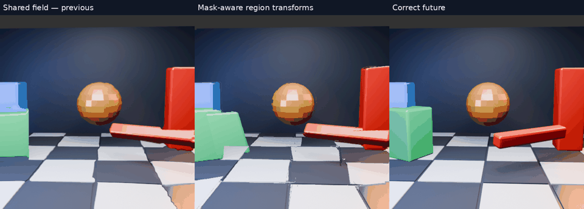
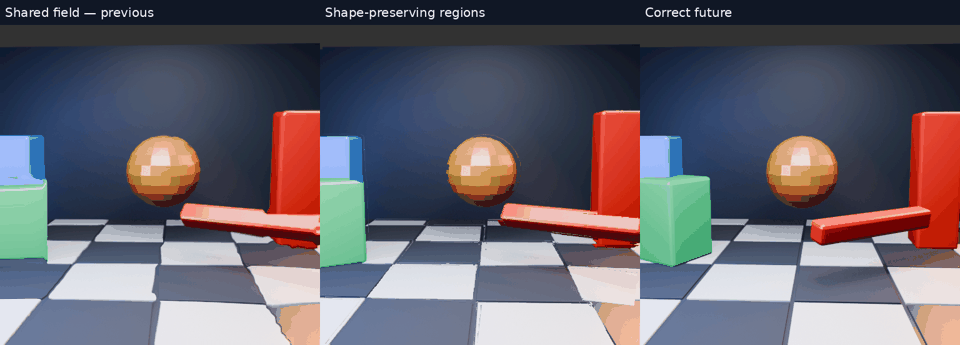
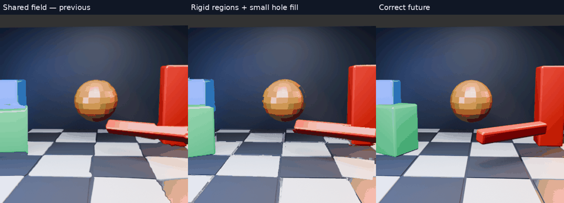
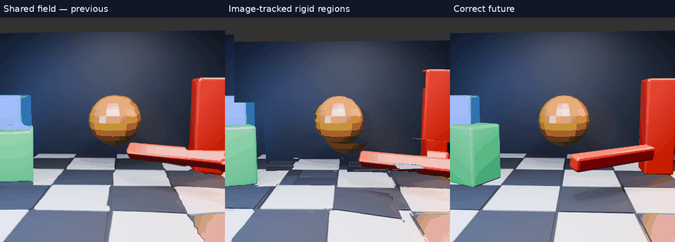
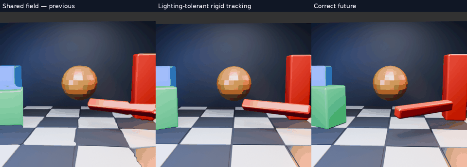
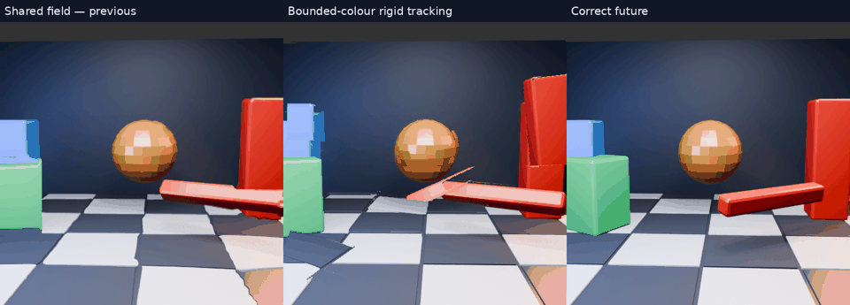
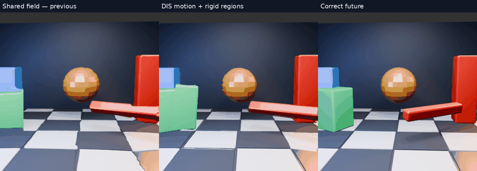
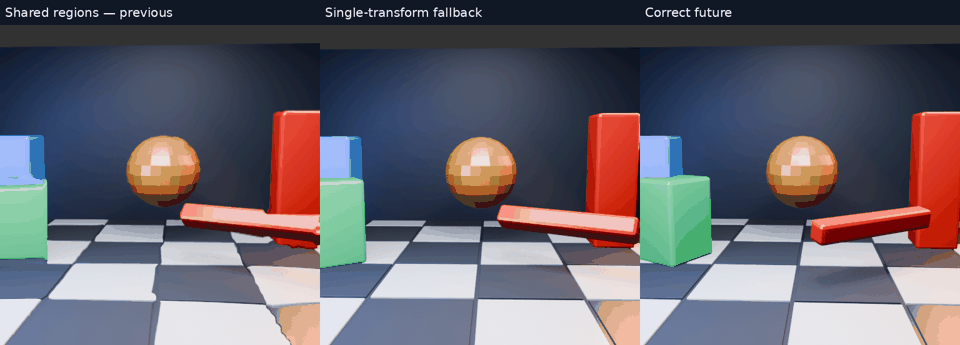

# Image-only motion: complete surface experiment gallery

[Read the paper-style report](../../../../docs/IMAGE_ONLY_MOTION.md).

[Full-resolution overview MP4](overview.mp4). All clips use the same 32 future targets and play four times slower than source progression. They are offline host-GPU reconstructions, not live Pico recordings. A cleaner shape does not imply correct motion or lower latency.

## Every variant in this round

### Affine regions with transported masks

[Full-resolution video](masked/comparison.mp4) · [Per-frame scores](masked/scores.json)

Animated preview

### Rigid similarity regions

[Full-resolution video](similarity/comparison.mp4) · [Per-frame scores](similarity/scores.json)

Animated preview

### Rigid regions with small hole extension

[Full-resolution video](filled/comparison.mp4) · [Per-frame scores](filled/scores.json)

Animated preview

### Image-region moment tracking

[Full-resolution video](moments/comparison.mp4) · [Per-frame scores](moments/scores.json)

Animated preview

### Lighting-tolerant colour tracking

[Full-resolution video](chroma-moments/comparison.mp4) · [Per-frame scores](chroma-moments/scores.json)

Animated preview

### Seed-bounded colour tracking

[Full-resolution video](seed-moments/comparison.mp4) · [Per-frame scores](seed-moments/scores.json)

Animated preview

### DIS flow with rigid regions

[Full-resolution video](dis-similarity/comparison.mp4) · [Per-frame scores](dis-similarity/scores.json)

Animated preview

### Single-transform fallback

[Full-resolution video](global/comparison.mp4) · [Per-frame scores](global/scores.json)

Animated preview

## Earlier animations

- [Original 3D scene and both prediction intervals](../motion-scene/README.md)
- [All four grid sizes: 64/32/16/8px](../motion-grid/README.md)
- [Tiny blur on 64px and 8px grids](../motion-tiny-blur/README.md)
- [Initial shared-region and cautious variants](../motion-regions/README.md)
- [Consensus fitting and straight-edge diagnostics](../motion-edges/README.md)
- [Real-photo translations and blink comparisons](../motion-photo/README.md)

## Reproduction notes

The runners use the original `nx-scratch/motion-regions` layout, source frames/linear data from `motion-scene`, and `tests/motion_gpu_truth` from WiVRn NX. Adjust local paths in another checkout. The masked/dense experiments export per-pixel inverse maps on the CPU and use the real GPU warp. Raw input and future remain separate; future pixels are never used to choose transforms. Full dense maps are reproducible and are not committed because they are diagnostic intermediate data.

Two first-run score serializers encountered NumPy integer conversion errors after rendering all frames. Their videos and `scores.json` were reconstructed from the completed per-frame GPU logs; the archived runners contain the corrected integer conversion. The failed serializer did not change images. Optional `diagnostics.json` is included only where valid.

`similarity-property.log` and `projective-check.log` test straight-line preservation of the transforms themselves. They do not certify the final silhouettes, visibility handling, perceived stability or motion accuracy. The report explains those limits and every rejected variant.
