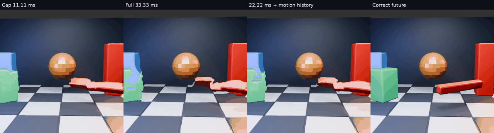

# Stronger warp with causal motion history

[Main animation](comparison.mp4) · [All six variants, held and reference](overview.mp4) · [All scores and trajectories](scores.json)

## Hypothesis

If a motion estimate jumps between consecutive source images, retaining prior estimates may permit stronger extrapolation without equally strong temporal instability. This quick offline study tests saved fields without using the Pico or changing the live profile.

## Method

All 32 saved 8px GPU fields and 512² readbacks from motion-gpu-cap are reused. Reconstruction is CPU NumPy bilinear inverse sampling in linear light, followed by sRGB conversion. CPU full/cap controls are within 0.005 mean RGB RMSE of their original GPU counterparts. That agreement is not full production equivalence.

- **cap:** current field / 3, nominal 11.11 ms.
- **full:** current field, nominal 33.33 ms.
- **ema:** equal current and recursively retained previous field at the same pixel.
- **transport:** equal current and recursively retained history, with history sampled at `q = p − 0.5 d_current(p)`. Blend only where mean absolute linear RGB difference between current at p and previous held at q is below 0.08 and q is in bounds; otherwise use current. First frame starts from current. This is adjacent-image consistency, not calibrated confidence.
- **balanced:** same-pixel ema multiplied by 2/3, nominal 22.22 ms.
- **medium:** raw current field multiplied by 2/3, matched-strength control.

Adjacent saved outputs advance 16.67 ms, whereas each field covers 33.33 ms. That accounts for the half-field history lookup. All methods use the same correct target 33.33 ms after current. Future pixels enter only scoring. Nominal duration does not measure corrected latency, especially with recursively smoothed velocities.

## Results

| Method | Mean RGB RMSE | Mean centre error px | Median gap closed | Residual second-difference RMS px |
|---|---:|---:|---:|---:|
| cap | 38.3238 | 26.67 | 16.4% | 10.51 |
| full | 37.7228 | 19.75 | 34.2% | 20.71 |
| ema | 38.2027 | 20.15 | 37.6% | 14.38 |
| transport | 38.0191 | 20.89 | 33.6% | 15.66 |
| balanced | 37.8427 | 23.32 | 29.5% | 11.04 |
| medium | 37.9367 | 23.54 | 26.9% | 15.12 |

The matched 22.22 ms control supports a smoothing effect beyond simply reducing strength: balanced history lowers the residual second-difference RMS from 15.12 to 11.04px (27%), while block progress increases from 26.9% to 29.5%. Compared with the installed-strength cap model, progress rises from 16.4% to 29.5%, with the diagnostic about 5% higher (10.51 to 11.04px).

The transported variant does not beat the simple same-pixel blend here. It is not promoted. No blur is added; these variants filter motion estimates rather than average output pictures.

## Quality and limits

**Promising offline candidate, not a completed fix.** Inspected frames 8, 16 and 24 retain bent silhouettes and a badly predicted rotating bar. No jitter-free or straight-edge claim is justified. Recursion can accumulate stale velocity after reversals, and same-pixel history mixes different moving surfaces. This selected setting has no held-out scene validation.

The temporal diagnostic is the RMS second difference of the visible green-block centroid error relative to the correct future, across 32 consecutive outputs. It is not a whole-image flicker, physical latency or perceptual jitter measurement. Occlusion and distorted masks can change the centre. Position aggregates use the existing green-dominance evaluator and held-to-target displacement of at least 4px; 30 frames qualify. RGB error uses the central 384² crop. The videos show every prediction at 15fps (4× slow motion), not live fresh/warped frame cadence. GIF skips alternate frames.

No device, stereo, foveation, quantized-field transport, pose-compensation or GPU-cost validation was performed. Live integration must reset history on discontinuities and reconcile the filtered total-motion field with head-pose compensation. The current installed cap remains unchanged.

## Reproduction

Run temporal_field_compare.py, then temporal_field_gallery.py from the original sibling motion-regions scratch layout containing gpu-cap/full and gpu-cap/cap. Requires NumPy, Pillow and ffmpeg. Scripts, all per-frame values, trajectories and comparison videos are archived here. Next useful check: a separate reversal/occlusion sequence and edge stability, followed by a GPU implementation only if those pass.
