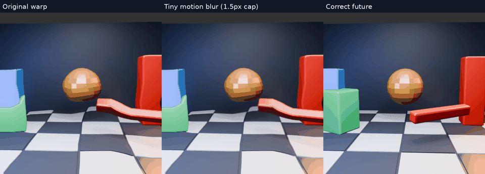
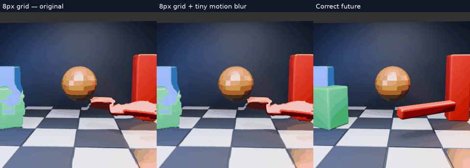
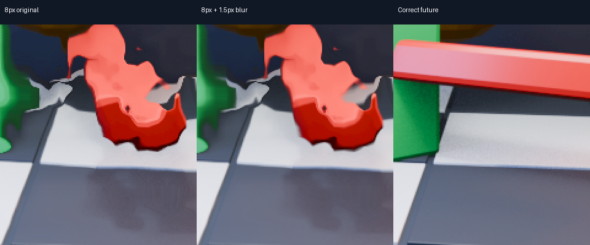

# Tiny motion-aligned blur: visual experiment

Same 32-output moving-scene stress fixture and 64px motion grid as [the previous comparison](../motion-scene/README.md). Original warp versus a three-tap linear-colour blur in the actual GPU warp shader, plus independently rendered future truth.

[Full-resolution slow-motion MP4](blur-slow.mp4). Playback is slowed 4×; GIF reduced for preview.

The blur samples the current retained image at q and q±offset, with weights 0.5/0.25/0.25. Direction follows estimated displacement; offset length is min(1.5px, 10% of displacement). Zero displacement yields zero blur. Radius is capped at 1.5px in the 512px fixture. This is a simple spatial approximation to motion blur, not temporal integration or a physical shutter simulation.

It adds two retained-image texture samples to the existing warp pass and no additional dispatch or intermediate image. Those costs are not a measured Pico timing result. It blurs along existing motion estimates, including incorrect estimates; it cannot restore exposed content, correct rotation, or straighten a bent object.

The candidate was built only into the headless host GPU fixture. Production shader source was restored before further work; no live profile or headset APK changed. Reproduction uses the archived shader in the existing 512px fixture with the original three-frame inputs; `blur_compare.py` retains local sibling build paths. The motion grid, source frames and score crop match the earlier gap-2 test. Raw logs and metrics accompany the animation.

## Visual preference

The user prefers the 8px grid for small-object detail despite its modest aggregate error improvement. Preserve it as a visual candidate; do not discard it solely on mean RMSE. Live deployment still requires timing and field-size compatibility work.

## Preferred 8px grid, with and without blur

[Full-resolution 8px comparison MP4](grid8-blur-slow.mp4).

| Grid | Original RMSE | Tiny blur RMSE |
|---|---:|---:|
| 64px | 40.801043 | 40.609032 |
| 8px | 37.726588 | 37.545263 |

Means cover the same 32 future targets. The blur softens jagged edges slightly; it does not resolve the distorted bar. These small score differences do not prove perceived quality or justify extra runtime cost. Keep this an optional visual candidate, not a deployed default. GPU validation reported no errors. Host shader sources and the live profile remain unchanged.

## Follow-up: requested client default

[c550d2f8](https://github.com/nerdrx/wivrn-nx/commit/c550d2f8) enables the tiny filter by default for active ordinary opaque client motion prediction. Atlas, compact and alpha paths are excluded; later upscaling/postprocessing can alter the effect. Set Android property `debug.wivrn.nx.motion_blur=0` and reconnect to disable, or host environment `WIVRN_NX_MOTION_BLUR=0`. This client approximation works in sampled colour space and decoded-image texels, so it is not pixel-identical to the host linear-colour fixture. Android release build passed and the updated APK was prepared. No client GPU-cost or visual equivalence claim is made. The 8px grid remains a separate unintegrated experiment.
